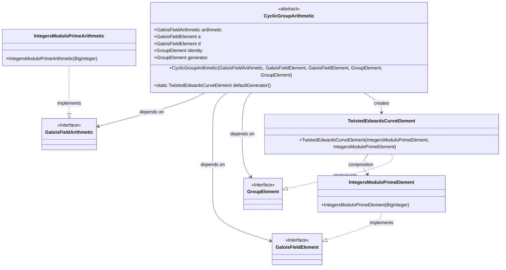
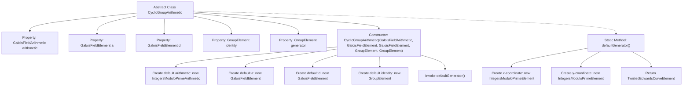

# Basic Information

|      |      |
|------|------|
| Name | CyclicGroupArithmetic |
| Language | .java |
| Code Path | WeFe/mpc/mpc-common/src/main/java/com/welab/wefe/mpc/pir/protocol/nt/group/cyclic/CyclicGroupArithmetic.java |
| Package Name | com.welab.wefe.mpc.pir.protocol.nt.group.cyclic |
| Dependencies | ['com.welab.wefe.mpc.pir.protocol.nt.field.GaloisFieldArithmetic', 'com.welab.wefe.mpc.pir.protocol.nt.field.GaloisFieldElement', 'com.welab.wefe.mpc.pir.protocol.nt.field.integers.IntegersModuloPrimeArithmetic', 'com.welab.wefe.mpc.pir.protocol.nt.field.integers.IntegersModuloPrimeElement', 'com.welab.wefe.mpc.pir.protocol.nt.group.GroupElement', 'com.welab.wefe.mpc.pir.protocol.nt.group.cyclic.twisted.TwistedEdwardsCurveElement', 'java.math.BigInteger'] |
| Brief Description | The abstract class `CyclicGroupArithmetic` defines cyclic group operations, including arithmetic, elements, identity elements, and generators, providing default constructor parameters and generator methods. |

# Description

CyclicGroupArithmetic is an abstract class designed to implement arithmetic operations for cyclic groups. It contains five key member variables: arithmetic (a Galois field arithmetic object), a and d (Galois field elements), identity (the group identity element), and generator (the group generator). The constructor allows customization of these parameters, with default values used when not provided: arithmetic defaults to integer modulo prime arithmetic for 2²⁵⁵-19, a defaults to 2²⁵⁵-20, and d is a specific large integer. The identity is set to (0,1) by default, while the generator is generated via the defaultGenerator method by default, with coordinates corresponding to specific large integers on a Twisted Edwards curve. This class provides a foundational framework for cyclic group operations.

# Class Summary

| Name   | Type  | Description |
|-------|------|-------------|
| CyclicGroupArithmetic | class | The abstract class CyclicGroupArithmetic defines cyclic group operations, including properties such as arithmetic, elements, identity elements, and generators. The constructor sets default values, with the default generator being a specific coordinate point. |

## Class CyclicGroupArithmetic

|      |      |
|------|------|
| Access Modifier | public abstract |
| Type | class |
| Name | CyclicGroupArithmetic |
| Description | The abstract class CyclicGroupArithmetic defines cyclic group operations, including properties such as arithmetic, elements, identity elements, and generators. The constructor sets default values, with the default generator being a specific coordinate point. |

### UML Class Diagram

This code defines an abstract class `CyclicGroupArithmetic` for implementing arithmetic operations of cyclic groups. The class depends on the interfaces `GaloisFieldArithmetic`, `GaloisFieldElement`, and `GroupElement`, and implements these interfaces through `IntegersModuloPrimeArithmetic` and `IntegersModuloPrimeElement`. `TwistedEdwardsCurveElement`, as an implementation of `GroupElement`, represents points on a twisted Edwards curve. The code provides default generator methods and handles default constructor parameter values, primarily used in elliptic curve arithmetic scenarios in cryptography.

### Internal Method Call Graph

This flowchart illustrates the structure and initialization logic of the abstract class CyclicGroupArithmetic. The class contains 5 properties and 1 constructor. The constructor checks if parameters are null, initializing them with default values if null. The generator property obtains its default value by invoking the static method defaultGenerator(), which creates and returns a TwistedEdwardsCurveElement instance with specific x/y coordinates. The flowchart clearly presents the class member relationships and conditional branching logic during initialization.

### Field List

| Name  | Type  | Description |
|-------|-------|------|
| a | GaloisFieldElement | The public variable a of type GaloisFieldElement. |
| generator | GroupElement | Group Element Generator |
| d | GaloisFieldElement | Public variable d of type GaloisFieldElement. |
| arithmetic | GaloisFieldArithmetic | Public arithmetic instances of the GaloisFieldArithmetic class. |
| identity | GroupElement | The identity variable of the GroupElement type represents the identity element. |

### Method List

| Name  | Type  | Description |
|-------|-------|------|
| defaultGenerator | TwistedEdwardsCurveElement | This method defines a static function defaultGenerator, which returns a TwistedEdwardsCurveElement instance. The instance uses two large integers constructed as IntegersModuloPrimeElement objects for the x and y coordinates, corresponding to specific curve generator point coordinates. |

