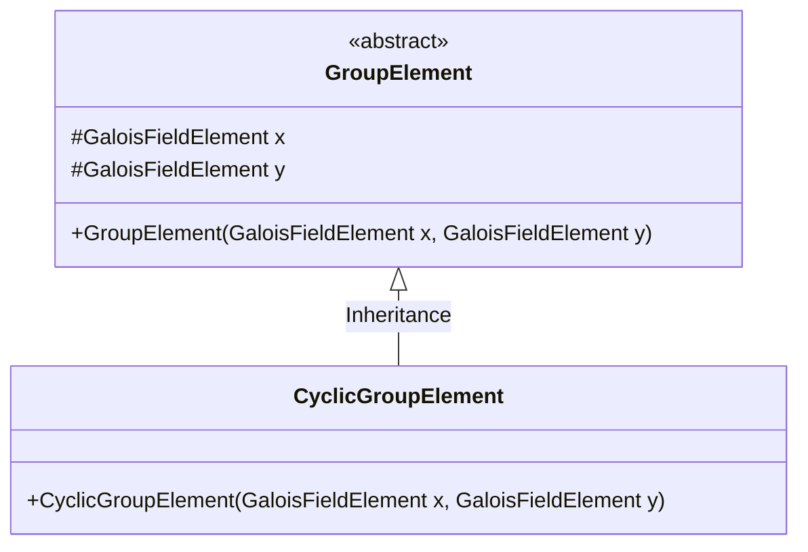
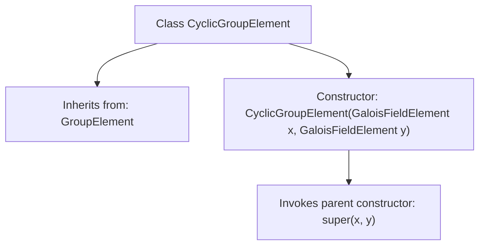

# Basic Information

|      |      |
|------|------|
| Name | CyclicGroupElement |
| Language | .java |
| Code Path | WeFe/mpc/mpc-common/src/main/java/com/welab/wefe/mpc/pir/protocol/nt/group/cyclic/CyclicGroupElement.java |
| Package Name | com.welab.wefe.mpc.pir.protocol.nt.group.cyclic |
| Dependencies | ['com.welab.wefe.mpc.pir.protocol.nt.field.GaloisFieldElement', 'com.welab.wefe.mpc.pir.protocol.nt.group.GroupElement'] |
| Brief Description | The `CyclicGroupElement` class inherits from `GroupElement`, and its constructor takes two `GaloisFieldElement` parameters, `x` and `y`. |

# Description

This code defines a class named `CyclicGroupElement`, which inherits from the `GroupElement` class. This class represents an element within a cyclic group. The constructor accepts two parameters of type `GaloisFieldElement`, `x` and `y`, and passes them to the constructor of the parent class `GroupElement` for initialization. This class is primarily used for creating and manipulating cyclic group elements, with its core functionality relying on operations involving elements from the Galois field.

# Class Summary

| Name   | Type  | Description |
|-------|------|-------------|
| CyclicGroupElement | class | The CyclicGroupElement class inherits from GroupElement and is constructed with GaloisFieldElement parameters x and y. |

## Class CyclicGroupElement

|      |      |
|------|------|
| Access Modifier | public |
| Type | class |
| Name | CyclicGroupElement |
| Description | The CyclicGroupElement class inherits from GroupElement and is constructed with GaloisFieldElement parameters x and y. |

### UML Class Diagram

This class diagram illustrates the hierarchical relationship where CyclicGroupElement inherits from the abstract class GroupElement. As the base class, GroupElement contains two protected members of type GaloisFieldElement (x and y) along with a constructor method. The concrete subclass CyclicGroupElement initializes coordinates by invoking the parent class constructor via super. This design demonstrates the extension of cyclic group element properties from fundamental group elements in algebraic structures, suitable for cryptographic or mathematical computation scenarios. The subclass inherits and reuses the storage structure of the parent class while maintaining type specificity.

### Internal Method Call Graph

This flowchart illustrates the structure of the CyclicGroupElement class and its relationship with the parent class GroupElement. CyclicGroupElement inherits from GroupElement and accepts two GaloisFieldElement parameters, x and y, in its constructor. During construction, it directly invokes the parent class GroupElement's constructor to complete initialization. The diagram clearly demonstrates the class inheritance hierarchy and the execution flow of the constructor, highlighting the child class's mechanism for reusing parent class functionality.

### Field List

| Name  | Type  | Description |
|-------|-------|------|

### Method List

| Name  | Type  | Description |
|-------|-------|------|

