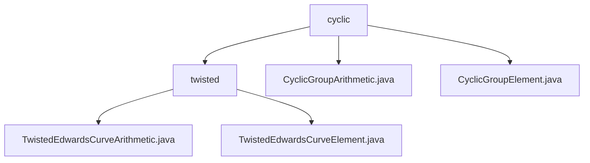

# Basic Information

|      |      |
|------|------|
| Name | cyclic |
| Language | .java |
| Code Path | WeFe/mpc/mpc-common/src/main/java/com/welab/wefe/mpc/pir/protocol/nt/group/cyclic |
| Package Name | docs.mpc.mpc-common.src.main.java.com.welab.wefe.mpc.pir.protocol.nt.group.cyclic |
| Brief Description | This module implements arithmetic operations for twisted Edwards curves, providing interfaces for point addition, scalar multiplication, and other functions. It supports coordinate encoding/decoding and group property queries, making it suitable for privacy-preserving computation scenarios in elliptic curve cryptography. |

# Description

## Overview  
This module implements standardized group operations for twisted Edwards curves, with core responsibilities including providing fundamental operation interfaces such as point addition and scalar multiplication, as well as element encoding/decoding functionality. The unified interface specification encompasses operations like group attribute queries and element validity checks, following a pattern similar to cryptographic primitive construction. Key data structures are TwistedEdwardsCurveElement (curve point coordinates) and CyclicGroupElement (cyclic group elements), relying on a Galois field arithmetic library. For instance, it employs the prime field of 2²⁵⁵-19 for default operations, with interaction data serialized via byte arrays.

## Primary Use Cases  
The module is specifically designed for elliptic curve cryptography in privacy-preserving computation scenarios, such as PIR protocols in secure multi-party computation. A typical workflow involves: initializing group elements (default generator coordinates as specific large integers) → performing scalar multiplication (with built-in validation) → result encoding/decoding, resembling a key derivation pattern. For example, in the NT group protocol, efficient point doubling is achieved through the CyclicGroupArithmetic framework, supporting custom a/d parameters or default values (a=2²⁵⁵-20). All operations are executed based on Galois field arithmetic objects.

### Package Internal Structure View

This flowchart illustrates the class file structure related to cyclic groups and twisted Edwards curves in the MPC project. The top level is the cyclic directory, which contains two subclass files and the twisted subdirectory. The twisted directory further includes two class files implementing twisted Edwards curve arithmetic, clearly presenting the code organization of mathematical operation modules in cryptographic protocols.

# File List

| Name   | Type  | Description |
|-------|------|-------------|
| [CyclicGroupArithmetic.java](CyclicGroupArithmetic.md) | file | The abstract class `CyclicGroupArithmetic` defines cyclic group operations, including arithmetic, elements, identity elements, and generators, providing default constructor parameters and generator methods. |
| [CyclicGroupElement.java](CyclicGroupElement.md) | file | The `CyclicGroupElement` class inherits from `GroupElement`, and its constructor takes two `GaloisFieldElement` parameters, x and y. |
| [twisted](twisted/_module.md) | package | The `TwistedEdwardsCurveArithmetic` class implements twisted Edwards curve group operations, including point addition, subtraction, scalar multiplication, etc., supporting encoding/decoding and attribute access. The `TwistedEdwardsCurveElement` class represents curve point coordinates, inheriting from `CyclicGroupElement`. |

