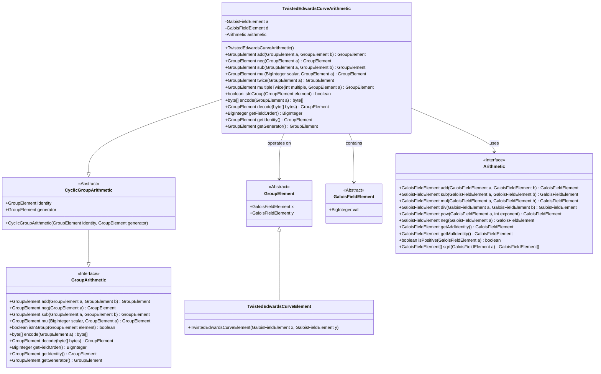
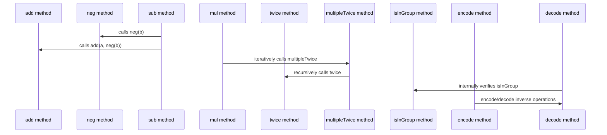

# Basic Information

|      |      |
|------|------|
| Name | TwistedEdwardsCurveArithmetic |
| Language | .java |
| Code Path | WeFe/mpc/mpc-common/src/main/java/com/welab/wefe/mpc/pir/protocol/nt/group/cyclic/twisted/TwistedEdwardsCurveArithmetic.java |
| Package Name | com.welab.wefe.mpc.pir.protocol.nt.group.cyclic.twisted |
| Dependencies | ['com.welab.wefe.mpc.commom.Conversion', 'com.welab.wefe.mpc.pir.protocol.nt.field.GaloisFieldElement', 'com.welab.wefe.mpc.pir.protocol.nt.field.integers.IntegersModuloPrimeArithmetic', 'com.welab.wefe.mpc.pir.protocol.nt.field.integers.IntegersModuloPrimeElement', 'com.welab.wefe.mpc.pir.protocol.nt.group.GroupArithmetic', 'com.welab.wefe.mpc.pir.protocol.nt.group.GroupElement', 'com.welab.wefe.mpc.pir.protocol.nt.group.cyclic.CyclicGroupArithmetic', 'java.math.BigInteger', 'java.util.List'] |
| Brief Description | TwistedEdwards curve arithmetic class, implementing group operations such as point addition, negation, point doubling, scalar multiplication, encoding and decoding. |

# Description

The `TwistedEdwardsCurveArithmetic` class implements group operations on twisted Edwards curves, inheriting from `CyclicGroupArithmetic`. Its primary functionalities include point addition, negation, subtraction, scalar multiplication, and point doubling. Point addition calculates new coordinates using the standard twisted Edwards curve formula. The class also incorporates group element encoding/decoding methods, supporting conversion between point coordinates and byte arrays, as well as reverse parsing. Additionally, it provides access methods for group properties, such as retrieving the identity element, generator, and finite field order. All operations are performed over finite fields and include validation logic for group element legitimacy.

# Class Summary

| Name   | Type  | Description |
|-------|------|-------------|
| TwistedEdwardsCurveArithmetic | class | TwistedEdwards curve arithmetic class, implementing group operations such as point addition, negation, point doubling, and encoding/decoding. |

## Class TwistedEdwardsCurveArithmetic

|      |      |
|------|------|
| Access Modifier | public |
| Type | class |
| Name | TwistedEdwardsCurveArithmetic |
| Description | TwistedEdwards curve arithmetic class, implementing group operations such as point addition, negation, point doubling, and encoding/decoding. |

### UML Class Diagram

This diagram illustrates the inheritance and dependency relationships of twisted Edwards curve arithmetic classes. TwistedEdwardsCurveArithmetic inherits from CyclicGroupArithmetic and implements the GroupArithmetic interface, encompassing operations on GroupElement and computations with GaloisFieldElement. The core classes perform field operations through the Arithmetic interface, with TwistedEdwardsCurveElement serving as the concrete implementation of GroupElement. The diagram clearly demonstrates the mathematical abstraction hierarchy and component collaboration of elliptic curve group operations.

### Internal Method Call Graph

```mermaid
graph TD
    A["Class TwistedEdwardsCurveArithmetic"]
    B["Constructor: TwistedEdwardsCurveArithmetic()"]
    C["Method: GroupElement add(GroupElement a, GroupElement b)"]
    D["Method: GroupElement neg(GroupElement a)"]
    E["Method: GroupElement sub(GroupElement a, GroupElement b)"]
    F["Method: GroupElement mul(BigInteger scalar, GroupElement a)"]
    G["Method: GroupElement twice(GroupElement a)"]
    H["Method: GroupElement multipleTwice(int multiple, GroupElement a)"]
    I["Method: boolean isInGroup(GroupElement element)"]
    J["Method: byte[] encode(GroupElement a)"]
    K["Method: GroupElement decode(byte[] bytes)"]
    L["Method: BigInteger getFieldOrder()"]
    M["Method: GroupElement getIdentity()"]
    N["Method: GroupElement getGenerator()"]

    A --> B
    A --> C
    A --> D
    A --> E
    A --> F
    A --> G
    A --> H
    A --> I
    A --> J
    A --> K
    A --> L
    A --> M
    A --> N
```

This flowchart illustrates the method structure of the TwistedEdwards curve arithmetic class, comprising 12 core methods that cover group operations (addition, negation, subtraction, scalar multiplication), point doubling, encoding/decoding, and group property validation. The sequence diagram highlights method invocation relationships, such as the sub method implementing subtraction by combining neg and add, the mul method performing fast scalar multiplication via multipleTwice, and the interplay between encoding/decoding processes and group validation, reflecting the mathematical properties of group operations in elliptic curve cryptography.

### Field List

| Name  | Type  | Description |
|-------|-------|------|

### Method List

| Name  | Type  | Description |
|-------|-------|------|
| decode | GroupElement | Decoding a byte array into a group element: Calculate the y-value, derive the denominator and numerator through arithmetic operations, take the square root, and select the x-value based on the first bit of the byte, returning the twisted Edwards curve element (x, y). |
| twice | GroupElement | This method computes the scalar multiplication of group elements by performing arithmetic operations in the Galois field to generate new coordinates x3 and y3, ultimately returning a new group element. |
| encode | byte[] | This method encodes a GroupElement object into a byte array. First, it sets the sign bit of the first byte (0x00 or 0xFF) based on the sign of x, then converts the y value into a byte array and appends it. Finally, it returns the combined byte array. |
| mul | GroupElement | This method implements scalar multiplication between large integers and group elements through binary representation. If the scalar is zero, it returns the identity element; otherwise, it converts the scalar to binary, computes each bit sequentially, and accumulates the result. |
| sub | GroupElement | The method implements the subtraction of two group elements by negating the second element and then adding it to the first element. |
| isInGroup | boolean | Check if an element is in the group: Calculate the squares of x and y and their combined value, then compare whether the results of the left and right expressions are equal. |
| multipleTwice | GroupElement | The method `multipleTwice` performs multiple `twice` operations on the GroupElement object `a`, with the number of operations specified by the parameter `multiple`. If `multiple` is 0, it directly returns `a`; otherwise, it iteratively calls the `twice` method and returns the result. |
| add | GroupElement | This method implements the addition of two points on a twisted Edwards curve, deriving the new point coordinates (x3, y3) through coordinate calculations and finite field arithmetic operations. |
| neg | GroupElement | Java Method: Negates the group element and returns a new object, with x negated and y unchanged. |
| getFieldOrder | BigInteger | Method override, returns the arithmetic modulo field value. |
| getIdentity | GroupElement | This method returns an identity object of type GroupElement. |
| getGenerator | GroupElement | This method returns a generator object of type GroupElement. |

