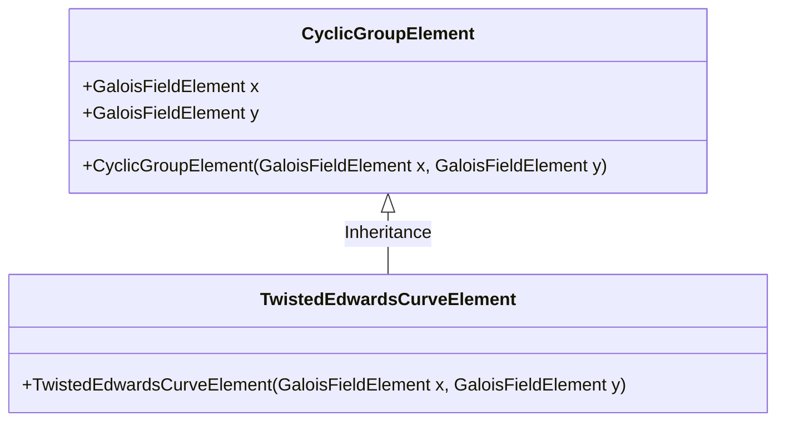
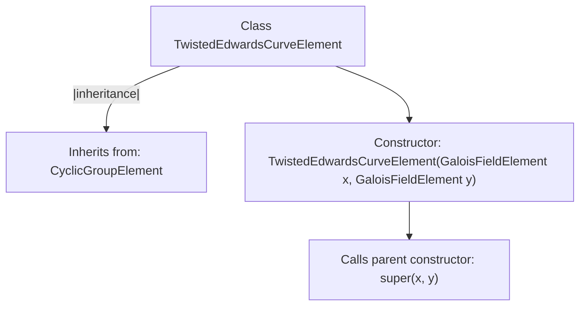

# Basic Information

|      |      |
|------|------|
| Name | TwistedEdwardsCurveElement |
| Language | .java |
| Code Path | WeFe/mpc/mpc-common/src/main/java/com/welab/wefe/mpc/pir/protocol/nt/group/cyclic/twisted/TwistedEdwardsCurveElement.java |
| Package Name | com.welab.wefe.mpc.pir.protocol.nt.group.cyclic.twisted |
| Dependencies | ['com.welab.wefe.mpc.pir.protocol.nt.field.GaloisFieldElement', 'com.welab.wefe.mpc.pir.protocol.nt.group.cyclic.CyclicGroupElement'] |
| Brief Description | The `TwistedEdwardsCurveElement` class inherits from `CyclicGroupElement` and constructs twisted Edwards curve elements using x and y coordinates. |

# Description

The `TwistedEdwardsCurveElement` class inherits from `CyclicGroupElement` and represents an element on a twisted Edwards curve. The constructor takes two parameters `x` and `y` of type `GaloisFieldElement`, and initializes them by calling the parent class constructor. This class is used to describe the coordinates of curve points and does not involve specific operation implementations.

# Class Summary

| Name   | Type  | Description |
|-------|------|-------------|
| TwistedEdwardsCurveElement | class | The `TwistedEdwardsCurveElement` class inherits from `CyclicGroupElement` and constructs a twisted Edwards curve element using x and y coordinates. |

## Class TwistedEdwardsCurveElement

|      |      |
|------|------|
| Access Modifier | public |
| Type | class |
| Name | TwistedEdwardsCurveElement |
| Description | The `TwistedEdwardsCurveElement` class inherits from `CyclicGroupElement` and constructs a twisted Edwards curve element using x and y coordinates. |

### UML Class Diagram

This diagram illustrates the class relationship where TwistedEdwardsCurveElement inherits from CyclicGroupElement. The base class CyclicGroupElement contains two coordinates (x, y) of type GaloisFieldElement, while TwistedEdwardsCurveElement extends the base class functionality through its constructor, specifically designed to represent points on twisted Edwards curves. This inheritance relationship reflects the hierarchical modeling of mathematical elements in elliptic curve cryptography.

### Internal Method Call Graph

This flowchart illustrates the structure of the TwistedEdwardsCurveElement class and its inheritance relationship with the parent class CyclicGroupElement. The class constructor takes two GaloisFieldElement parameters x and y, and directly invokes the parent class constructor for initialization. The diagram clearly presents the class inheritance chain and the internal invocation logic of the constructor, demonstrating the child class's direct reuse of parent class functionality.

### Field List

| Name  | Type  | Description |
|-------|-------|------|

### Method List

| Name  | Type  | Description |
|-------|-------|------|

