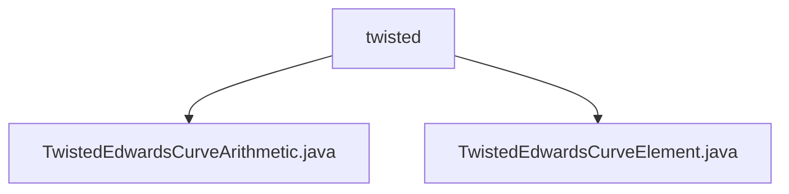

# Basic Information

|      |      |
|------|------|
| Name | twisted |
| Language | .java |
| Code Path | WeFe/mpc/mpc-common/src/main/java/com/welab/wefe/mpc/pir/protocol/nt/group/cyclic/twisted |
| Package Name | docs.mpc.mpc-common.src.main.java.com.welab.wefe.mpc.pir.protocol.nt.group.cyclic.twisted |
| Brief Description | The `TwistedEdwardsCurveArithmetic` class implements twisted Edwards curve group operations, including point addition, subtraction, scalar multiplication, etc., supporting encoding/decoding and attribute access. The `TwistedEdwardsCurveElement` class represents curve point coordinates, inheriting from `CyclicGroupElement`. |

# Description

## Overview  
This module implements the arithmetic system for twisted Edwards curves, with its core responsibility being to provide standardized group operation interfaces and element representation. The interface specifications cover basic operations such as point addition, negation, and scalar multiplication, supporting coordinate encoding/decoding and group property queries. Key data structures include TwistedEdwardsCurveElement (storing curve point coordinates) and GaloisFieldElement (finite field elements). Dependencies are limited to finite field arithmetic libraries. For example, point addition is implemented via standard formulas, and serialization interactions use byte arrays.  

## Primary Use Cases  
The module is suitable for privacy-preserving computation scenarios requiring elliptic curve cryptography, such as PIR protocols in secure multi-party computation. Typical workflows include group element initialization → scalar multiplication → result encoding/decoding, resembling the construction patterns of cryptographic primitives. For instance, in NT group protocols, efficient key derivation is achieved through double-and-add operations, with all operations incorporating built-in validity checks to ensure security.

### Package Internal Structure View

This flowchart illustrates two Java files under the `twisted` directory: `TwistedEdwardsCurveArithmetic.java` and `TwistedEdwardsCurveElement.java`. Both files reside at the same level directly within the `twisted` folder, with no deeper nested structure.

# File List

| Name   | Type  | Description |
|-------|------|-------------|
| [TwistedEdwardsCurveArithmetic.java](TwistedEdwardsCurveArithmetic.md) | file | TwistedEdwards curve arithmetic class, implementing group operations such as point addition, negation, point doubling, scalar multiplication, encoding and decoding. |
| [TwistedEdwardsCurveElement.java](TwistedEdwardsCurveElement.md) | file | The `TwistedEdwardsCurveElement` class inherits from `CyclicGroupElement` and constructs twisted Edwards curve elements using x and y coordinates. |

