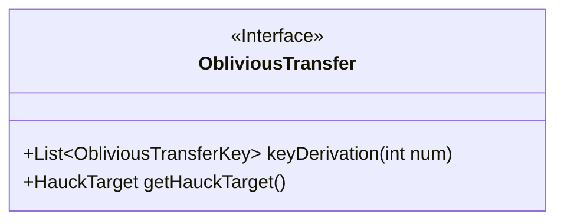
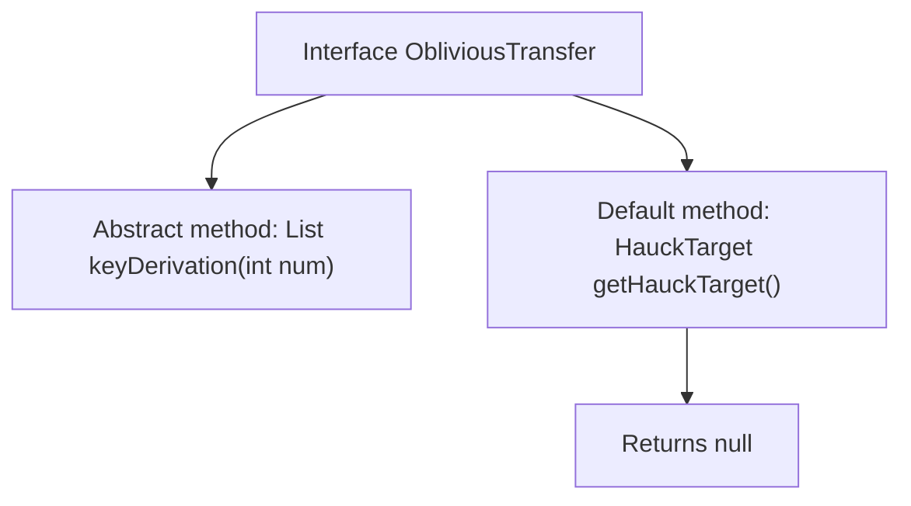

# Basic Information

|      |      |
|------|------|
| Name | ObliviousTransfer |
| Language | .java |
| Code Path | WeFe/mpc/mpc-common/src/main/java/com/welab/wefe/mpc/pir/protocol/ot/ObliviousTransfer.java |
| Package Name | com.welab.wefe.mpc.pir.protocol.ot |
| Dependencies | ['com.welab.wefe.mpc.pir.protocol.ot.hauck.HauckTarget', 'java.util.List'] |
| Brief Description | The ObliviousTransfer interface defines the key generation method keyDerivation and the getHauckTarget method which returns null by default. |

# Description

The interface defines a protocol named ObliviousTransfer, which includes two core functions. Firstly, it provides the keyDerivation method for generating a specified number of ObliviousTransferKey lists, where the parameter num specifies the quantity of keys to be generated. Secondly, it contains a default-implemented getHauckTarget method that returns a HauckTarget object, with null returned by default. This interface is primarily used to implement operations related to the oblivious transfer protocol.

# Class Summary

| Name   | Type  | Description |
|-------|------|-------------|
| ObliviousTransfer | interface | The ObliviousTransfer interface defines the key generation method keyDerivation and the getHauckTarget method which returns null by default. |

## Class ObliviousTransfer

|      |      |
|------|------|
| Access Modifier | public |
| Type | interface |
| Name | ObliviousTransfer |
| Description | The ObliviousTransfer interface defines the key generation method keyDerivation and the getHauckTarget method which returns null by default. |

### UML Class Diagram

This class diagram illustrates an interface named ObliviousTransfer, which defines two methods: keyDerivation for generating a list of keys with a specified quantity, returning a generic List<ObliviousTransferKey>; and getHauckTarget as a default method that returns a HauckTarget object. The interface is marked with <<Interface>>, and all methods are public, with keyDerivation including parameter and generic return type specifications.

### Internal Method Call Graph

This flowchart illustrates the structure of the ObliviousTransfer interface, which contains an abstract method keyDerivation requiring implementation and a default method getHauckTarget. The keyDerivation method takes an integer parameter and returns a list of keys, while the getHauckTarget default method directly returns null. The interface defines the basic functional framework, with concrete implementations requiring subclasses to complete the keyDerivation method.

### Field List

| Name  | Type  | Description |
|-------|-------|------|

### Method List

| Name  | Type  | Description |
|-------|-------|------|
| keyDerivation | List<ObliviousTransferKey> | Generate a list of oblivious transfer keys with the specified quantity. |
| getHauckTarget | HauckTarget | The method getHauckTarget returns null by default. |

