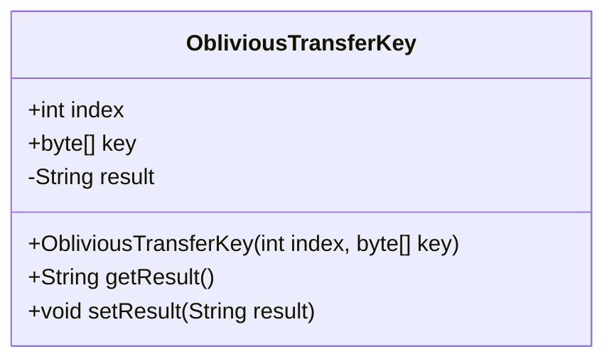
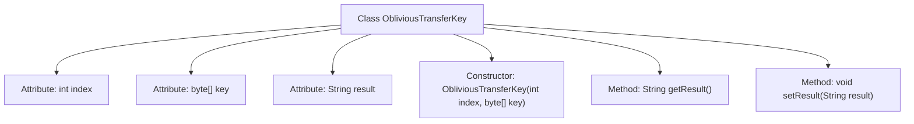

# Basic Information

|      |      |
|------|------|
| Name | ObliviousTransferKey |
| Language | .java |
| Code Path | WeFe/mpc/mpc-common/src/main/java/com/welab/wefe/mpc/pir/protocol/ot/ObliviousTransferKey.java |
| Package Name | com.welab.wefe.mpc.pir.protocol.ot |
| Dependencies | [] |
| Brief Description | The `ObliviousTransferKey` class contains index, key, and result fields, providing constructor methods and result accessor methods. |

# Description

The `ObliviousTransferKey` class contains two public fields, `index` and `key`, representing the index and the key byte array, respectively. The private field `result` is used to store the result string. The constructor accepts `index` and `key` parameters and initializes the corresponding fields. It provides `getResult` and `setResult` methods to retrieve and set the value of the `result` field. This class is primarily used for managing keys and result data in oblivious transfer protocols.

# Class Summary

| Name   | Type  | Description |
|-------|------|-------------|
| ObliviousTransferKey | class | The ObliviousTransferKey class contains index, key, and result fields, providing constructor methods and result accessor methods. |

## Class ObliviousTransferKey

|      |      |
|------|------|
| Access Modifier | public |
| Type | class |
| Name | ObliviousTransferKey |
| Description | The ObliviousTransferKey class contains index, key, and result fields, providing constructor methods and result accessor methods. |

### UML Class Diagram

This code defines a class named ObliviousTransferKey, which is used to store key information in an oblivious transfer protocol. The class contains three main members: a public integer 'index' representing the index, a public byte array 'key' storing the key data, and a private string 'result' for storing processing outcomes. It provides a constructor to initialize 'index' and 'key', along with getter and setter methods to access the 'result' field. This class may be utilized in secure communication scenarios to enable selective data retrieval without disclosing other information.

### Internal Method Call Graph

This flowchart illustrates the structure of the ObliviousTransferKey class, which includes three attributes (index/key/result), one constructor, and two operational methods (getResult/setResult). The constructor initializes index and key, while the private attribute result is accessed via setter and getter for controlled access. Collectively, it forms a simple Data Transfer Object (DTO) pattern designed to encapsulate key indices and result data in oblivious transfer protocols.

### Field List

| Name  | Type  | Description |
|-------|-------|------|
| index | int | Public integer variable index. |
| result = "" | String | Declare a private string variable named result with an initial value of an empty string. |
| key | byte[] | Declare a public byte array variable key. |

### Method List

| Name  | Type  | Description |
|-------|-------|------|
| getResult | String | Methods to obtain the result string. |
| setResult | void | Methods for setting the result value, assigning the input string to the class's result variable. |

