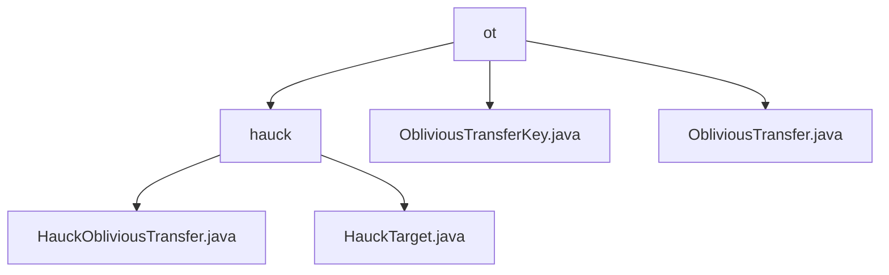

# Basic Information

|      |      |
|------|------|
| Name | ot |
| Language | .java |
| Code Path | WeFe/mpc/mpc-common/src/main/java/com/welab/wefe/mpc/pir/protocol/ot |
| Package Name | docs.mpc.mpc-common.src.main.java.com.welab.wefe.mpc.pir.protocol.ot |
| Brief Description | This module implements an oblivious transfer protocol based on twisted Edwards curves, with core classes providing cryptographically secure operations. It supports private information retrieval scenarios, including key management and target generation functionalities. |

# Description

## Overview  
This module implements an Oblivious Transfer protocol based on twisted Edwards curves, with core responsibilities including secure key derivation and private data encapsulation. The HauckObliviousTransfer class provides cryptographic operations such as group operations and hash computations, while HauckTarget serves as a secure envelope structure encapsulating critical data like random scalars and group elements. Key data structures include ObliviousTransferKey (managing key indices and results) and HauckTarget triplets. Dependencies include the SHA-256 algorithm and elliptic curve arithmetic modules. For example, generateHauckTarget produces verified transfer targets, and ObliviousTransferKey stores protocol execution results.  

## Primary Business Scenarios  
The module supports private information retrieval in secure multi-party computation, with typical workflows encompassing key derivation, target generation, and validity verification. Two modes are implemented via the ObliviousTransfer interface: keyDerivation for batch key generation (similar to a key distribution center) and getHauckTarget for obtaining secure carriers. The interaction process resembles the commitment-response mechanism of zero-knowledge proofs—for instance, HauckTarget debug output ensures transparency, while the protocol core guarantees transfer security. Typical applications include joint risk control scenarios, where ObliviousTransferKey acts as a session credential throughout the process.

### Package Internal Structure View

This flowchart illustrates the file structure related to the OT protocol in the WeFe project. The top level is the ot directory, which contains the hauck subdirectory and two OT protocol implementation files. The hauck directory further includes two concrete implementation classes, clearly reflecting the hierarchical relationships and file distribution within the OT protocol module.

# File List

| Name   | Type  | Description |
|-------|------|-------------|
| [ObliviousTransferKey.java](ObliviousTransferKey.md) | file | The `ObliviousTransferKey` class contains fields for index, key, and result, providing constructor methods and result accessor methods. |
| [ObliviousTransfer.java](ObliviousTransfer.md) | file | The ObliviousTransfer interface defines the key generation method keyDerivation and the getHauckTarget method which returns null by default. |
| [hauck](hauck/_module.md) | package | The `HauckObliviousTransfer` class implements an oblivious transfer protocol based on twisted Edwards curves, including core functionalities such as group operations and hashing. The `generateHauckTarget` method generates secure transfer targets. The `HauckTarget` class encapsulates three parameters—`y`, `s`, and `t`—and provides formatted output. |

