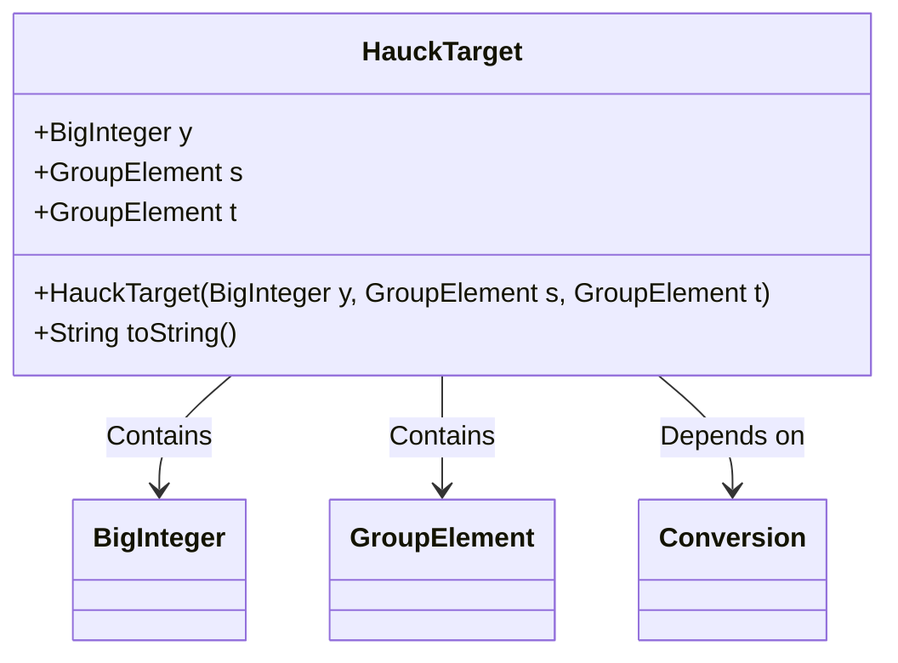
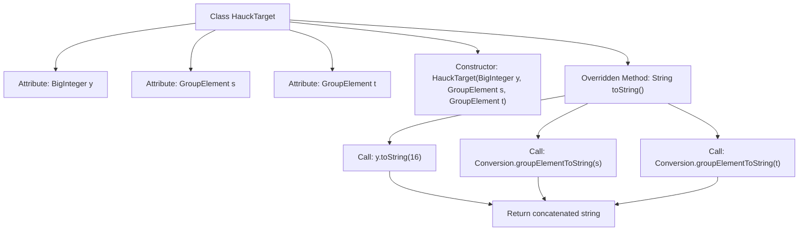

# Basic Information

|      |      |
|------|------|
| Name | HauckTarget |
| Language | .java |
| Code Path | WeFe/mpc/mpc-common/src/main/java/com/welab/wefe/mpc/pir/protocol/ot/hauck/HauckTarget.java |
| Package Name | com.welab.wefe.mpc.pir.protocol.ot.hauck |
| Dependencies | ['com.welab.wefe.mpc.commom.Conversion', 'com.welab.wefe.mpc.pir.protocol.nt.group.GroupElement', 'java.math.BigInteger'] |
| Brief Description | The HauckTarget class contains BigInteger y and GroupElement s, t, providing a constructor method and toString to output the hexadecimal representation of y and the string representations of s and t. |

# Description

The HauckTarget class contains three member variables: y of type BigInteger, and s and t of type GroupElement. The constructor takes these three parameters and initializes the corresponding member variables. The toString method returns a formatted string containing the hexadecimal value of y, as well as the string-converted values of s and t via the Conversion utility class.

# Class Summary

| Name   | Type  | Description |
|-------|------|-------------|
| HauckTarget | class | The HauckTarget class contains three member variables: BigInteger y and GroupElement s, t. It provides a constructor for initialization and a toString method that outputs the string representations of y, s, and t in hexadecimal format. |

## Class HauckTarget

|      |      |
|------|------|
| Access Modifier | public |
| Type | class |
| Name | HauckTarget |
| Description | The HauckTarget class contains three member variables: BigInteger y and GroupElement s, t. It provides a constructor for initialization and a toString method that outputs the string representations of y, s, and t in hexadecimal format. |

### UML Class Diagram

This code defines a class named HauckTarget, which stores three public attributes: y of type BigInteger, and two GroupElement-type attributes s and t. The class includes a constructor method to initialize these attributes and overrides the toString() method to output the object's content as a hexadecimal string. The class relies on the Conversion utility class for converting GroupElement to string. The overall structure is simple and clear, primarily used for encapsulating target data related to cryptography or mathematical computations.

### Internal Method Call Graph

This flowchart illustrates the structure of the HauckTarget class, which includes three attributes (y, s, t), a constructor, and an overridden toString method. The toString method converts attributes to hexadecimal strings and group element strings by calling conversion functions, ultimately concatenating them into a specific output format. The process clearly demonstrates the call chain relationship of data conversion and string synthesis.

### Field List

| Name  | Type  | Description |
|-------|-------|------|
| y | BigInteger | Public large integer variable y. |
| s | GroupElement | Group element variable s |
| t | GroupElement | The public variable t of type GroupElement. |

### Method List

| Name  | Type  | Description |
|-------|-------|------|
| toString | String | The toString method of the HauckTarget class returns a formatted string of the object's attributes y (in hexadecimal), s, and t (converted to string). |

