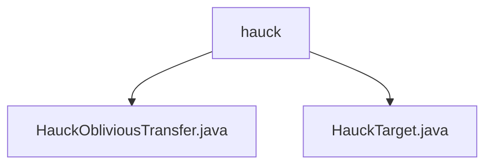

# Basic Information

|      |      |
|------|------|
| Name | hauck |
| Language | .java |
| Code Path | WeFe/mpc/mpc-common/src/main/java/com/welab/wefe/mpc/pir/protocol/ot/hauck |
| Package Name | docs.mpc.mpc-common.src.main.java.com.welab.wefe.mpc.pir.protocol.ot.hauck |
| Brief Description | The `HauckObliviousTransfer` class implements an oblivious transfer protocol based on twisted Edwards curves, including core functionalities such as group operations and hashing. The `generateHauckTarget` method generates secure transfer targets. The `HauckTarget` class encapsulates three parameters—`y`, `s`, and `t`—and provides formatted output. |

# Description

## Overview  
This module implements an oblivious transfer protocol based on twisted Edwards curves, with the core class `HauckObliviousTransfer` providing cryptographically secure foundational operations, including group operations, hash computations, and message authentication code generation. `HauckTarget` serves as a data transmission carrier, encapsulating the random scalar `y`, group element `s`, and hash result `t`, resembling a secure envelope structure in the protocol. Dependencies include the SHA-256 hash algorithm and elliptic curve arithmetic module. For instance, the `generateHauckTarget` method continuously generates verified transmission target triplets.  

## Key Business Scenarios  
The module focuses on private information retrieval scenarios in secure multi-party computation, achieving oblivious transfer through the generation of random scalars and corresponding group elements. Typical workflows include initializing curve parameters, generating transmission targets, and verifying the validity of group elements. For example, `HauckTarget` supports debugging via formatted output, while the protocol's core logic ensures the transmission process meets cryptographic security requirements, akin to the commitment mechanism in zero-knowledge proofs.

### Package Internal Structure View

This flowchart illustrates the Java file hierarchy related to the Hauck OT protocol. The root node "hauck" represents the protocol directory, which contains two implementation files: HauckObliviousTransfer.java implements the basic OT protocol functionality, while HauckTarget.java defines the protocol target interface. This structure reflects the modular design of the OT protocol in MPC privacy protection, with the two key class files directly subordinate to the protocol directory without intermediate layers.

# File List

| Name   | Type  | Description |
|-------|------|-------------|
| [HauckObliviousTransfer.java](HauckObliviousTransfer.md) | file | The HauckObliviousTransfer class implements an oblivious transfer protocol based on twisted Edwards curves, incorporating functionalities such as random number generation, hash computation, MAC initialization, and target generation. |
| [HauckTarget.java](HauckTarget.md) | file | The HauckTarget class contains BigInteger y and GroupElement s, t, providing a constructor method and toString to output the hexadecimal representation of y and the string representations of s, t. |

