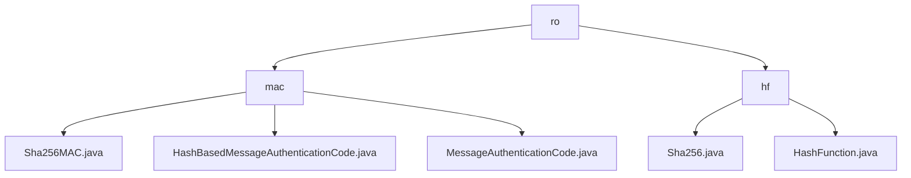

# Basic Information

|      |      |
|------|------|
| Name | ro |
| Language | .java |
| Code Path | WeFe/mpc/mpc-common/src/main/java/com/welab/wefe/mpc/pir/protocol/ro |
| Package Name | docs.mpc.mpc-common.src.main.java.com.welab.wefe.mpc.pir.protocol.ro |
| Brief Description | Module 1 implements hash-based message authentication code functionality, adopting a three-layer inheritance structure to support data integrity verification, and relies on the Java Cryptography Library to generate authentication codes. Module 2 provides SHA-256 hash computation services, achieving extensible digest functionality through interface segregation design, suitable for scenarios such as data verification. |

# Description

## Overview  
The core responsibility of this module is to provide dual protection for data security: Hash-based Message Authentication Code (MAC) and message digest functionality, used for data authenticity verification and integrity validation respectively. It adopts a layered design pattern, with MAC functionality implemented through a three-tier inheritance structure (base framework - abstract methods - concrete algorithms), while hash computation follows the interface segregation principle.  

Key data structures include key byte arrays, message byte arrays, and hash values, processed through SecretKeySpec and MessageDigest for cryptographic transformations. External dependencies are primarily focused on Java standard library's Mac and cryptographic-related classes. For example, Sha256MAC employs the HmacSHA256 algorithm to generate authentication codes, while the Sha256 class implements standard hash computation via MessageDigest.  

## Primary Business Scenarios  
The module is suitable for secure communication and data processing scenarios, similar to the dual verification mechanism in HTTPS certificate chains. Typical workflows are divided into two modes: MAC requires key initialization to generate authentication codes, whereas hash computation directly processes raw data. For instance, in secure multi-party computation, SHA-256 hashing and MAC can be combined to achieve tamper-proof closed-loop verification of transmitted data.  

The interaction model follows a unified "input-process-output" approach, supporting byte arrays as universal data carriers. APIs include functional interfaces (HashFunction) and inheritance hierarchies (MessageAuthenticationCode). Integration examples demonstrate details such as exception handling, including fault-tolerant designs like returning empty arrays when hash computation fails.

### Package Internal Structure View

This flowchart illustrates the file structure related to the PIR protocol in the MPC module of the WeFe project. The root node "ro" branches into two subdirectories, "mac" and "hf", which contain implementation class files for MAC (Message Authentication Code) and hash functions respectively. The "mac" directory includes three MAC implementation classes, while the "hf" directory contains two hash function-related classes.

# File List

| Name   | Type  | Description |
|-------|------|-------------|
| [mac](mac/_module.md) | package | The Sha256MAC class inherits from HashBasedMessageAuthenticationCode, implementing SHA-256 message authentication code functionality. It contains a key and a Mac instance, providing a digest method to generate authentication codes. HashBasedMessageAuthenticationCode is an abstract class that requires subclasses to implement the digest method. MessageAuthenticationCode is the foundational framework class used for message authentication code functionality. |
| [hf](hf/_module.md) | package | The Sha256 class implements the HashFunction interface, providing a digest method that generates hash values using the SHA-256 algorithm and returns an empty array in case of exceptions. The HashFunction interface defines hash computation functionality. |

