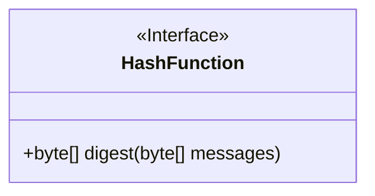
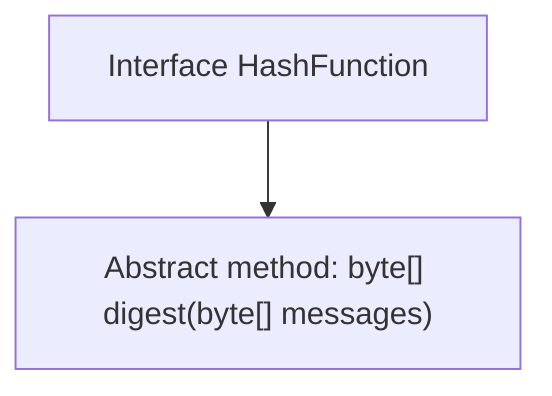

# Basic Information

|      |      |
|------|------|
| Name | HashFunction |
| Language | .java |
| Code Path | WeFe/mpc/mpc-common/src/main/java/com/welab/wefe/mpc/pir/protocol/ro/hf/HashFunction.java |
| Package Name | com.welab.wefe.mpc.pir.protocol.ro.hf |
| Dependencies | [] |
| Brief Description | Hash function interface, defining the digest method, with both input and output as byte arrays. |

# Description

The content defines a public interface named HashFunction, which includes a digest method. This method takes a parameter messages of type byte array and returns a byte array. The interface is used to abstract the computation functionality of hash functions, allowing the implementation of specific hash algorithms to generate message digests.

# Class Summary

| Name   | Type  | Description |
|-------|------|-------------|
| HashFunction | interface | The HashFunction interface defines a digest method, with both input and output being byte arrays. |

## Class HashFunction

|      |      |
|------|------|
| Access Modifier | public |
| Type | interface |
| Name | HashFunction |
| Description | The HashFunction interface defines a digest method, with both input and output being byte arrays. |

### UML Class Diagram

This code defines an interface named HashFunction, which declares a digest method that takes a byte array as the message parameter and returns a byte array result. In the class diagram, the interface is marked with <<Interface>>, indicating it is an abstract type that only defines method signatures without implementations. This interface might be used in hash computation scenarios, where concrete implementation classes would carry out different hash algorithm logic, such as MD5, SHA-1, etc. The simplicity of the interface design makes it easy to extend and adheres to the Single Responsibility Principle.

### Internal Method Call Graph

This flowchart illustrates the structure of the HashFunction interface, which defines an abstract method named `digest` that takes a byte array as input and returns a byte array. Since this is an interface, all methods are abstract by default, so no implementation details are required. The flowchart clearly reflects the interface's single responsibility—providing message digest functionality, which is the core operation of hash algorithms.

### Field List

| Name  | Type  | Description |
|-------|-------|------|

### Method List

| Name  | Type  | Description |
|-------|-------|------|
| digest | byte[] | Calculate the byte array digest of the message. |

