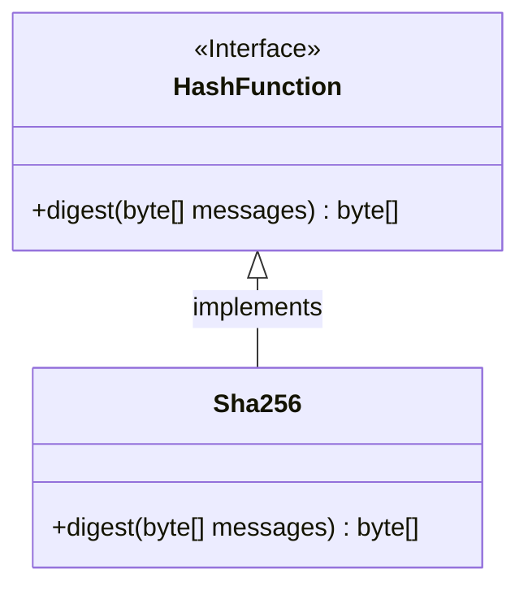
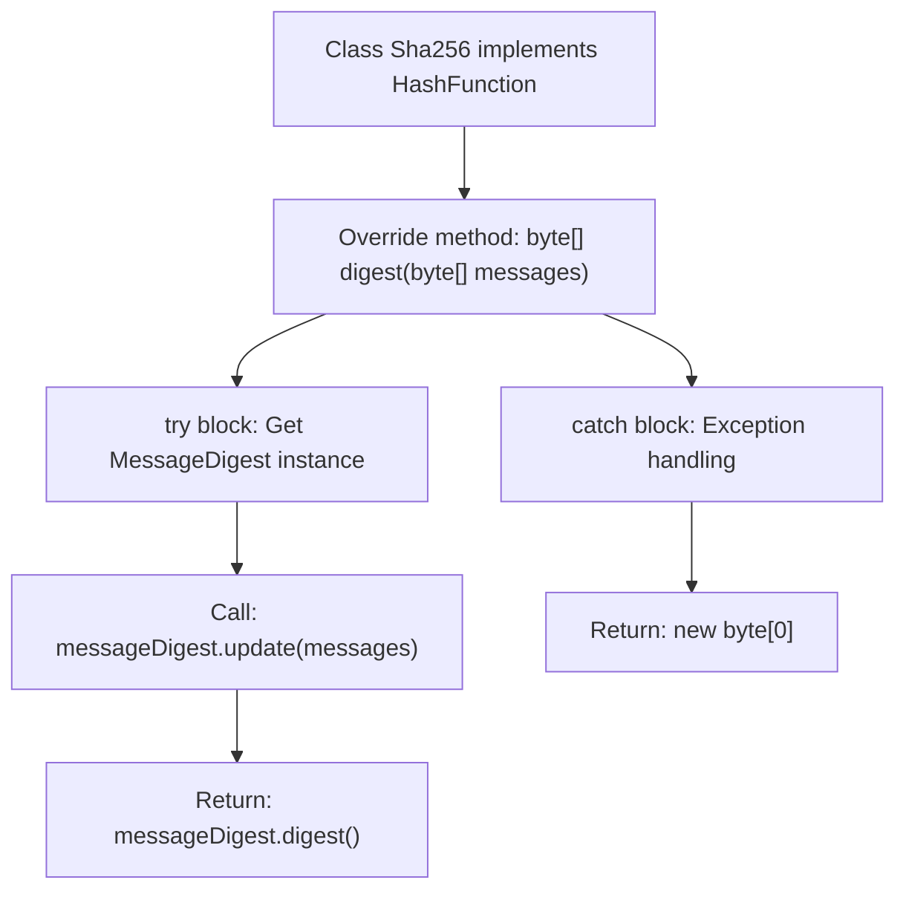

# Basic Information

|      |      |
|------|------|
| Name | Sha256 |
| Language | .java |
| Code Path | WeFe/mpc/mpc-common/src/main/java/com/welab/wefe/mpc/pir/protocol/ro/hf/Sha256.java |
| Package Name | com.welab.wefe.mpc.pir.protocol.ro.hf |
| Dependencies | ['java.security.MessageDigest'] |
| Brief Description | The Sha256 class implements the HashFunction interface, using the SHA-256 algorithm to generate hash values for input byte arrays, and returns an empty byte array in case of exceptions. |

# Description

The content describes a class named Sha256, which implements the HashFunction interface. This class includes a digest method that takes a byte array as the input message and generates a hash value using the SHA-256 algorithm. Internally, the method obtains a SHA-256 instance through the MessageDigest class, updates the message, and computes the digest. If an exception occurs, the method returns an empty byte array. The entire process demonstrates a basic implementation of the SHA-256 hashing functionality.

# Class Summary

| Name   | Type  | Description |
|-------|------|-------------|
| Sha256 | class | The Sha256 class implements the HashFunction interface, using the SHA-256 algorithm to generate a hash value from the input byte array, and returns an empty array in case of exceptions. |

## Class Sha256

|      |      |
|------|------|
| Access Modifier | public |
| Type | class |
| Name | Sha256 |
| Description | The Sha256 class implements the HashFunction interface, using the SHA-256 algorithm to generate a hash value from the input byte array, and returns an empty array in case of exceptions. |

### UML Class Diagram

This code demonstrates a `Sha256` class that implements the `HashFunction` interface for computing SHA-256 hash values. The `Sha256` class overrides the `digest` method from the interface, generating hash values for input byte arrays using Java's `MessageDigest` class. The class diagram clearly illustrates the inheritance relationship between the interface and its implementing class, with `Sha256` providing concrete hash computation functionality. When input exceptions occur, the method returns an empty byte array as fault-tolerant handling. The entire design adheres to object-oriented principles, where the interface defines the standard and the implementing class delivers the specific algorithm.

### Internal Method Call Graph

This flowchart describes the execution flow of the digest method in the Sha256 class. It first obtains an instance of the SHA-256 algorithm, then updates the message content and generates the digest. If an exception occurs, it returns an empty byte array. The entire process demonstrates the complete processing chain from message input to hash output, including both normal flow and exception handling paths, reflecting the secure implementation approach of cryptographic hash functions.

### Field List

| Name  | Type  | Description |
|-------|-------|------|

### Method List

| Name  | Type  | Description |
|-------|-------|------|
| digest | byte[] | Java Method: Generates a digest for the input byte array using the SHA-256 algorithm, returns an empty array in case of an exception. |

