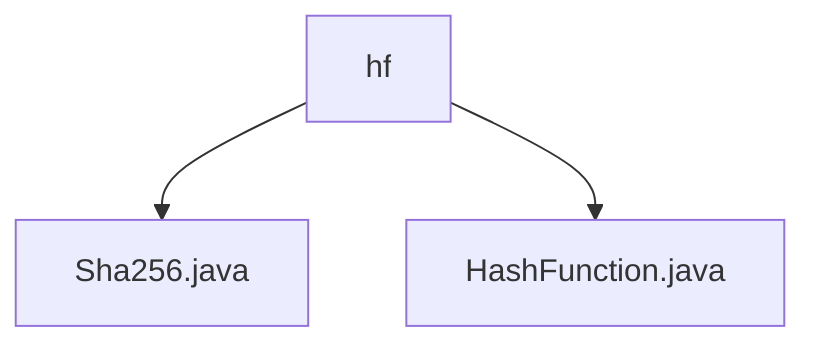

# Basic Information

|      |      |
|------|------|
| Name | hf |
| Language | .java |
| Code Path | WeFe/mpc/mpc-common/src/main/java/com/welab/wefe/mpc/pir/protocol/ro/hf |
| Package Name | docs.mpc.mpc-common.src.main.java.com.welab.wefe.mpc.pir.protocol.ro.hf |
| Brief Description | The Sha256 class implements the HashFunction interface, providing a digest method that generates hash values using the SHA-256 algorithm and returns an empty array in case of exceptions. The HashFunction interface defines hash computation functionality. |

# Description

## Overview  
The core responsibility of this module is to implement hash computation functionality based on the SHA-256 algorithm, providing extensible hash services through a design pattern that separates abstract interfaces from concrete implementations. The interface specification defines a unified `digest` method, which accepts a byte array as input and returns the hash value. For example, the `Sha256` class implements this interface and handles exception cases. The key data structure is solely the raw byte array, relying on Java's native `MessageDigest` class for cryptographic operations.  

## Primary Business Scenarios  
This module is suitable for scenarios requiring message digest generation, such as data integrity verification or basic digital signature operations. A typical usage pattern involves the caller injecting a concrete implementation (e.g., `Sha256`) through the `HashFunction` interface, passing in the message, and obtaining the hash value. The API type is a single-function interface, with integration examples demonstrating a standard SHA-256 algorithm implementation, such as fault-tolerant logic that returns an empty array when handling exceptions. The interaction model follows a simple "input-compute-output" workflow.

### Package Internal Structure View

This flowchart illustrates two Java files under the `hf` directory: `Sha256.java` and `HashFunction.java`. Both files are directly subordinate to the `hf` directory with no deeper subdirectory hierarchy. The diagram clearly depicts the dependency relationship between the files and their parent directory, aligning with the given path information.

# File List

| Name   | Type  | Description |
|-------|------|-------------|
| [Sha256.java](Sha256.md) | file | The Sha256 class implements the HashFunction interface, using the SHA-256 algorithm to generate hash values for input byte arrays, and returns an empty byte array in case of exceptions. |
| [HashFunction.java](HashFunction.md) | file | Hash function interface, defining the digest method, with both input and output as byte arrays. |

