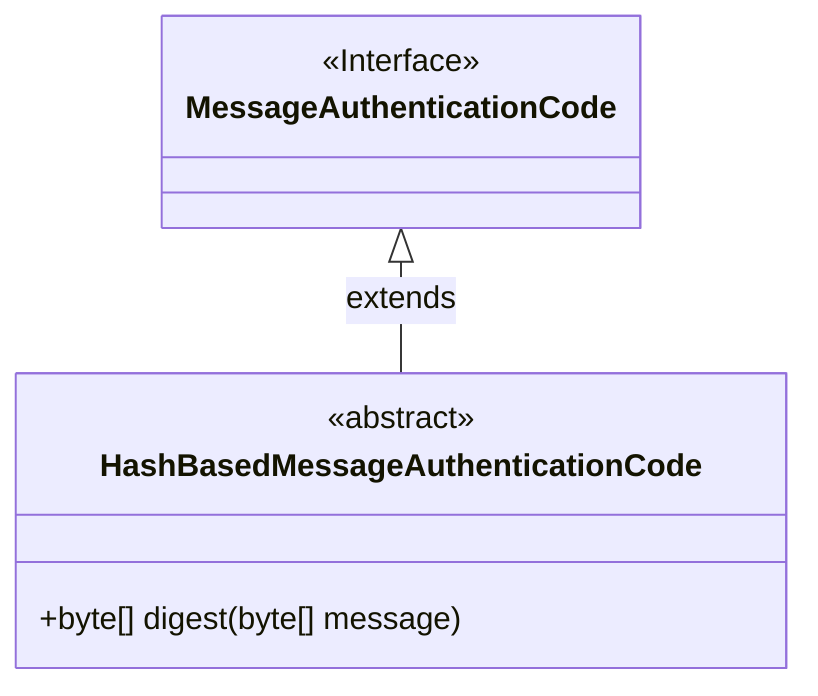
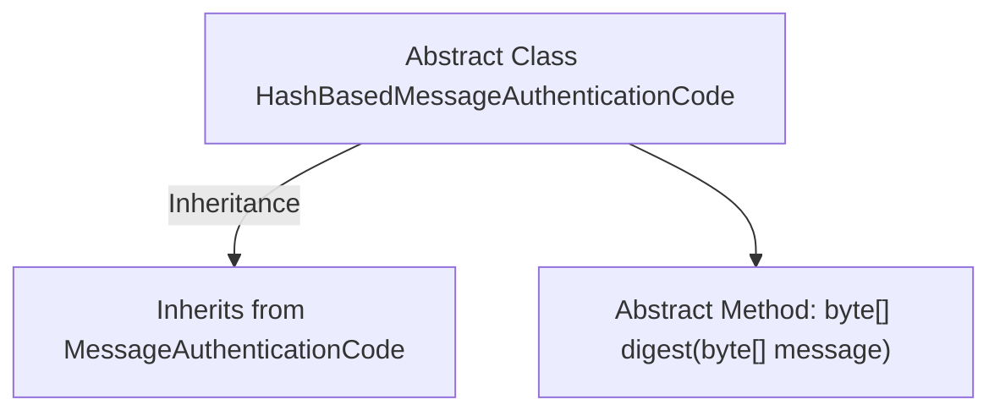

# Basic Information

|      |      |
|------|------|
| Name | HashBasedMessageAuthenticationCode |
| Language | .java |
| Code Path | WeFe/mpc/mpc-common/src/main/java/com/welab/wefe/mpc/pir/protocol/ro/mac/HashBasedMessageAuthenticationCode.java |
| Package Name | com.welab.wefe.mpc.pir.protocol.ro.mac |
| Dependencies | [] |
| Brief Description | The abstract class HashBasedMessageAuthenticationCode inherits from MessageAuthenticationCode, defining the digest method `digest`, which accepts a byte array message and returns a byte array digest. |

# Description

This content defines an abstract class named `HashBasedMessageAuthenticationCode`, which inherits from the `MessageAuthenticationCode` class. The class includes an abstract method `digest` that accepts a `byte` array parameter named `message` and returns a `byte` array. This abstract class is primarily used for hash-based message authentication code functionality, requiring subclasses to implement the `digest` method to perform specific message digest calculations.

# Class Summary

| Name   | Type  | Description |
|-------|------|-------------|
| HashBasedMessageAuthenticationCode | class | The abstract class HashBasedMessageAuthenticationCode inherits from MessageAuthenticationCode, defining the digest method which takes a byte array message and returns a byte array result. |

## Class HashBasedMessageAuthenticationCode

|      |      |
|------|------|
| Access Modifier | public abstract |
| Type | class |
| Name | HashBasedMessageAuthenticationCode |
| Description | The abstract class HashBasedMessageAuthenticationCode inherits from MessageAuthenticationCode, defining the digest method which takes a byte array message and returns a byte array result. |

### UML Class Diagram

This class diagram illustrates a cryptography-related class structure. HashBasedMessageAuthenticationCode is an abstract class that inherits from the MessageAuthenticationCode interface. It defines an abstract method digest for generating message authentication codes from input messages. This structure is commonly used to implement hash-based message authentication functionality, providing a foundational framework for concrete implementation classes.

### Internal Method Call Graph

This flowchart illustrates the structure of the abstract class `HashBasedMessageAuthenticationCode`, which inherits from the base class `MessageAuthenticationCode` and declares an abstract method named `digest`. The diagram clearly demonstrates the inheritance relationship between classes and the definition of abstract methods, aligning with the object-oriented design principle where abstract classes serve as templates for base classes. The arrow directions accurately represent the inheritance relationship from child class to parent class, as well as the containment relationship of a class to its own methods.

### Field List

| Name  | Type  | Description |
|-------|-------|------|

### Method List

| Name  | Type  | Description |
|-------|-------|------|
| digest | byte[] | The abstract method `digest` takes a byte array `message` as input and returns a byte array representing its digest result. |

