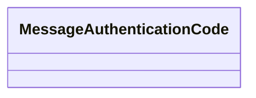

# Basic Information

|      |      |
|------|------|
| Name | MessageAuthenticationCode |
| Language | .java |
| Code Path | WeFe/mpc/mpc-common/src/main/java/com/welab/wefe/mpc/pir/protocol/ro/mac/MessageAuthenticationCode.java |
| Package Name | com.welab.wefe.mpc.pir.protocol.ro.mac |
| Dependencies | [] |
| Brief Description | Message Authentication Code class, used for data integrity verification. |

# Description

This is a public Java class named MessageAuthenticationCode, designed to implement message authentication code functionality. Currently, the class is an empty implementation without any member variables or methods, but it provides a foundational framework structure for subsequent implementations of message authentication code algorithms (such as HMAC). As a security-related class, it is typically used to verify data integrity and authenticity.

# Class Summary

| Name   | Type  | Description |
|-------|------|-------------|
| MessageAuthenticationCode | class | Message Authentication Code class, used for data integrity verification and identity authentication. |

## Class MessageAuthenticationCode

|      |      |
|------|------|
| Access Modifier | public |
| Type | class |
| Name | MessageAuthenticationCode |
| Description | Message Authentication Code class, used for data integrity verification and identity authentication. |

### UML Class Diagram

This class diagram illustrates an empty class structure named MessageAuthenticationCode. The class currently has no defined attributes or methods and serves solely as a foundational framework for message authentication codes. In cryptography, message authentication codes are typically used to verify message integrity and authenticity. Core functionalities such as key management, hash computation, and verification can be added later as extensions. The diagram clearly reflects the current minimalistic class structure, providing a foundational framework for future functional expansion.

### Internal Method Call Graph

This flowchart depicts an empty class structure named MessageAuthenticationCode. The diagram contains only a single node representing the class itself, with no additional connected nodes since the class has no defined attributes or methods. Such a structure typically serves as a starting point for a code framework, where MAC algorithm-related properties and methods (such as key management, hash computation, verification logic, etc.) can be added later. The current diagram reflects the most basic state of a class declaration, conforming to the initial definition form of a class in object-oriented programming.

### Field List

| Name  | Type  | Description |
|-------|-------|------|

### Method List

| Name  | Type  | Description |
|-------|-------|------|

