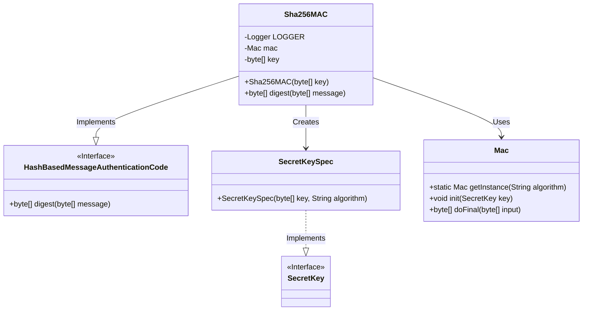
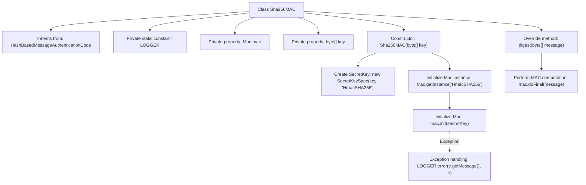

# Basic Information

|      |      |
|------|------|
| Name | Sha256MAC |
| Language | .java |
| Code Path | WeFe/mpc/mpc-common/src/main/java/com/welab/wefe/mpc/pir/protocol/ro/mac/Sha256MAC.java |
| Package Name | com.welab.wefe.mpc.pir.protocol.ro.mac |
| Dependencies | ['org.slf4j.Logger', 'org.slf4j.LoggerFactory', 'javax.crypto.Mac', 'javax.crypto.SecretKey', 'javax.crypto.spec.SecretKeySpec'] |
| Brief Description | The Sha256MAC class implements message authentication code functionality based on the HmacSHA256 algorithm, initializing a Mac instance with a key and providing a digest method to generate message digests. |

# Description

The Sha256MAC class inherits from HashBasedMessageAuthenticationCode and implements message authentication code functionality based on the SHA-256 algorithm. This class contains a Mac instance and a key byte array as member variables. The constructor accepts a key byte array, creates a SecretKeySpec key using the HmacSHA256 algorithm mode, and initializes the Mac instance. If initialization fails, an error log is recorded. The digest method accepts a message byte array, invokes the doFinal method of the Mac instance to generate an authentication code, and returns it. The entire class focuses on providing message authentication functionality using the SHA-256 algorithm.

# Class Summary

| Name   | Type  | Description |
|-------|------|-------------|
| Sha256MAC | class | The Sha256MAC class implements message authentication code functionality based on the HmacSHA256 algorithm, initializing with a secret key to generate message digests. |

## Class Sha256MAC

|      |      |
|------|------|
| Access Modifier | public |
| Type | class |
| Name | Sha256MAC |
| Description | The Sha256MAC class implements message authentication code functionality based on the HmacSHA256 algorithm, initializing with a secret key to generate message digests. |

### UML Class Diagram

This class diagram illustrates the implementation structure of SHA-256 Message Authentication Code. The Sha256MAC class implements the HashBasedMessageAuthenticationCode interface, with its core functionality being message digest calculation via the Mac class. It uses SecretKeySpec to create keys and captures exceptions during the initialization process. The overall design follows standard patterns for cryptographic services, leveraging Java's core cryptographic classes to achieve security functions while maintaining robust exception handling mechanisms.

### Internal Method Call Graph

This flowchart illustrates the complete structure and workflow of the Sha256MAC class. The class inherits from HashBasedMessageAuthenticationCode and contains LOGGER constant along with mac/key properties. The constructor handles HmacSHA256 algorithm key initialization and Mac instance configuration, with exception handling for error logging. The digest method delegates the final message authentication code computation to the mac instance. The entire process highlights critical security operations such as key handling, algorithm initialization, and exception management.

### Field List

| Name  | Type  | Description |
|-------|-------|------|
| mac | Mac | Declare a Mac class object named mac. |
| LOGGER = LoggerFactory.getLogger(Sha256MAC.class) | Logger | Defined a private static immutable logger instance for logging output in the Sha256MAC class. |
| key | byte[] | Declare a byte array variable named key. |

### Method List

| Name  | Type  | Description |
|-------|-------|------|
| digest | byte[] | This method takes a byte array message as input, generates its digest byte array using the MAC algorithm, and returns it. |

