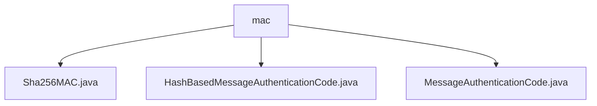

# Basic Information

|      |      |
|------|------|
| Name | mac |
| Language | .java |
| Code Path | WeFe/mpc/mpc-common/src/main/java/com/welab/wefe/mpc/pir/protocol/ro/mac |
| Package Name | docs.mpc.mpc-common.src.main.java.com.welab.wefe.mpc.pir.protocol.ro.mac |
| Brief Description | The Sha256MAC class inherits from HashBasedMessageAuthenticationCode, implementing SHA-256 message authentication code functionality. It contains a key and a Mac instance, providing a digest method to generate authentication codes. HashBasedMessageAuthenticationCode is an abstract class that requires subclasses to implement the digest method. MessageAuthenticationCode is the foundational framework class used for message authentication code functionality. |

# Description

## Overview  
This module implements Hash-based Message Authentication Code (MAC) functionality, with its core responsibility being to provide security support for data integrity and authenticity verification. It adopts a three-tier inheritance structure: the top-level MessageAuthenticationCode serves as the foundational framework, the middle-layer HashBasedMessageAuthenticationCode defines abstract digest methods, and the bottom-layer Sha256MAC implements the specific authentication logic of the SHA-256 algorithm.  

Key data structures include a secret key byte array and a message byte array, with the key format converted via SecretKeySpec. External dependencies are limited to Java standard library classes such as Mac and cryptography-related classes. For example, Sha256MAC initializes a Mac instance using the HmacSHA256 algorithm mode and generates the authentication code through doFinal.  

## Primary Business Scenarios  
The module is suitable for secure communication scenarios requiring tamper-proof data verification, similar to the integrity check mechanism of HTTPS. A typical workflow involves configuring the key during initialization and generating an authentication code for the input message during the processing phase. For instance, in secure multi-party computation, the SHA-256 algorithm can ensure transmitted data remains untampered.  

The interaction model uniformly follows a two-step operation of key initialization + message digest, supporting byte arrays as a universal data carrier. All implementations adhere to the basic "key-message-authentication code" model. For example, Sha256MAC inherits the abstract class to implement specific hash computation logic, forming a complete message authentication chain.

### Package Internal Structure View

This flowchart illustrates three Java files under the mac directory: Sha256MAC.java, HashBasedMessageAuthenticationCode.java, and MessageAuthenticationCode.java. All three files are directly subordinate to the mac directory with no deeper nesting, belonging to the same level of implementation class files.

# File List

| Name   | Type  | Description |
|-------|------|-------------|
| [Sha256MAC.java](Sha256MAC.md) | file | The Sha256MAC class implements message authentication code functionality based on the HmacSHA256 algorithm, initializing a Mac instance with a key and providing a digest method to generate message digests. |
| [HashBasedMessageAuthenticationCode.java](HashBasedMessageAuthenticationCode.md) | file | The abstract class `HashBasedMessageAuthenticationCode` inherits from `MessageAuthenticationCode`, defining the digest method `digest`, which accepts a byte array message and returns a byte array digest. |
| [MessageAuthenticationCode.java](MessageAuthenticationCode.md) | file | Message Authentication Code class, used for data integrity verification. |

