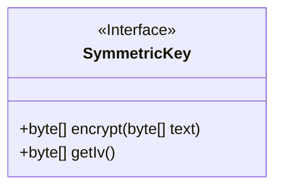
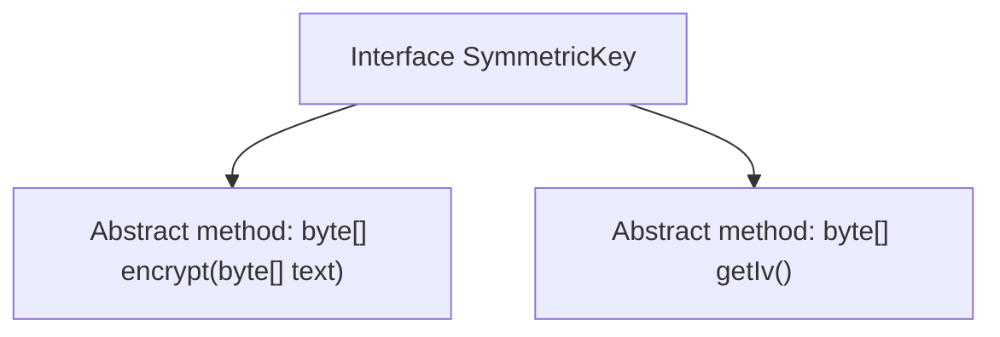

# Basic Information

|      |      |
|------|------|
| Name | SymmetricKey |
| Language | .java |
| Code Path | WeFe/mpc/mpc-common/src/main/java/com/welab/wefe/mpc/pir/protocol/se/SymmetricKey.java |
| Package Name | com.welab.wefe.mpc.pir.protocol.se |
| Dependencies | [] |
| Brief Description | The symmetric key interface defines encryption methods, with both input and output being byte arrays, and provides a method to obtain the initialization vector. |

# Description

The content defines a public interface named SymmetricKey, which includes two core methods. The encrypt method takes plaintext input in the form of a byte array and returns the encrypted byte array result. The getIv method is used to obtain the initialization vector (IV), returning the byte array representation of the IV. This interface clarifies the basic functional requirements for symmetric key encryption, emphasizing data encryption and initialization vector retrieval capabilities, making it suitable for scenarios requiring symmetric encryption.

# Class Summary

| Name   | Type  | Description |
|-------|------|-------------|
| SymmetricKey | interface | Symmetric key interface defines encryption methods: encrypt processes byte arrays, getIv retrieves the initialization vector. |

## Class SymmetricKey

|      |      |
|------|------|
| Access Modifier | public |
| Type | interface |
| Name | SymmetricKey |
| Description | Symmetric key interface defines encryption methods: encrypt processes byte arrays, getIv retrieves the initialization vector. |

### UML Class Diagram

This code defines an interface named `SymmetricKey`, which specifies two core methods that symmetric encryption algorithms must implement: `encrypt` for encrypting byte array data and returning the encrypted byte array, and `getIv` for retrieving the initialization vector (IV). The interface is explicitly marked as abstract with the `<<Interface>>` notation, and both methods are public, reflecting the core functionalities of data encryption and key management in symmetric encryption. This interface can serve as a unified abstraction layer for various symmetric encryption algorithms (e.g., AES, DES).

### Internal Method Call Graph

This flowchart illustrates the structure of the SymmetricKey interface, which defines two core abstract methods: encrypt for encrypting byte arrays and getIv for obtaining the initialization vector. As an abstract specification for symmetric key encryption, all classes implementing this interface must provide concrete implementations of these two methods. The diagram clearly shows the hierarchical relationship between the interface and its methods, highlighting the interface's role as a behavioral contract.

### Field List

| Name  | Type  | Description |
|-------|-------|------|

### Method List

| Name  | Type  | Description |
|-------|-------|------|
| encrypt | byte[] | Encryption function, both input and output are byte arrays. |
| getIv | byte[] | Method for obtaining the byte array of the initialization vector (IV). |

