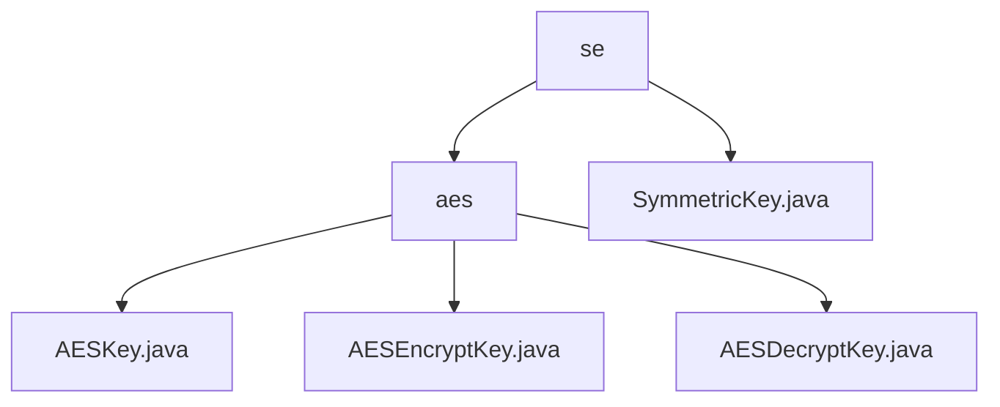

# Basic Information

|      |      |
|------|------|
| Name | se |
| Language | .java |
| Code Path | WeFe/mpc/mpc-common/src/main/java/com/welab/wefe/mpc/pir/protocol/se |
| Package Name | docs.mpc.mpc-common.src.main.java.com.welab.wefe.mpc.pir.protocol.se |
| Brief Description | AES symmetric encryption module, including key management, encryption and decryption functions, supports automatic IV generation and strict matching, suitable for privacy protection scenarios. Depends on Java Cryptography Extension and complies with the SymmetricKey interface specification. |

# Description

## Overview  
This module implements the complete AES symmetric encryption workflow, with core responsibilities covering key management and encryption/decryption operations. It standardizes encryption behavior through the SymmetricKey interface, with the abstract class AESKey deriving encryption/decryption subclasses. Key data structures include a 16-byte IV and a key byte array, adhering to the AES/CBC/PKCS5Padding standard. External dependencies are limited to Java Cryptography Extension. For instance, the IV auto-completion mechanism resembles the TLS random number strategy to ensure security.  

## Primary Business Scenarios  
It supports two modes: automatic IV generation during encryption and explicit IV usage during decryption, both uniformly interacting via the encrypt method. Typical use cases include secure multi-party computation, such as triggering random IV generation when the provided IV is under 16 bytes during encryption, while decryption requires strict matching of the original IV. The module fully covers key generation, data encryption/decryption, and exception handling, analogous to the HTTPS handshake process. The API primarily focuses on the encrypt/getIv methods of the SymmetricKey interface.

### Package Internal Structure View

This flowchart illustrates the hierarchical structure under the SE protocol directory, with the top-level "se" folder containing the "aes" subdirectory and the "SymmetricKey.java" file. The "aes" directory further includes three AES-related key class files: AESKey.java, AESEncryptKey.java, and AESDecryptKey.java, clearly presenting the file organization of the symmetric encryption protocol module.

# File List

| Name   | Type  | Description |
|-------|------|-------------|
| [SymmetricKey.java](SymmetricKey.md) | file | The symmetric key interface defines encryption methods, with both input and output being byte arrays, and provides a way to obtain the initialization vector. |
| [aes](aes/_module.md) | package | The AESKey abstract class encapsulates AES keys and IV, containing key, iv, and cipher variables, with the constructor handling IV generation. AESEncryptKey and AESDecryptKey implement encryption and decryption respectively, using the AES/CBC/PKCS5Padding mode, providing construction, initialization, and operational functionalities, with exceptions logged. |

