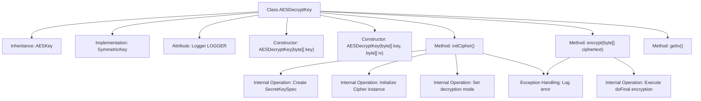

# Basic Information

|      |      |
|------|------|
| Name | AESDecryptKey |
| Language | .java |
| Code Path | WeFe/mpc/mpc-common/src/main/java/com/welab/wefe/mpc/pir/protocol/se/aes/AESDecryptKey.java |
| Package Name | com.welab.wefe.mpc.pir.protocol.se.aes |
| Dependencies | ['com.welab.wefe.mpc.pir.protocol.se.SymmetricKey', 'org.slf4j.Logger', 'org.slf4j.LoggerFactory', 'javax.crypto.Cipher', 'javax.crypto.spec.IvParameterSpec', 'javax.crypto.spec.SecretKeySpec', 'java.security.Key'] |
| Brief Description | AES decryption key class, inherits from AESKey and implements the SymmetricKey interface, provides decryption initialization, encryption method (actually used for decryption), and IV retrieval functionality, includes exception handling and logging. |

# Description

The AESDecryptKey class inherits from AESKey and implements the SymmetricKey interface, designed for AES decryption operations. This class contains two constructors that accept either a key or a key plus an initialization vector as parameters. The core method initCipher initializes the Cipher instance for decryption using the AES/CBC/PKCS5Padding mode. The encrypt method performs the decryption operation and returns the plaintext, while the getIv method retrieves the initialization vector. Exception handling is implemented through LOGGER to record error logs.

# Class Summary

| Name   | Type  | Description |
|-------|------|-------------|
| AESDecryptKey | class | AES decryption key class, inherits from AESKey and implements the SymmetricKey interface, provides decryption initialization, encryption methods, and IV retrieval functionality, logs exceptions when errors occur. |


## Class AESDecryptKey

|      |      |
|------|------|
| Access Modifier | public |
| Type | class |
| Name | AESDecryptKey |
| Description | AES decryption key class, inherits from AESKey and implements the SymmetricKey interface, provides decryption initialization, encryption methods, and IV retrieval functionality, logs exceptions when errors occur. |


### UML Class Diagram

```mermaid
classDiagram
    class AESKey {
        -byte[] key
        -byte[] iv
        -Cipher cipher
        +AESKey(byte[] key, byte[] iv)
    }

    class AESDecryptKey {
        -static Logger LOGGER
        +AESDecryptKey(byte[] key)
        +AESDecryptKey(byte[] key, byte[] iv)
        +initCipher() void
        +encrypt(byte[] ciphertext) byte[]
        +getIv() byte[]
    }

    <<Interface>> SymmetricKey {
        <<abstract>>
        +initCipher() void
        +encrypt(byte[] ciphertext) byte[]
        +getIv() byte[]
    }

    AESKey <|-- AESDecryptKey
    SymmetricKey <|.. AESDecryptKey
```

This class diagram illustrates the structure where AESDecryptKey inherits from AESKey and implements the SymmetricKey interface. AESDecryptKey includes methods for decryption initialization, encryption operations, and obtaining the initialization vector, with exceptions logged via LOGGER. AESKey serves as the parent class providing the foundation for key and initialization vector storage, while the SymmetricKey interface defines the basic operational specifications for symmetric keys.


### Internal Method Call Graph



This code flowchart illustrates the complete structure of the AESDecryptKey class, which inherits from AESKey and implements the SymmetricKey interface. The core process includes two constructors for initializing the key and IV vector, the initCipher() method configuring AES/CBC/PKCS5Padding decryption mode via SecretKeySpec and Cipher instance, and the encrypt() method performing actual decryption operations with exception handling. All exceptions are logged through LOGGER, while getIv() provides IV vector access. The flowchart clearly presents class inheritance relationships, method call chains, and exception handling paths.

### Field List

| Name  | Type  | Description |
|-------|-------|------|
| LOGGER = LoggerFactory.getLogger(AESDecryptKey.class) | Logger | A private static constant logger named LOGGER is defined for logging output in the AESDecryptKey class. |

### Method List

| Name  | Type  | Description |
|-------|-------|------|
| initCipher | void | Initialize the AES decryptor using CBC mode and PKCS5 padding, handle exceptions and log them. |
| encrypt | byte[] | This method is used to encrypt a byte array, calling cipher.doFinal to process the input data. In case of an exception, it logs the error and returns an empty byte array. |
| getIv | byte[] | The method returns the iv byte array of the current object. |


