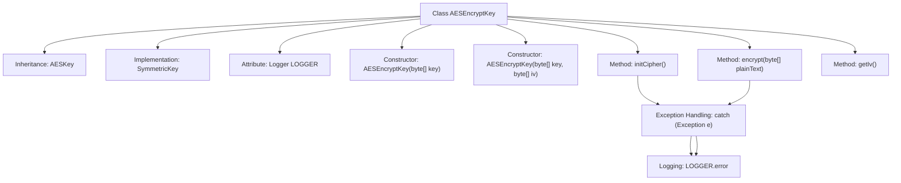

# Basic Information

|      |      |
|------|------|
| Name | AESEncryptKey |
| Language | .java |
| Code Path | WeFe/mpc/mpc-common/src/main/java/com/welab/wefe/mpc/pir/protocol/se/aes/AESEncryptKey.java |
| Package Name | com.welab.wefe.mpc.pir.protocol.se.aes |
| Dependencies | ['com.welab.wefe.mpc.pir.protocol.se.SymmetricKey', 'org.slf4j.Logger', 'org.slf4j.LoggerFactory', 'javax.crypto.Cipher', 'javax.crypto.spec.IvParameterSpec', 'javax.crypto.spec.SecretKeySpec', 'java.security.Key'] |
| Brief Description | The AESEncryptKey class implements symmetric key encryption, inherits from AESKey, supports initializing the encryptor and performing encryption operations, uses AES/CBC/PKCS5Padding mode, and includes error logging. |

# Description

The AESEncryptKey class inherits from AESKey and implements the SymmetricKey interface, designed for AES encryption operations. This class contains two constructors that accept a key and an optional initialization vector (IV) respectively. The initCipher method configures the AES/CBC/PKCS5Padding encryption mode. The encrypt method performs encryption and returns the result, logging errors and returning an empty array when failures occur. The getIv method retrieves the initialization vector. All exceptions are caught and logged via a logger.

# Class Summary

| Name   | Type  | Description |
|-------|------|-------------|
| AESEncryptKey | class | AES encryption key class, inherits from AESKey and implements the SymmetricKey interface, supports key and IV initialization, provides encryption methods and IV retrieval functionality, using AES/CBC/PKCS5Padding mode. |


## Class AESEncryptKey

|      |      |
|------|------|
| Access Modifier | public |
| Type | class |
| Name | AESEncryptKey |
| Description | AES encryption key class, inherits from AESKey and implements the SymmetricKey interface, supports key and IV initialization, provides encryption methods and IV retrieval functionality, using AES/CBC/PKCS5Padding mode. |


### UML Class Diagram

```mermaid
classDiagram
    class AESKey {
        -byte[] key
        -byte[] iv
        -Cipher cipher
        +AESKey(byte[] key, byte[] iv)
    }

    class AESEncryptKey {
        -static Logger LOGGER
        +AESEncryptKey(byte[] key)
        +AESEncryptKey(byte[] key, byte[] iv)
        +void initCipher()
        +byte[] encrypt(byte[] plainText)
        +byte[] getIv()
    }

    <<Interface>> SymmetricKey {
        <<interface>>
        +void initCipher()
        +byte[] encrypt(byte[] plainText)
        +byte[] getIv()
    }

    AESKey <|-- AESEncryptKey
    SymmetricKey <|.. AESEncryptKey
```

Class diagram description: The AESEncryptKey class inherits from the AESKey base class and implements the SymmetricKey interface, designed for AES encryption operations. It includes methods such as initializing the cipher (initCipher), encrypting data (encrypt), and obtaining the initialization vector (getIv). The AES/CBC/PKCS5Padding encryption algorithm is implemented through SecretKeySpec and Cipher. LOGGER is used to record exception information, reflecting a robust error-handling mechanism.


### Internal Method Call Graph



This code demonstrates an AES encryption key class that inherits from AESKey and implements the SymmetricKey interface. Its core functionalities include cipher initialization (initCipher), encryption execution (encrypt), and initialization vector retrieval (getIv). The flowchart clearly presents the class structure, constructors, core method call chains, and exception handling paths, where both encryption operations and initialization processes incorporate exception catching and logging mechanisms.

### Field List

| Name  | Type  | Description |
|-------|-------|------|
| LOGGER = LoggerFactory.getLogger(AESEncryptKey.class) | Logger | The AESEncryptKey class defines a static immutable logger instance. |

### Method List

| Name  | Type  | Description |
|-------|-------|------|
| initCipher | void | Initialize the AES encryptor using CBC mode and PKCS5 padding, catch exceptions and log them. |
| encrypt | byte[] | Encryption method: Input byte array, encrypt using cipher, log exceptions and return empty array if an error occurs. |
| getIv | byte[] | Method to obtain the byte array of IV (Initialization Vector). |


