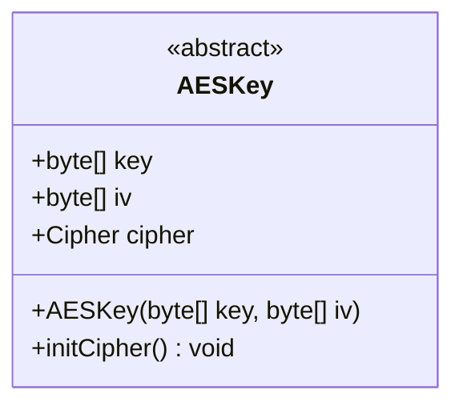
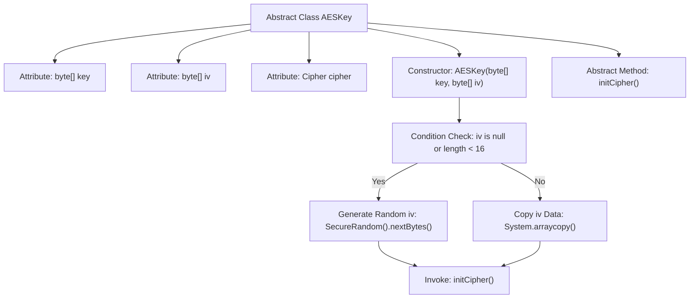

# Basic Information

|      |      |
|------|------|
| Name | AESKey |
| Language | .java |
| Code Path | WeFe/mpc/mpc-common/src/main/java/com/welab/wefe/mpc/pir/protocol/se/aes/AESKey.java |
| Package Name | com.welab.wefe.mpc.pir.protocol.se.aes |
| Dependencies | ['javax.crypto.Cipher', 'java.security.SecureRandom'] |
| Brief Description | The AESKey abstract class contains a key, a 16-byte IV, and a Cipher object. The constructor handles IV initialization and calls the abstract method initCipher. |

# Description

This is an abstract class AESKey, used to encapsulate the key and initialization vector related to AES encryption. The class contains three member variables: the key byte array stores the key, the iv byte array stores the 16-byte initialization vector, and the cipher object is used for encryption operations. The constructor takes key and iv parameters; if iv is empty or less than 16 bytes, a random iv is generated, otherwise the first 16 bytes are copied. The abstract method initCipher needs to be implemented by subclasses to initialize the cipher.

# Class Summary

| Name   | Type  | Description |
|-------|------|-------------|
| AESKey | class | The AESKey abstract class contains the key, iv, and cipher fields. The constructor initializes the key and a 16-byte iv (randomly generated or copied from input) and calls the abstract method initCipher. |

## Class AESKey

|      |      |
|------|------|
| Access Modifier | public abstract |
| Type | class |
| Name | AESKey |
| Description | The AESKey abstract class contains the key, iv, and cipher fields. The constructor initializes the key and a 16-byte iv (randomly generated or copied from input) and calls the abstract method initCipher. |

### UML Class Diagram

This code defines an abstract class `AESKey` for managing the key and initialization vector (iv) required for AES encryption. The class contains three public fields: `key` stores the encryption key, `iv` stores a 16-byte initialization vector, and `cipher` stores the cipher instance. The constructor accepts key and iv parameters; if the iv is empty or less than 16 bytes, it is filled using a secure random number generator. The abstract method `initCipher()` requires subclasses to implement specific cipher initialization logic. This class provides a foundational framework for AES encryption, enforcing subclasses to complete the cipher initialization work.

### Internal Method Call Graph

This flowchart illustrates the structure and initialization process of the AESKey abstract class. The class contains three attributes and one constructor, where the iv initialization checks input parameters - generating random bytes if invalid, otherwise copying the first 16 bytes. Finally, it invokes the abstract method initCipher() to complete cipher initialization. The process clearly demonstrates conditional branching during object construction and the ultimate abstract method invocation.

### Field List

| Name  | Type  | Description |
|-------|-------|------|
| key | byte[] | Declare a byte array variable named key. |
| iv | byte[] | Declare a public variable named iv of type byte array. |
| cipher | Cipher | Declare a public variable named cipher of type Cipher class. |

### Method List

| Name  | Type  | Description |
|-------|-------|------|
| initCipher | void | Abstract method initCipher, used to initialize the cipher. |

