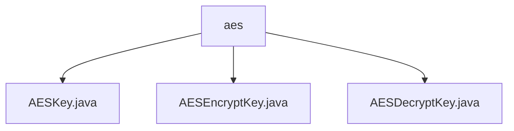

# Basic Information

|      |      |
|------|------|
| Name | aes |
| Language | .java |
| Code Path | WeFe/mpc/mpc-common/src/main/java/com/welab/wefe/mpc/pir/protocol/se/aes |
| Package Name | docs.mpc.mpc-common.src.main.java.com.welab.wefe.mpc.pir.protocol.se.aes |
| Brief Description | The AESKey abstract class encapsulates AES keys and IV, containing key, iv, and cipher variables, with the constructor handling IV generation. AESEncryptKey and AESDecryptKey implement encryption and decryption respectively, using the AES/CBC/PKCS5Padding mode, providing construction, initialization, and operational functionalities, with exceptions logged. |

# Description

## Overview  
This module provides a complete implementation of AES symmetric encryption, with core responsibilities including key management and encryption/decryption operations. The abstract class `AESKey` encapsulates the basic key structure, while its subclasses `AESEncryptKey` and `AESDecryptKey` implement encryption and decryption functionalities respectively, both adhering to the `SymmetricKey` interface specification. Key data structures include a key byte array and a 16-byte initialization vector (IV), employing the `AES/CBC/PKCS5Padding` standard mode. External dependencies are limited to the Java Cryptography Extension. For instance, the IV auto-completion mechanism ensures encryption security, resembling the random number generation strategy of the TLS protocol.  

## Key Business Scenarios  
The module supports two typical applications: automatically generating an IV during data encryption (similar to HTTPS handshakes) and explicitly passing the IV during decryption. The interaction mode uniformly executes operations via the `encrypt` method, with exceptions handled by a logger. For example, in encryption scenarios, an IV shorter than 16 bytes triggers random generation; decryption scenarios require strict matching of the IV used during encryption. The full functionality covers key generation, data encryption/decryption, and exception handling, making it suitable for privacy-preserving scenarios such as secure multi-party computation.

### Package Internal Structure View

This flowchart illustrates the hierarchical relationship of three key class files related to the AES encryption protocol under the aes directory. The files AESKey.java, AESEncryptKey.java, and AESDecryptKey.java are all directly located within the aes directory without any deeper subdirectory structure. These three files collectively form the foundational implementation components of the AES encryption protocol.

# File List

| Name   | Type  | Description |
|-------|------|-------------|
| [AESKey.java](AESKey.md) | file | The AESKey abstract class contains a key, a 16-byte IV, and a Cipher object. The constructor handles IV initialization and calls the abstract method initCipher. |
| [AESEncryptKey.java](AESEncryptKey.md) | file | The AESEncryptKey class implements symmetric key encryption, inherits from AESKey, supports initializing the encryptor and performing encryption operations, uses AES/CBC/PKCS5Padding mode, and includes error logging. |
| [AESDecryptKey.java](AESDecryptKey.md) | file | AES decryption key class, inherits from AESKey and implements the SymmetricKey interface, provides decryption initialization, encryption method (actually used for decryption), and IV retrieval functionality, includes exception handling and logging. |

