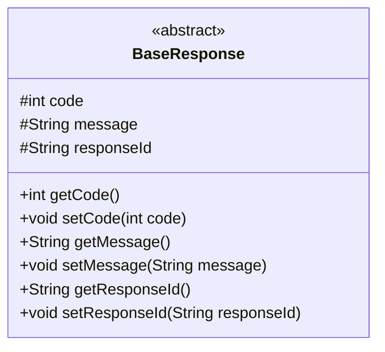
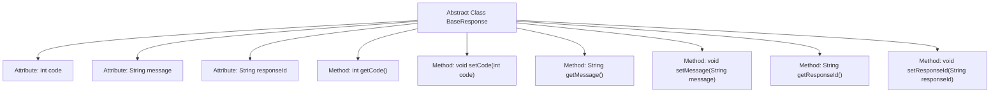

# Basic Information

|      |      |
|------|------|
| Name | BaseResponse |
| Language | .java |
| Code Path | WeFe/mpc/mpc-common/src/main/java/com/welab/wefe/mpc/pir/request/BaseResponse.java |
| Package Name | com.welab.wefe.mpc.pir.request |
| Dependencies | [] |
| Brief Description | The abstract class BaseResponse includes three attributes: code, message, and responseId, along with their corresponding getter and setter methods. |

# Description

BaseResponse is an abstract class that defines three protected member variables: code, message, and responseId. code is of integer type, while message and responseId are of string type. The class provides getter and setter methods for these three variables, which are used to retrieve and set their values, respectively. getCode returns the value of code, and setCode is used to set the value of code. getMessage returns the value of message, and setMessage is used to set the value of message. getResponseId returns the value of responseId, and setResponseId is used to set the value of responseId.

# Class Summary

| Name   | Type  | Description |
|-------|------|-------------|
| BaseResponse | class | The abstract class BaseResponse includes three attributes: code, message, and responseId, along with their corresponding getter and setter methods. |

## Class BaseResponse

|      |      |
|------|------|
| Access Modifier | public abstract |
| Type | class |
| Name | BaseResponse |
| Description | The abstract class BaseResponse includes three attributes: code, message, and responseId, along with their corresponding getter and setter methods. |

### UML Class Diagram

This class diagram illustrates an abstract base class BaseResponse, which contains three protected fields (code, message, responseId) along with their corresponding getter and setter methods. As an abstract class, it is designed to provide a common structure for concrete response classes, encapsulating basic attributes such as response status codes, messages, and unique identifiers, thereby facilitating derived classes to extend specific functionalities. All fields and methods use the # symbol to denote protected visibility, adhering to the encapsulation principles of object-oriented design.

### Internal Method Call Graph

This code defines an abstract class BaseResponse containing three protected attributes (code, message, responseId) and their corresponding getter/setter methods. The flowchart illustrates the hierarchical relationship between the class and its attributes/methods, with all methods directly linked to the abstract class without internal invocation relationships. This design provides a foundational structure for response objects, supporting standard operations for status codes, messages, and response IDs.

### Field List

| Name  | Type  | Description |
|-------|-------|------|
| code | int | The protected integer variable code. |
| message | String | The protected string type variable message. |
| responseId | String | Declared a protected string-type variable responseId. |

### Method List

| Name  | Type  | Description |
|-------|-------|------|
| setMessage | void | Methods for setting message content: assign the input parameter `message` to the `message` property of the current object. |
| getCode | int | This is a Java method that returns the value of the integer variable code. |
| setResponseId | void | This is a Java method used to set the value of the class's responseId property. The method takes a string parameter named responseId and assigns it to the class's member variable of the same name. |
| getResponseId | String | The method returns a responseId string. |
| getMessage | String | This is a Java method that returns the value of the string-type variable `message`. |
| setCode | void | Set the value of the integer variable code. |

