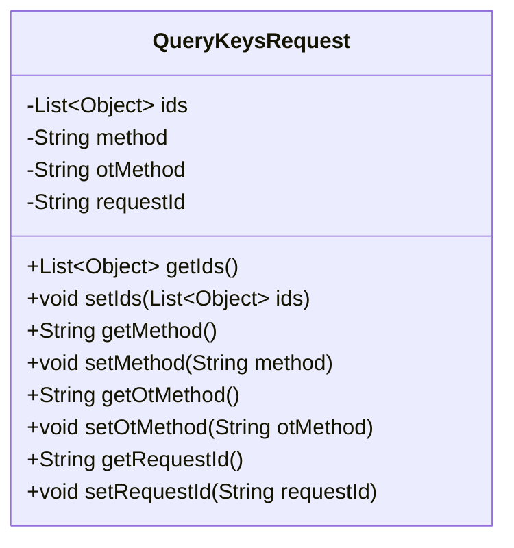

# Basic Information

|      |      |
|------|------|
| Name | QueryKeysRequest |
| Language | .java |
| Code Path | WeFe/mpc/mpc-common/src/main/java/com/welab/wefe/mpc/pir/request/QueryKeysRequest.java |
| Package Name | com.welab.wefe.mpc.pir.request |
| Dependencies | ['java.io.Serializable', 'java.util.List'] |
| Brief Description | The QueryKeysRequest class includes fields such as the ids list, the id encryption method, the oblivious transfer implementation otMethod, the request ID requestId, along with their corresponding getter and setter methods. |

# Description

QueryKeysRequest is a serializable Java class designed to encapsulate information related to key query requests. The class comprises four primary attributes: `ids` is a list of objects representing the set of IDs to be queried; the `method` field describes the encryption method for the IDs, supporting three types: plaintext, MD5, or SHA256; the `otMethod` field specifies the implementation method for oblivious transfer, with two supported options: `naorpinkas_ot` or `huack_ot`; and `requestId` serves as a unique identifier for the request. The class provides standard getter and setter methods for each attribute, facilitating access and modification of these field values.

# Class Summary

| Name   | Type  | Description |
|-------|------|-------------|
| QueryKeysRequest | class | The QueryKeysRequest class includes a list of ids, an id encryption method, an oblivious transfer implementation otMethod, and a requestId field, providing getter and setter methods for each field. |

## Class QueryKeysRequest

|      |      |
|------|------|
| Access Modifier | public |
| Type | class |
| Name | QueryKeysRequest |
| Description | The QueryKeysRequest class includes a list of ids, an id encryption method, an oblivious transfer implementation otMethod, and a requestId field, providing getter and setter methods for each field. |

### UML Class Diagram

This code defines a class named QueryKeysRequest, which implements the Serializable interface and represents a key query request. The class contains four private fields: ids (a list of objects), method (encryption method), otMethod (oblivious transfer implementation method), and requestId (request ID), along with corresponding getter and setter methods. This class is primarily used to encapsulate parameters for key query requests sent from the client to the server, supporting different encryption methods and transmission protocols.

### Internal Method Call Graph

```mermaid
graph TD
    A["Class QueryKeysRequest"]
    B["Static field: long serialVersionUID = 1335229126255217344L"]
    C["Field: List<Object> ids"]
    D["Field: String method 'ID encryption method'"]
    E["Field: String otMethod 'Oblivious Transfer implementation'"]
    F["Field: String requestId"]
    G["Method: getIds()"]
    H["Method: setIds(List<Object>)"]
    I["Method: getMethod()"]
    J["Method: setMethod(String)"]
    K["Method: getOtMethod()"]
    L["Method: setOtMethod(String)"]
    M["Method: getRequestId()"]
    N["Method: setRequestId(String)"]

    A --> B
    A --> C
    A --> D
    A --> E
    A --> F
    A --> G
    A --> H
    A --> I
    A --> J
    A --> K
    A --> L
    A --> M
    A --> N
```

This flowchart illustrates the complete structure of the QueryKeysRequest class, containing 1 static serialVersionUID field and 4 instance fields (ids list, method encryption field, otMethod transport protocol field, requestId request identifier), along with corresponding 8 getter/setter methods. All fields are private and exposed through public methods, complying with JavaBean specifications. It primarily serves to encapsulate parameter data for key query requests, supporting configuration of different encryption methods and transport protocols.

### Field List

| Name  | Type  | Description |
|-------|-------|------|
| serialVersionUID = 1335229126255217344L | long | Declare a private static final long serialVersionUID with a value of 1335229126255217344. |
| otMethod | String | Declare a private string variable otMethod. |
| ids | List<Object> | Private object list IDs. |
| requestId | String | The private string-type variable requestId is used to uniquely identify a request. |
| method | String | Private string type method variables |

### Method List

| Name  | Type  | Description |
|-------|-------|------|
| getMethod | String | This is a Java method that returns a string variable named method. |
| setIds | void | This is a Java method used to set the ids property of an object, accepting a List of Object type as a parameter. |
| setMethod | void | Public function for setting method properties, with parameters of string type. |
| getIds | List<Object> | This method returns a list containing object IDs. |
| getOtMethod | String | Public method to obtain the otMethod value. |
| setOtMethod | void | Set the OT method and assign the input parameter to the class variable otMethod. |
| getRequestId | String | Methods to obtain the request ID, returns the requestId as a string type. |
| setRequestId | void | Defines a public method `setRequestId` for setting the `requestId` property value of the current object. The parameter is of string type. |

