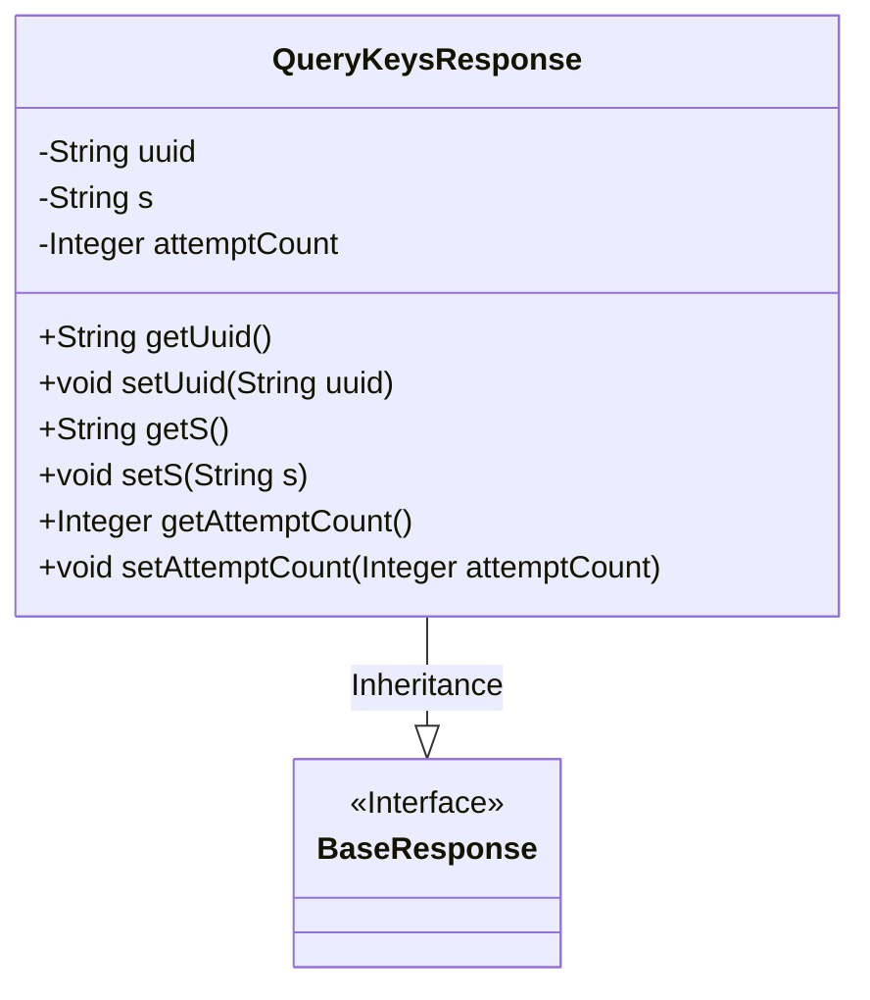
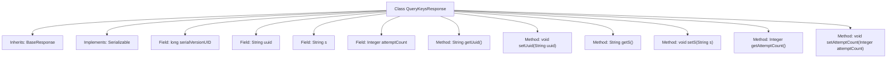

# Basic Information

|      |      |
|------|------|
| Name | QueryKeysResponse |
| Language | .java |
| Code Path | WeFe/mpc/mpc-common/src/main/java/com/welab/wefe/mpc/pir/request/QueryKeysResponse.java |
| Package Name | com.welab.wefe.mpc.pir.request |
| Dependencies | ['java.io.Serializable'] |
| Brief Description | The QueryKeysResponse class inherits from BaseResponse and includes three attributes—uuid, s, and attemptCount—along with their corresponding getter and setter methods. |

# Description

The QueryKeysResponse class inherits from BaseResponse and implements the Serializable interface, containing three private fields: uuid (String type), s (String type), and attemptCount (int type). This class provides getter and setter methods for these three fields to retrieve and set their values. The serialVersionUID is used for serialization version control.

# Class Summary

| Name   | Type  | Description |
|-------|------|-------------|
| QueryKeysResponse | class | The QueryKeysResponse class extends BaseResponse, containing three attributes—uuid, s, and attemptCount—along with their getter/setter methods, and implements the Serializable interface. |

## Class QueryKeysResponse

|      |      |
|------|------|
| Access Modifier | public |
| Type | class |
| Name | QueryKeysResponse |
| Description | The QueryKeysResponse class extends BaseResponse, containing three attributes—uuid, s, and attemptCount—along with their getter/setter methods, and implements the Serializable interface. |

### UML Class Diagram

This class diagram illustrates the structure where the QueryKeysResponse class inherits from the BaseResponse interface. QueryKeysResponse contains three private fields (uuid, s, attemptCount) along with their corresponding getter/setter methods, implements the serialization interface, and has a fixed serialVersionUID. As a response object, it inherits basic response characteristics from the BaseResponse interface while extending specific business fields for handling key query scenarios, embodying the "open for extension" principle in object-oriented design.

### Internal Method Call Graph

This flowchart illustrates the structure of the QueryKeysResponse class, including its inheritance, implemented interfaces, fields, and methods. QueryKeysResponse inherits from the BaseResponse class and implements the Serializable interface. It contains three private fields (uuid, s, attemptCount) along with their corresponding getter and setter methods. The serialVersionUID is used for serialization version control. The entire class is designed to encapsulate query key response data, supporting serialized transmission.

### Field List

| Name  | Type  | Description |
|-------|-------|------|
| uuid | String | Declare a private string variable uuid. |
| attemptCount | Integer | Private integer variable, recording the number of attempts. |
| s | String | Declare a private string variable s. |
| serialVersionUID = 2217113747124783613L | long | Declare a private static final long serialVersionUID with the value 2217113747124783613. |

### Method List

| Name  | Type  | Description |
|-------|-------|------|
| getAttemptCount | Integer | Get the integer value of the attempt count. |
| setS | void | This is a Java method used to set the value of the class member variable s. The method is named setS, which takes a string parameter s and assigns it to the s property of the current object. |
| getUuid | String | The method returns a UUID value of string type. |
| getS | String | This is a Java method that returns the value of the string variable s. |
| setUuid | void | This is a Java method used to set the uuid property value of an object. The method accepts a string parameter uuid and assigns it to the uuid member variable of the object. |
| setAttemptCount | void | Public method to set the number of attempts, with the parameter being of integer type. |

