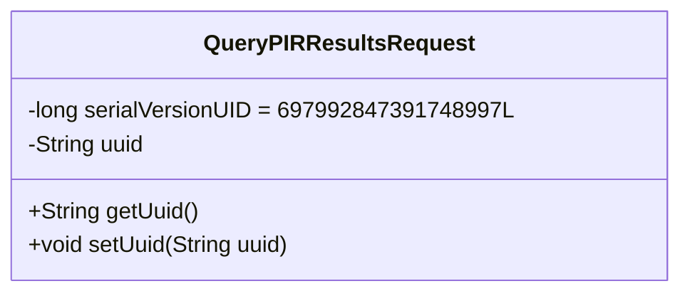
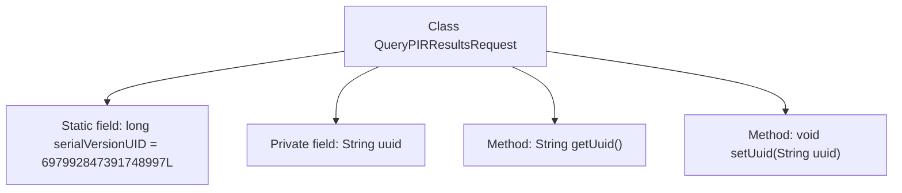

# Basic Information

|      |      |
|------|------|
| Name | QueryPIRResultsRequest |
| Language | .java |
| Code Path | WeFe/mpc/mpc-common/src/main/java/com/welab/wefe/mpc/pir/request/QueryPIRResultsRequest.java |
| Package Name | com.welab.wefe.mpc.pir.request |
| Dependencies | ['java.io.Serializable'] |
| Brief Description | Serialization class QueryPIRResultsRequest, containing UUID field along with its getter and setter methods. |

# Description

This is a Java class named QueryPIRResultsRequest, which implements the Serializable interface to ensure serializability. The class includes a private static constant serialVersionUID for version control, with a value of 697992847391748997L. The main attribute is a private String-type uuid, with corresponding getter and setter methods provided for accessing and modifying this attribute. This class may be used to encapsulate request parameters for querying PIR results.

# Class Summary

| Name   | Type  | Description |
|-------|------|-------------|
| QueryPIRResultsRequest | class | This is a Java class that implements the Serializable interface, designed for querying PIR result requests. It includes a UUID field along with its corresponding getter and setter methods. |

## Class QueryPIRResultsRequest

|      |      |
|------|------|
| Access Modifier | public |
| Type | class |
| Name | QueryPIRResultsRequest |
| Description | This is a Java class that implements the Serializable interface, designed for querying PIR result requests. It includes a UUID field along with its corresponding getter and setter methods. |

### UML Class Diagram

This code defines a class named `QueryPIRResultsRequest` that implements the `Serializable` interface for serializing request data. The class contains a private static constant `serialVersionUID` for version control and a private string field `uuid` to store a unique identifier. It provides `getUuid()` and `setUuid()` methods to access and modify the `uuid` field. This is a typical Java Data Transfer Object (DTO) design used for transmitting query result request information across networks or between processes.

### Internal Method Call Graph

This flowchart depicts the structure of the QueryPIRResultsRequest class, which is a Java class implementing the Serializable interface. The class contains a static serialVersionUID for serialization version control and a private uuid string field. It provides two methods, getUuid() and setUuid(), for retrieving and setting the uuid value respectively. The overall class structure is simple and clear, primarily designed to encapsulate request data for querying PIR results.

### Field List

| Name  | Type  | Description |
|-------|-------|------|
| uuid | String | Declare a private string variable uuid. |
| serialVersionUID = 697992847391748997L | long | Declare a private static final long serialVersionUID = 697992847391748997L. |

### Method List

| Name  | Type  | Description |
|-------|-------|------|
| getUuid | String | The method returns a UUID value of string type. |
| setUuid | void | This is a Java method used to set the uuid property value of an object. The method takes a string parameter uuid and assigns it to the uuid member variable of the object. |

