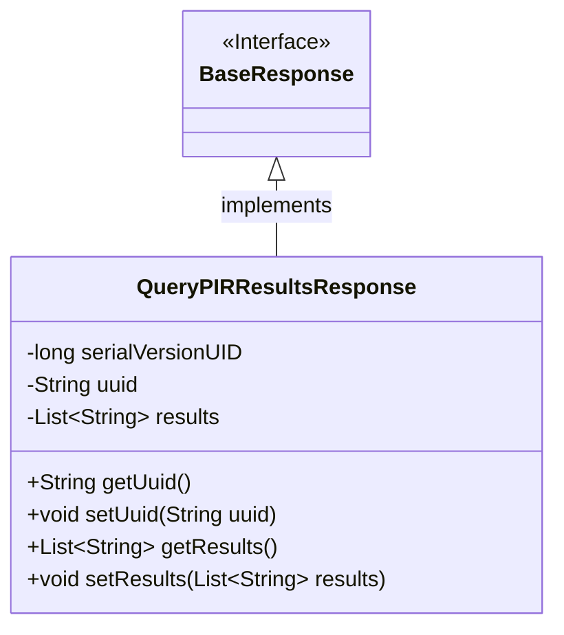
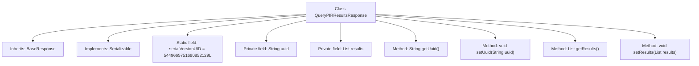

# Basic Information

|      |      |
|------|------|
| Name | QueryPIRResultsResponse |
| Language | .java |
| Code Path | WeFe/mpc/mpc-common/src/main/java/com/welab/wefe/mpc/pir/request/QueryPIRResultsResponse.java |
| Package Name | com.welab.wefe.mpc.pir.request |
| Dependencies | ['java.io.Serializable', 'java.util.List'] |
| Brief Description | The QueryPIRResultsResponse class inherits from BaseResponse, containing the uuid and results fields along with their getter/setter methods, and implements the serialization interface. |

# Description

The content describes a Java class named QueryPIRResultsResponse, which extends BaseResponse and implements the Serializable interface. The class includes a serialVersionUID field for serialization control, along with two main attributes: uuid (String type) and results (List of String type). Getter and setter methods are provided for these attributes to retrieve and set their values.

# Class Summary

| Name   | Type  | Description |
|-------|------|-------------|
| QueryPIRResultsResponse | class | The QueryPIRResultsResponse class inherits from BaseResponse, containing uuid and results fields along with their getter/setter methods, and implements the serialization interface. |

## Class QueryPIRResultsResponse

|      |      |
|------|------|
| Access Modifier | public |
| Type | class |
| Name | QueryPIRResultsResponse |
| Description | The QueryPIRResultsResponse class inherits from BaseResponse, containing uuid and results fields along with their getter/setter methods, and implements the serialization interface. |

### UML Class Diagram

This code defines a `QueryPIRResultsResponse` class that inherits from the `BaseResponse` interface and implements the `Serializable` interface. The class contains a serialization ID, a UUID string, and a list of string results, providing public methods to get and set these properties. The class diagram clearly illustrates the inheritance relationship and class member structure, reflecting the data encapsulation characteristics of the response object.

### Internal Method Call Graph

This code defines a class named QueryPIRResultsResponse, which inherits from BaseResponse and implements the Serializable interface. The class contains two private fields: uuid and results, used to store a unique identifier and a list of results respectively. Corresponding getter and setter methods are provided to access and modify these fields. The serialVersionUID ensures version consistency during serialization. The overall structure is clear, conforms to JavaBean specifications, and is suitable for data transfer and persistence scenarios.

### Field List

| Name  | Type  | Description |
|-------|-------|------|
| results | List<String> | Private string list variable `results`. |
| uuid | String | Private string variable uuid |
| serialVersionUID = 5449665751690852129L | long | Defined a private static final serial version ID with the value 5449665751690852129L. |

### Method List

| Name  | Type  | Description |
|-------|-------|------|
| setUuid | void | Methods for setting UUID values, assigning parameters to the member variable `uuid`. |
| getUuid | String | The method returns the value of the uuid variable of string type. |
| getResults | List<String> | This method returns a list of strings named results. |
| setResults | void | The method to set the result list assigns the input parameters to the class member variable `results`. |

