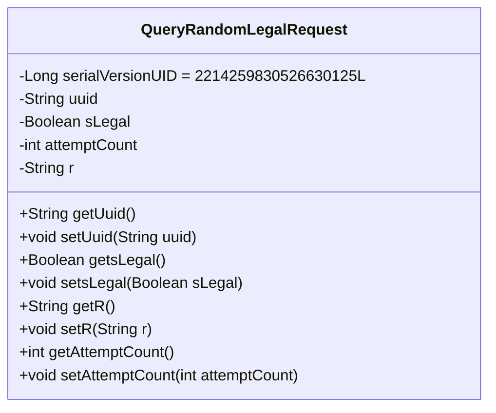
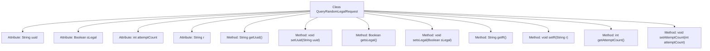

# Basic Information

|      |      |
|------|------|
| Name | QueryRandomLegalRequest |
| Language | .java |
| Code Path | WeFe/mpc/mpc-common/src/main/java/com/welab/wefe/mpc/pir/request/QueryRandomLegalRequest.java |
| Package Name | com.welab.wefe.mpc.pir.request |
| Dependencies | ['java.io.Serializable'] |
| Brief Description | The QueryRandomLegalRequest class implements the Serializable interface and includes the fields uuid, sLegal, attemptCount, and r, providing corresponding getter and setter methods. |

# Description

QueryRandomLegalRequest is a serializable Java class designed to encapsulate data related to querying random legal requests. This class contains four private fields: `uuid` (String type), `sLegal` (boolean type), `attemptCount` (integer type), and `r` (String type). Each field has corresponding getter and setter methods for accessing and modifying its value. The class implements the `Serializable` interface and defines a `serialVersionUID` for version control.

# Class Summary

| Name   | Type  | Description |
|-------|------|-------------|
| QueryRandomLegalRequest | class | This is a serializable Java class QueryRandomLegalRequest, which contains four attributes: uuid, sLegal, attemptCount, and r, along with their corresponding getter and setter methods. |

## Class QueryRandomLegalRequest

|      |      |
|------|------|
| Access Modifier | public |
| Type | class |
| Name | QueryRandomLegalRequest |
| Description | This is a serializable Java class QueryRandomLegalRequest, which contains four attributes: uuid, sLegal, attemptCount, and r, along with their corresponding getter and setter methods. |

### UML Class Diagram

This code defines a class named QueryRandomLegalRequest, which implements the Serializable interface, indicating that its instances can be serialized. The class contains four private fields: uuid (String type), sLegal (Boolean type), attemptCount (integer type), and r (String type), along with corresponding getter and setter methods. The serialVersionUID field is used for version control to ensure compatibility during serialization and deserialization. This class is primarily used to encapsulate data related to querying random legal requests, providing access and modification to this data through getter and setter methods.

### Internal Method Call Graph

This code defines a serializable class named QueryRandomLegalRequest, containing four private attributes: uuid, sLegal, attemptCount, and r. The class provides corresponding getter and setter methods for each attribute to retrieve and modify their values. The flowchart clearly illustrates the hierarchical relationship between the class and its attributes/methods, with all methods directly linked to the main class without nested call relationships. This class is primarily designed to encapsulate request data and enable data transmission or persistence through serialization.

### Field List

| Name  | Type  | Description |
|-------|-------|------|
| r | String | Declaration of private string variable r. |
| attemptCount | int | Private integer variable, recording the number of attempts. |
| sLegal | Boolean | The boolean private variable sLegal indicates the legal status. |
| uuid | String | Private string variable uuid, used to store unique identifiers. |
| serialVersionUID = 2214259830526630125L | long | Declare a private static final long serialVersionUID with the value 2214259830526630125. |

### Method List

| Name  | Type  | Description |
|-------|-------|------|
| getsLegal | Boolean | Public method to obtain the sLegal boolean value. |
| setUuid | void | Methods for setting UUID string values. |
| setsLegal | void | This is a Java method used to set the boolean value of the sLegal property. The method is named setsLegal and accepts a Boolean parameter. |
| getUuid | String | This method returns the value of the uuid variable as a string. |
| getR | String | This is a Java method that returns the value of the member variable r of type String. |
| setR | void | Set the value of the string property r. |
| getAttemptCount | int | Get the integer value of the attempt count. |
| setAttemptCount | void | A public method to set the number of attempts, with an integer parameter attemptCount, which is assigned to the class member variable attemptCount. |

