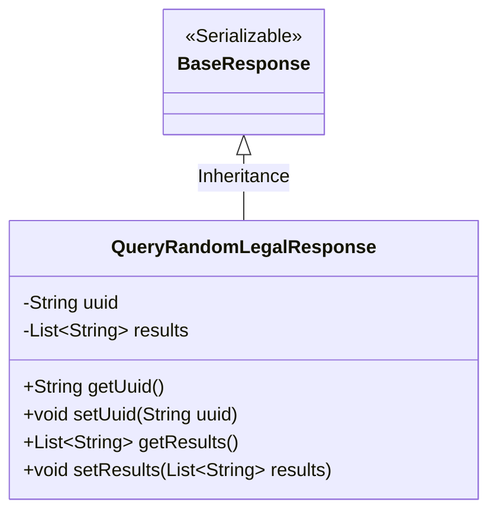
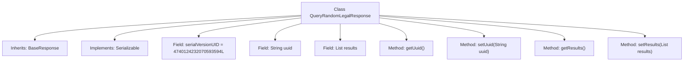

# Basic Information

|      |      |
|------|------|
| Name | QueryRandomLegalResponse |
| Language | .java |
| Code Path | WeFe/mpc/mpc-common/src/main/java/com/welab/wefe/mpc/pir/request/QueryRandomLegalResponse.java |
| Package Name | com.welab.wefe.mpc.pir.request |
| Dependencies | ['java.io.Serializable', 'java.util.List'] |
| Brief Description | The QueryRandomLegalResponse class inherits from BaseResponse, containing a uuid and a nullable results list, and provides getter/setter methods. |

# Description

The `QueryRandomLegalResponse` class extends `BaseResponse` and implements the `Serializable` interface, containing a serialization ID field `serialVersionUID`. This class defines two private member variables: a `uuid` string and a `results` string list, where `results` can be empty. Getter and setter methods are provided to access and modify these two variables.

# Class Summary

| Name   | Type  | Description |
|-------|------|-------------|
| QueryRandomLegalResponse | class | The `QueryRandomLegalResponse` class inherits from `BaseResponse`, containing a `uuid` and a nullable `results` list, and provides getter/setter methods. |

## Class QueryRandomLegalResponse

|      |      |
|------|------|
| Access Modifier | public |
| Type | class |
| Name | QueryRandomLegalResponse |
| Description | The `QueryRandomLegalResponse` class inherits from `BaseResponse`, containing a `uuid` and a nullable `results` list, and provides getter/setter methods. |

### UML Class Diagram

This class diagram illustrates the structure where the QueryRandomLegalResponse class inherits from the BaseResponse base class and implements the Serializable interface. QueryRandomLegalResponse contains private fields uuid (String type) and results (List of Strings type), along with corresponding getter/setter methods. BaseResponse is marked as a serializable interface, serving as the parent class to provide basic response functionality. The child class extends specific business logic through inheritance, designed to handle random query responses containing a UUID identifier and a potentially empty results list.

### Internal Method Call Graph

This flowchart illustrates the structure of the QueryRandomLegalResponse class, including its inheritance from BaseResponse and implementation of the Serializable interface. The class contains the serialVersionUID serialization identifier, a String uuid field, a results list field, along with corresponding getter and setter methods. All fields and methods are connected to the main class via arrows, clearly presenting the class composition and hierarchical relationships.

### Field List

| Name  | Type  | Description |
|-------|-------|------|
| serialVersionUID = 4740124232070593594L | long | Define the serial version UID as 4740124232070593594L to ensure class version compatibility. |
| results | List<String> | Private string list variable `results`. |
| uuid | String | Private string variable uuid, used to store a unique identifier. |

### Method List

| Name  | Type  | Description |
|-------|-------|------|
| getUuid | String | Methods to obtain UUID string values. |
| getResults | List<String> | This method returns a list of strings results. |
| setResults | void | Method for setting the result list, which assigns the input list to the class variable results. |
| setUuid | void | Methods for setting UUID string values. |

