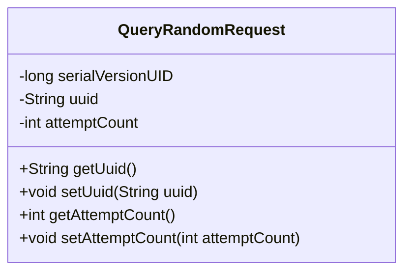
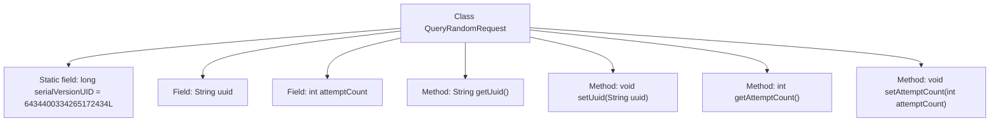

# Basic Information

|      |      |
|------|------|
| Name | QueryRandomRequest |
| Language | .java |
| Code Path | WeFe/mpc/mpc-common/src/main/java/com/welab/wefe/mpc/pir/request/QueryRandomRequest.java |
| Package Name | com.welab.wefe.mpc.pir.request |
| Dependencies | ['java.io.Serializable'] |
| Brief Description | Serializable class QueryRandomRequest, containing uuid and attemptCount attributes along with corresponding getter/setter methods. |

# Description

This is a Java class named QueryRandomRequest, which implements the Serializable interface for serialization. The class contains two private member variables: uuid (String type) and attemptCount (integer type), used to store a unique identifier and the number of attempts, respectively. Getter and setter methods are provided for these variables to access and modify them. The class also defines a static serialVersionUID field to control serialization version compatibility.

# Class Summary

| Name   | Type  | Description |
|-------|------|-------------|
| QueryRandomRequest | class | QueryRandomRequest is a serializable class containing a uuid string field and an attemptCount integer field, providing getter and setter methods. |

## Class QueryRandomRequest

|      |      |
|------|------|
| Access Modifier | public |
| Type | class |
| Name | QueryRandomRequest |
| Description | QueryRandomRequest is a serializable class containing a uuid string field and an attemptCount integer field, providing getter and setter methods. |

### UML Class Diagram

This code defines a class named QueryRandomRequest that implements the Serializable interface, indicating its instances are serializable. The class contains two private fields: uuid (String type) and attemptCount (integer type), used to store a unique identifier and attempt count respectively. Standard getter and setter methods are provided for field access and modification. The serialVersionUID field is used for version control to ensure serialization compatibility. This is a typical Data Transfer Object (DTO) design, suitable for network transmission or persistence scenarios.

### Internal Method Call Graph

This flowchart illustrates the complete structure of the QueryRandomRequest class, containing a static serialization ID and two member variables (uuid and attemptCount), along with their corresponding getter/setter methods. The class implements the Serializable interface, supporting serial version control through serialVersionUID. All methods revolve around core properties, forming a standard data encapsulation structure suitable for network transmission or persistence scenarios.

### Field List

| Name  | Type  | Description |
|-------|-------|------|
| attemptCount | int | Private integer variable, recording the number of attempts. |
| serialVersionUID = 6434400334265172434L | long | Defined a private static final serial version UID with the value 6434400334265172434L. |
| uuid | String | Declare a private string variable uuid. |

### Method List

| Name  | Type  | Description |
|-------|-------|------|
| setAttemptCount | void | Public method to set the number of attempts, with an integer parameter attemptCount, which is assigned to the class member variable attemptCount. |
| getUuid | String | The method returns the value of the uuid variable of string type. |
| setUuid | void | Set the UUID value of the object. |
| getAttemptCount | int | Method for obtaining the integer value of attempt count. |

