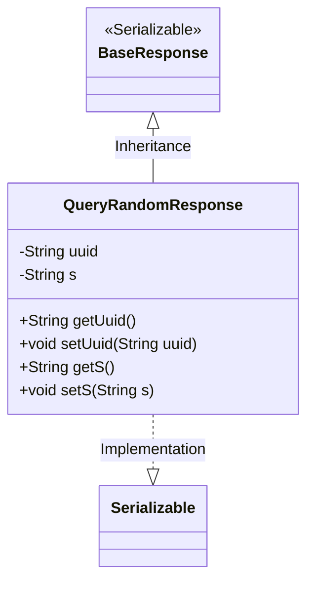
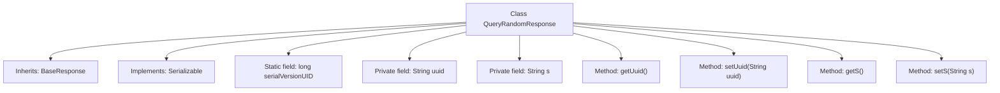

# Basic Information

|      |      |
|------|------|
| Name | QueryRandomResponse |
| Language | .java |
| Code Path | WeFe/mpc/mpc-common/src/main/java/com/welab/wefe/mpc/pir/request/QueryRandomResponse.java |
| Package Name | com.welab.wefe.mpc.pir.request |
| Dependencies | ['java.io.Serializable'] |
| Brief Description | The QueryRandomResponse class inherits from BaseResponse and implements the Serializable interface, containing two string attributes, uuid and s, along with their getter/setter methods, and a serialization ID of 9183224785171833749L. |

# Description

The content defines a Java class named QueryRandomResponse, which extends BaseResponse and implements the Serializable interface. The class contains two private String fields, uuid and s, accessed and modified via getter and setter methods. It uses the serialVersionUID field for serialization version control. The overall structure is a typical data transfer object designed to encapsulate response data.

# Class Summary

| Name   | Type  | Description |
|-------|------|-------------|
| QueryRandomResponse | class | The QueryRandomResponse class extends BaseResponse, containing two string attributes uuid and s along with their getter/setter methods, and implements the Serializable interface. |

## Class QueryRandomResponse

|      |      |
|------|------|
| Access Modifier | public |
| Type | class |
| Name | QueryRandomResponse |
| Description | The QueryRandomResponse class extends BaseResponse, containing two string attributes uuid and s along with their getter/setter methods, and implements the Serializable interface. |

### UML Class Diagram

This class diagram illustrates the structure where QueryRandomResponse inherits from BaseResponse and implements the Serializable interface. QueryRandomResponse contains two private string attributes, uuid and s, along with their corresponding getter and setter methods. BaseResponse is marked as a serializable interface, and QueryRandomResponse acquires the base class characteristics through inheritance while also implementing serialization functionality itself, indicating that instances of this class can be serialized for transmission or storage. The overall design demonstrates simple data encapsulation and inheritance relationships, suitable for scenarios requiring serializable response objects.

### Internal Method Call Graph

This flowchart illustrates the structure of the `QueryRandomResponse` class, which inherits from `BaseResponse` and implements the `Serializable` interface. The class contains two private fields `uuid` and `s`, along with their corresponding getter and setter methods. The static field `serialVersionUID` is used for serialization version control. The entire design is concise, primarily serving to encapsulate random query response data and support serialized transmission.

### Field List

| Name  | Type  | Description |
|-------|-------|------|
| serialVersionUID = 9183224785171833749L | long | Defined a private static constant serialVersionUID with the value 9183224785171833749L for serial version control. |
| s | String | Declare a private string variable s. |
| uuid | String | The private string variable uuid is used to store a unique identifier. |

### Method List

| Name  | Type  | Description |
|-------|-------|------|
| setUuid | void | Methods for setting UUID string values. |
| getUuid | String | Methods to obtain the UUID string, directly returning the value of the member variable uuid. |
| getS | String | The method getS returns the value of string s. |
| setS | void | This is a Java method used to set the value of a string-type variable s. The method is named setS, which accepts a string parameter s and assigns it to the s property of the current object. |

