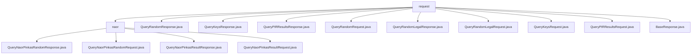

# Basic Information

|      |      |
|------|------|
| Name | request |
| Language | .java |
| Code Path | WeFe/mpc/mpc-common/src/main/java/com/welab/wefe/mpc/pir/request |
| Package Name | docs.mpc.mpc-common.src.main.java.com.welab.wefe.mpc.pir.request |
| Brief Description | This module implements private information retrieval based on the Naor-Pinkas protocol, comprising four types of operations: random number request/response and result request/response. It supports dynamic condition combination and batch result return, relying on the JCE encryption library and base response class. |

# Description

## Overview  
This module implements Privacy Information Retrieval (PIR) functionality based on the Naor-Pinkas protocol, with its core responsibility being to enable encrypted queries and result retrieval through a two-phase interaction. The interface specification comprises six primary operations: random number query (QueryRandomRequest/Response), key query (QueryKeysRequest/Response), result query (QueryPIRResultsRequest/Response), and their respective legality verification (QueryRandomLegalRequest/Response). Key data structures include session identifiers (uuid), modular exponentiation parameters (s), key materials (results), and query conditions (ids/method), relying on the BaseResponse base class and the JCE encryption library. For example, the `s` field in the random number response must work in conjunction with `uuid` to implement a challenge-response mechanism, while the result ciphertext adopts a list structure strictly aligned with the original ID order.  

## Primary Business Scenarios  
The typical workflow consists of three steps: First, the client submits a set of IDs and encryption methods (e.g., MD5/SHA256) via `QueryKeysRequest` to obtain random numbers (s/uuid). Next, it verifies legality through `QueryRandomRequest`. Finally, it retrieves encrypted results using `QueryPIRResultsRequest`. The interaction mode resembles zero-knowledge proofs, with the server maintaining `uuid` session states and executing OT protocols (supporting both Naor-Pinkas and Huack algorithms). Functional completeness is reflected in dynamic condition combinations and batch processing capabilities, such as the `attemptCount` field enabling query retry mechanisms. It is primarily applied to privacy-preserving federated learning for joint data computation. The API design adopts a layered structure: the transport layer handles hexadecimal strings, while the business layer encapsulates condition sets of type `List<Object>`.

### Package Internal Structure View

This flowchart illustrates the hierarchical structure of the PIR request module in the MPC project. The top level is the request directory, which contains multiple direct child files and the naor subdirectory. The naor directory further includes four request/response files related to the Naor-Pinkas protocol. The overall structure clearly reflects the modular design of PIR request processing, where base request classes are separated from specific protocol implementations.

# File List

| Name   | Type  | Description |
|-------|------|-------------|
| [QueryRandomResponse.java](QueryRandomResponse.md) | file | The QueryRandomResponse class extends BaseResponse and implements the Serializable interface, containing two string properties, uuid and s, along with their getter/setter methods, with a serialization ID of 9183224785171833749L. |
| [QueryKeysResponse.java](QueryKeysResponse.md) | file | The QueryKeysResponse class inherits from BaseResponse and includes three attributes: uuid, s, and attemptCount, along with their corresponding getter/setter methods. |
| [QueryPIRResultsResponse.java](QueryPIRResultsResponse.md) | file | The QueryPIRResultsResponse class inherits from BaseResponse, containing the uuid and results fields along with their getter/setter methods, and implements the serialization interface. |
| [QueryRandomRequest.java](QueryRandomRequest.md) | file | The serializable class QueryRandomRequest includes the properties uuid and attemptCount along with their corresponding getter and setter methods. |
| [QueryRandomLegalResponse.java](QueryRandomLegalResponse.md) | file | The QueryRandomLegalResponse class inherits from BaseResponse, containing a uuid and a nullable results list, and provides getter/setter methods. |
| [QueryRandomLegalRequest.java](QueryRandomLegalRequest.md) | file | The QueryRandomLegalRequest class implements the Serializable interface, containing the fields uuid, sLegal, attemptCount, and r, and provides corresponding getter and setter methods. |
| [QueryKeysRequest.java](QueryKeysRequest.md) | file | The QueryKeysRequest class includes an ids list, an ID encryption method, an oblivious transfer implementation otMethod, and a requestId field along with their corresponding getter/setter methods. |
| [QueryPIRResultsRequest.java](QueryPIRResultsRequest.md) | file | Serialization class QueryPIRResultsRequest, containing UUID field along with its getter and setter methods. |
| [BaseResponse.java](BaseResponse.md) | file | The abstract class BaseResponse includes three attributes: code, message, and responseId, along with their corresponding getter and setter methods. |
| [naor](naor/_module.md) | package | The QueryNaorPinkasRandomResponse class inherits from BaseResponse and contains the fields uuid, g, p, secret, and randoms. The QueryNaorPinkasRandomRequest class encapsulates a list of query conditions. The QueryNaorPinkasResultResponse class inherits from BaseResponse and contains the fields uuid and encryptResults. The QueryNaorPinkasResultRequest class encapsulates the fields uuid and pk. |

