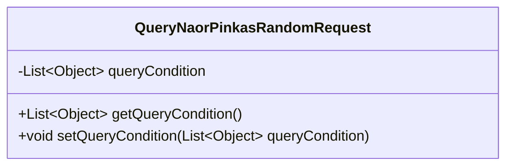
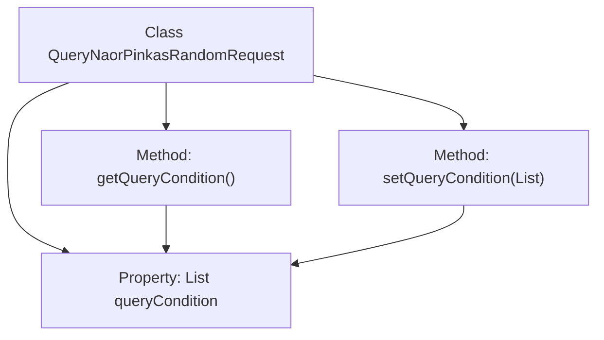

# Basic Information

|      |      |
|------|------|
| Name | QueryNaorPinkasRandomRequest |
| Language | .java |
| Code Path | WeFe/mpc/mpc-common/src/main/java/com/welab/wefe/mpc/pir/request/naor/QueryNaorPinkasRandomRequest.java |
| Package Name | com.welab.wefe.mpc.pir.request.naor |
| Dependencies | ['java.util.List'] |
| Brief Description | The QueryNaorPinkasRandomRequest class contains a List of query conditions of type Object, providing getter and setter methods. |

# Description

QueryNaorPinkasRandomRequest is a Java class used to encapsulate query conditions. This class contains a private member variable named queryCondition, of type List<Object>, which stores a list of query conditions. It provides two public methods, getQueryCondition and setQueryCondition, for retrieving and setting the value of queryCondition, respectively. This class is primarily designed to handle random query requests, allowing flexible passing of different types of query condition parameters in the form of a list.

# Class Summary

| Name   | Type  | Description |
|-------|------|-------------|
| QueryNaorPinkasRandomRequest | class | The QueryNaorPinkasRandomRequest class contains a queryCondition list, providing get and set methods to manipulate this list. |

## Class QueryNaorPinkasRandomRequest

|      |      |
|------|------|
| Access Modifier | public |
| Type | class |
| Name | QueryNaorPinkasRandomRequest |
| Description | The QueryNaorPinkasRandomRequest class contains a queryCondition list, providing get and set methods to manipulate this list. |

### UML Class Diagram

This class diagram depicts a simple Java class named QueryNaorPinkasRandomRequest, which contains a private member variable queryCondition (of type List<Object>) along with corresponding public getter and setter methods. The primary function of this class is to encapsulate a list of query conditions, providing read-write access to the internal list data through standard accessor methods, embodying fundamental encapsulation principles. The class structure is concise and clear, making it suitable for use as a data transfer object.

### Internal Method Call Graph

This code defines a class named QueryNaorPinkasRandomRequest, which includes a List-type property queryCondition and corresponding getter/setter methods. The flowchart illustrates the hierarchical relationship between the class, its properties, and methods, as well as the access paths of methods to properties. This is a typical Java Bean class design used for encapsulating query condition data, providing secure access to private properties through getter/setter methods.

### Field List

| Name  | Type  | Description |
|-------|-------|------|
| queryCondition | List<Object> | Defined a private list variable queryCondition for storing query condition objects. |

### Method List

| Name  | Type  | Description |
|-------|-------|------|
| getQueryCondition | List<Object> | The method returns a list of query conditions. |
| setQueryCondition | void | This is a Java method used to set the query condition list. The method accepts a List parameter of type Object and assigns it to the queryCondition member variable of the class. |

