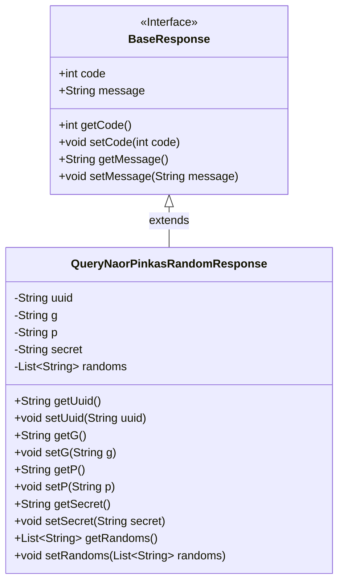

# Basic Information

|      |      |
|------|------|
| Name | QueryNaorPinkasRandomResponse |
| Language | .java |
| Code Path | WeFe/mpc/mpc-common/src/main/java/com/welab/wefe/mpc/pir/request/naor/QueryNaorPinkasRandomResponse.java |
| Package Name | com.welab.wefe.mpc.pir.request.naor |
| Dependencies | ['java.util.List', 'com.welab.wefe.mpc.pir.request.BaseResponse'] |
| Brief Description | The QueryNaorPinkasRandomResponse class contains fields such as uuid, base g, modulus p, server key secret, and a list of random large numbers randoms, providing getter and setter methods. |

# Description

The code defines a class named `QueryNaorPinkasRandomResponse`, which inherits from `BaseResponse`. The class contains the following key fields: `uuid` as a unique identifier, `g` representing the base, `p` representing the modulus, `secret` being the server key in the form of g^a, and `randoms` as a list of hexadecimal strings whose size is one less than the number of obfuscated IDs. Additionally, the class provides standard getter and setter methods for all fields, along with related methods for the `code` and `message` fields inherited from the parent class.

# Class Summary

| Name   | Type  | Description |
|-------|------|-------------|
| QueryNaorPinkasRandomResponse | class | The `QueryNaorPinkasRandomResponse` class contains fields such as UUID, base `g`, modulus `p`, server key `secret`, and a list of random numbers `randoms`, which are used to handle the random response of the Naor-Pinkas protocol. |

## Class QueryNaorPinkasRandomResponse

|      |      |
|------|------|
| Access Modifier | public |
| Type | class |
| Name | QueryNaorPinkasRandomResponse |
| Description | The `QueryNaorPinkasRandomResponse` class contains fields such as UUID, base `g`, modulus `p`, server key `secret`, and a list of random numbers `randoms`, which are used to handle the random response of the Naor-Pinkas protocol. |

### UML Class Diagram

Class diagram description:  
The QueryNaorPinkasRandomResponse class extends the BaseResponse interface, implementing basic response code and message functionality while expanding fields required for the Naor-Pinkas random response protocol. These include UUID identifier, base g, modulus p, server secret key, and a list of randoms. The class provides complete getter/setter methods for field access, primarily used in cryptographic protocols for secure parameter transmission scenarios.

### Internal Method Call Graph

```mermaid
graph TD
    A["Class QueryNaorPinkasRandomResponse"]
    B["Inherits from: BaseResponse"]
    C["Attribute: String uuid"]
    D["Attribute: String g"]
    E["Attribute: String p"]
    F["Attribute: String secret"]
    G["Attribute: List<String> randoms"]
    H["Method: String getUuid()"]
    I["Method: void setUuid(String uuid)"]
    J["Method: String getG()"]
    K["Method: void setG(String g)"]
    L["Method: String getP()"]
    M["Method: void setP(String p)"]
    N["Method: String getSecret()"]
    O["Method: void setSecret(String secret)"]
    P["Method: List<String> getRandoms()"]
    Q["Method: void setRandoms(List<String> randoms)"]
    R["Method: int getCode()"]
    S["Method: void setCode(int code)"]
    T["Method: String getMessage()"]
    U["Method: void setMessage(String message)"]

    A --> B
    A --> C
    A --> D
    A --> E
    A --> F
    A --> G
    A --> H
    A --> I
    A --> J
    A --> K
    A --> L
    A --> M
    A --> N
    A --> O
    A --> P
    A --> Q
    A --> R
    A --> S
    A --> T
    A --> U
```

This flowchart illustrates the complete structure of the QueryNaorPinkasRandomResponse class, including its inheritance relationship and all attributes/methods. The class inherits from BaseResponse and contains 5 core attributes (uuid, g, p, secret, randoms) with corresponding getter/setter methods, along with code/message-related methods inherited from the parent class. The diagram clearly presents hierarchical relationships between class members: attributes are denoted by square boxes, methods by rounded rectangles, and inheritance relationships by solid arrows.

### Field List

| Name  | Type  | Description |
|-------|-------|------|
| g | String | Declared a private string variable g. |
| p | String | private string variable p |
| randoms | List<String> | Declare a private string list variable randoms. |
| uuid | String | Declare a private string variable uuid. |
| secret | String | Private string type variable secret. |

### Method List

| Name  | Type  | Description |
|-------|-------|------|
| getG | String | Methods to obtain the value of a string-type variable g. |
| getUuid | String | The method getUuid returns a uuid value of string type. |
| getP | String | This is a Java method that returns the value of the private variable p. |
| setUuid | void | This is a Java method used to set the uuid property value of an object. The method takes a string parameter uuid and assigns it to the uuid field of the current object. |
| setSecret | void | The method to set the secret attribute assigns the passed secret parameter to the secret member variable of the current object. |
| getSecret | String | Methods to obtain the secret string. |
| getRandoms | List<String> | Methods to Obtain a List of Random Strings. |
| setP | void | This is a Java method used to set the value of the class property p. The method is named setP, which takes a string parameter p and assigns it to the member variable this.p of the class. |
| setG | void | Set the value of the string variable g. |
| setRandoms | void | Java Method: Set Random String List Parameter. |
| getCode | int | This is a Java method that returns the value of the integer variable code. |
| setCode | void | This is a Java method used to set the value of the class member variable `code`. The method accepts an integer parameter `code` and assigns it to the `code` attribute of the current object. |
| getMessage | String | Methods to obtain the message string. |
| setMessage | void | This is a Java method used to set the message property value of a class. The method takes a string parameter message and assigns it to the member variable message of the class. |

