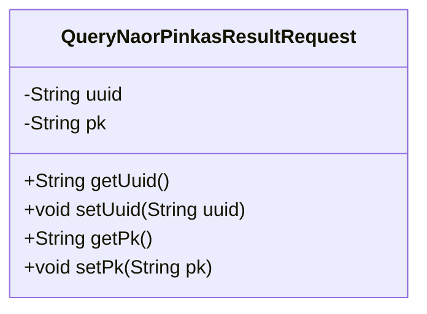
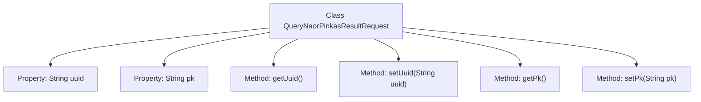

# Basic Information

|      |      |
|------|------|
| Name | QueryNaorPinkasResultRequest |
| Language | .java |
| Code Path | WeFe/mpc/mpc-common/src/main/java/com/welab/wefe/mpc/pir/request/naor/QueryNaorPinkasResultRequest.java |
| Package Name | com.welab.wefe.mpc.pir.request.naor |
| Dependencies | [] |
| Brief Description | The QueryNaorPinkasResultRequest class contains two string attributes, uuid and pk, each with corresponding getter and setter methods. |

# Description

This is a Java class named `QueryNaorPinkasResultRequest`, designed to encapsulate request data for querying the results of the Naor-Pinkas protocol. The class contains two private string fields: `uuid` for uniquely identifying the request, and `pk` representing public key information (annotated as `pk0` in the comments). Standard getter and setter methods are provided to access and modify the values of these two fields.

# Class Summary

| Name   | Type  | Description |
|-------|------|-------------|
| QueryNaorPinkasResultRequest | class | The QueryNaorPinkasResultRequest class contains uuid and pk fields, providing getter and setter methods. |

## Class QueryNaorPinkasResultRequest

|      |      |
|------|------|
| Access Modifier | public |
| Type | class |
| Name | QueryNaorPinkasResultRequest |
| Description | The QueryNaorPinkasResultRequest class contains uuid and pk fields, providing getter and setter methods. |

### UML Class Diagram

This code defines a class named QueryNaorPinkasResultRequest, which encapsulates request data for querying Naor-Pinkas protocol results. The class contains two private fields: uuid (unique identifier) and pk (public key), along with corresponding getter and setter methods for accessing and modifying these field values. This is a typical Data Transfer Object (DTO) used to pass query parameters between different layers.

### Internal Method Call Graph

This code defines a class named QueryNaorPinkasResultRequest, containing two private properties uuid and pk, along with their corresponding getter and setter methods. The flowchart illustrates the hierarchical relationship between the class and its properties/methods, where uuid serves as a unique identifier, and pk likely represents a public key or other critical data. All methods revolve around read-write operations for these two properties, forming a standard Java Bean structure.

### Field List

| Name  | Type  | Description |
|-------|-------|------|
| pk | String | Private string type primary key field. |
| uuid | String | Declare a private string variable uuid. |

### Method List

| Name  | Type  | Description |
|-------|-------|------|
| getPk | String | Methods to obtain the primary key value, returning a string-type variable pk. |
| getUuid | String | The method returns the value of the uuid variable of string type. |
| setUuid | void | Methods for setting UUID, assign the passed string to the uuid property of the object. |
| setPk | void | This is a Java method used to set the value of the private member variable `pk` of a class. The method takes a string parameter `pk` and assigns it to the `pk` attribute of the current object. |

