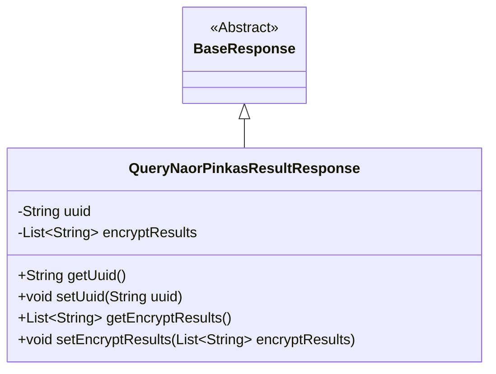
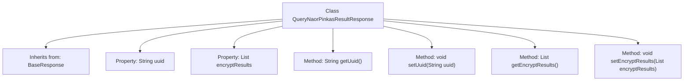

# Basic Information

|      |      |
|------|------|
| Name | QueryNaorPinkasResultResponse |
| Language | .java |
| Code Path | WeFe/mpc/mpc-common/src/main/java/com/welab/wefe/mpc/pir/request/naor/QueryNaorPinkasResultResponse.java |
| Package Name | com.welab.wefe.mpc.pir.request.naor |
| Dependencies | ['java.util.List', 'com.welab.wefe.mpc.pir.request.BaseResponse'] |
| Brief Description | The QueryNaorPinkasResultResponse class inherits from BaseResponse and contains uuid along with encryptResults fields, where the latter stores hexadecimal ciphertext and AES padding string lists. |

# Description

The `QueryNaorPinkasResultResponse` class inherits from `BaseResponse` and contains two main attributes: `uuid` and `encryptResults`. `uuid` is a string-type field used for unique identification. `encryptResults` is a list of strings that stores the encrypted result set, whose size matches the obfuscated IDs. Each element is formatted as a combination of a hexadecimal ciphertext and a hexadecimal AES algorithm padding string, separated by a semicolon. The class provides getter and setter methods for these two attributes.

# Class Summary

| Name   | Type  | Description |
|-------|------|-------------|
| QueryNaorPinkasResultResponse | class | The QueryNaorPinkasResultResponse class inherits from BaseResponse and contains uuid and encryptResults attributes, where the latter stores a list of hexadecimal ciphertexts and AES padding strings. |

## Class QueryNaorPinkasResultResponse

|      |      |
|------|------|
| Access Modifier | public |
| Type | class |
| Name | QueryNaorPinkasResultResponse |
| Description | The QueryNaorPinkasResultResponse class inherits from BaseResponse and contains uuid and encryptResults attributes, where the latter stores a list of hexadecimal ciphertexts and AES padding strings. |

### UML Class Diagram

This class diagram illustrates the structure where QueryNaorPinkasResultResponse inherits from the abstract base class BaseResponse. The subclass contains two private fields: a uuid string and a List~String~ of encryptResults, along with standard getter/setter methods. The encryptResults field stores encrypted data in hexadecimal format, with each element comprising a combination of ciphertext and AES padding strings. The class relationships clearly demonstrate the inheritance hierarchy and encapsulation characteristics, conforming to the data encapsulation pattern of the JavaBean specification.

### Internal Method Call Graph

This flowchart illustrates the structure of the QueryNaorPinkasResultResponse class, which inherits from BaseResponse and contains two private properties: uuid and encryptResults, used to store a unique identifier and a set of encrypted results, respectively. The class provides four public methods, including getUuid() and setUuid() for retrieving and setting the uuid, as well as getEncryptResults() and setEncryptResults() for accessing and modifying the encrypted results. The flowchart clearly presents the class's inheritance relationship and the invocation relationships between its member methods.

### Field List

| Name  | Type  | Description |
|-------|-------|------|
| encryptResults | List<String> | Private string list, storing encrypted results. |
| uuid | String | Declare a private string variable uuid. |

### Method List

| Name  | Type  | Description |
|-------|-------|------|
| getEncryptResults | List<String> | This method returns a list of strings containing the encryption results. |
| getUuid | String | Methods to obtain the UUID string, directly return the value of the member variable uuid. |
| setUuid | void | This is a Java method used to set the uuid property of an object. The method takes a string parameter uuid and assigns it to the uuid member variable of the object. |
| setEncryptResults | void | Java Method: Set the encryption result list, assigning the input parameter to the class member variable encryptResults. |

