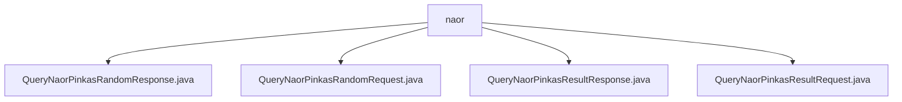

# Basic Information

|      |      |
|------|------|
| Name | naor |
| Language | .java |
| Code Path | WeFe/mpc/mpc-common/src/main/java/com/welab/wefe/mpc/pir/request/naor |
| Package Name | docs.mpc.mpc-common.src.main.java.com.welab.wefe.mpc.pir.request.naor |
| Brief Description | The QueryNaorPinkasRandomResponse class inherits from BaseResponse and contains the fields uuid, g, p, secret, and randoms. The QueryNaorPinkasRandomRequest class encapsulates a list of query conditions. The QueryNaorPinkasResultResponse class inherits from BaseResponse and contains the fields uuid and encryptResults. The QueryNaorPinkasResultRequest class encapsulates the fields uuid and pk. |

# Description

## Overview  
This module implements Privacy Information Retrieval (PIR) functionality based on the Naor-Pinkas protocol, with its core responsibility being to handle the request/response interactions for random number generation and encrypted result queries. The interface specification includes four primary operations: random number query request (QueryNaorPinkasRandomRequest), random number response (QueryNaorPinkasRandomResponse), result query request (QueryNaorPinkasResultRequest), and result response (QueryNaorPinkasResultResponse). Key data structures involve modular exponentiation parameters (g/p), key material (secret/pk), obfuscation identifiers (uuid), and encrypted result sets (encryptResults). External dependencies include the base response class (BaseResponse) and the JCE encryption library. For example, the number of randoms fields in the response class must be one less than the number of obfuscation IDs, and the result ciphertext adopts the AES padding format.

## Key Business Scenarios  
The complete workflow consists of two phases: the client first submits a query condition list (queryCondition) to obtain random numbers (g^a/p/randoms), then requests encrypted results using the uuid and public key (pk0). The interaction mode resembles a challenge-response mechanism, with the server maintaining session state (uuid) and performing modular exponentiation. Functional integrity is reflected in supporting dynamic condition combinations and batch result returns, such as ensuring the encryptResults list strictly aligns with the original IDs. Typical applications include private data queries and federated computation scenarios, with API types covering condition encapsulation classes (List<Object>) and cryptographic parameter transmission classes (hexadecimal strings).

### Package Internal Structure View

This flowchart illustrates the structure of four Java files under the naor directory. All files are directly located within the naor directory without any deeper subdirectories. These files include two request classes (RandomRequest and ResultRequest) and two response classes (RandomResponse and ResultResponse), forming a complete request-response file group.

# File List

| Name   | Type  | Description |
|-------|------|-------------|
| [QueryNaorPinkasRandomResponse.java](QueryNaorPinkasRandomResponse.md) | file | The QueryNaorPinkasRandomResponse class includes fields such as uuid, base g, modulus p, server key secret, and a list of random large numbers randoms, providing getter and setter methods. |
| [QueryNaorPinkasRandomRequest.java](QueryNaorPinkasRandomRequest.md) | file | The `QueryNaorPinkasRandomRequest` class contains a List of query conditions of type `Object`, providing getter and setter methods. |
| [QueryNaorPinkasResultResponse.java](QueryNaorPinkasResultResponse.md) | file | The `QueryNaorPinkasResultResponse` class inherits from `BaseResponse` and contains `uuid` and `encryptResults` fields, where the latter stores a list of hexadecimal ciphertexts and AES padding strings. |
| [QueryNaorPinkasResultRequest.java](QueryNaorPinkasResultRequest.md) | file | The QueryNaorPinkasResultRequest class contains two string attributes, uuid and pk, each with corresponding getter and setter methods. |

