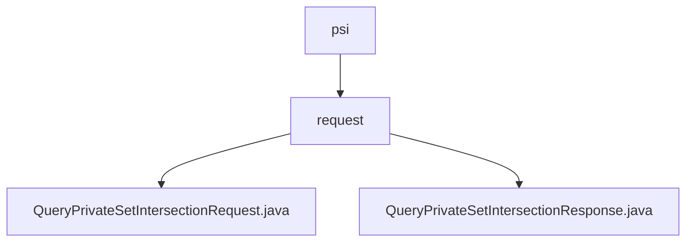

# Basic Information

|      |      |
|------|------|
| Name | psi |
| Language | .java |
| Code Path | WeFe/mpc/mpc-common/src/main/java/com/welab/wefe/mpc/psi |
| Package Name | docs.mpc.mpc-common.src.main.java.com.welab.wefe.mpc.psi |
| Brief Description | The QueryPrivateSetIntersectionRequest class encapsulates the parameters for a private set intersection request, including fields such as clientIds along with their corresponding getter and setter methods. The QueryPrivateSetIntersectionResponse class represents the response result, containing fields such as an encrypted ID list and status code, along with their respective getter and setter methods. |

# Description

## Overview  
The core responsibility of this module is to encapsulate requests and responses for Private Set Intersection (PSI) queries, resembling a data exchange protocol pattern. The interface specification includes the `QueryPrivateSetIntersectionRequest` request class (with fields such as the `p` parameter and `clientIds` list) and the `QueryPrivateSetIntersectionResponse` response class (with fields such as encrypted ID lists and batch status). Key data structures include client ID lists, batch control parameters, and PSI type identifiers. External dependencies are limited to JSON serialization libraries. For example, the request class uses the `JSONField` annotation for field mapping.  

## Main Business Scenarios  
The module supports batch-based PSI query scenarios, enabling streaming data processing through `currentBatch` and `batchSize`. The interaction model follows a request-response pattern—for instance, a client submits a request with a type identifier, and the server returns encrypted results and batch status. Typical applications include secure cross-institution data comparison, where multi-party identifier matching is achieved via `clientIds`. The API type is a POJO entity class, and integration examples demonstrate the serialized transmission of request/response objects. For example, the response class uses the `hasNextBatch` flag to control query termination conditions.

### Package Internal Structure View

This flowchart illustrates the file structure related to PSI request processing in the mpc-common module of the WeFe project. The root node is the psi directory, which contains a subdirectory named request. Under this subdirectory, there are two Java files: QueryPrivateSetIntersectionRequest and QueryPrivateSetIntersectionResponse, handling the request and response logic for private set intersection queries, respectively.

# File List

| Name   | Type  | Description |
|-------|------|-------------|
| [request](request/_module.md) | package | The QueryPrivateSetIntersectionRequest class encapsulates the parameters of a private set intersection request, including fields such as clientIds along with their getter/setter methods. The QueryPrivateSetIntersectionResponse class represents the response result, containing fields like an encrypted ID list, status code, and their corresponding getter/setter methods. |

