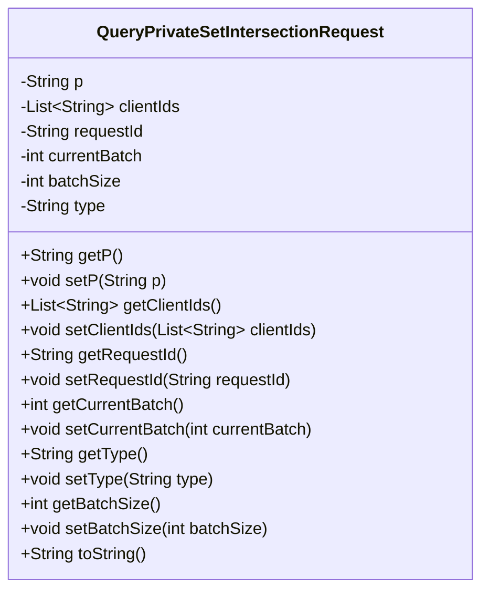

# Basic Information

|      |      |
|------|------|
| Name | QueryPrivateSetIntersectionRequest |
| Language | .java |
| Code Path | WeFe/mpc/mpc-common/src/main/java/com/welab/wefe/mpc/psi/request/QueryPrivateSetIntersectionRequest.java |
| Package Name | com.welab.wefe.mpc.psi.request |
| Dependencies | ['java.util.List', 'com.alibaba.fastjson.annotation.JSONField'] |
| Brief Description | The QueryPrivateSetIntersectionRequest class contains parameters for private set intersection query requests: p, clientIds, requestId, currentBatch, batchSize, and type, providing getter and setter methods for each field. |

# Description

This is a Java class named QueryPrivateSetIntersectionRequest, designed to encapsulate the relevant parameters for a private set intersection query request. The class includes the following fields: a string p, a list of client IDs clientIds (annotated with JSONField), a request ID string requestId, an integer currentBatch indicating the current batch, an integer batchSize representing the batch size, and a string type denoting the PSI type. The class provides getter and setter methods for all fields and overrides the toString method to output object information.

# Class Summary

| Name   | Type  | Description |
|-------|------|-------------|
| QueryPrivateSetIntersectionRequest | class | The QueryPrivateSetIntersectionRequest class contains private set intersection query request parameters: p, clientIds, requestId, currentBatch, batchSize, and type, providing getter and setter methods for each field. |

## Class QueryPrivateSetIntersectionRequest

|      |      |
|------|------|
| Access Modifier | public |
| Type | class |
| Name | QueryPrivateSetIntersectionRequest |
| Description | The QueryPrivateSetIntersectionRequest class contains private set intersection query request parameters: p, clientIds, requestId, currentBatch, batchSize, and type, providing getter and setter methods for each field. |

### UML Class Diagram

This code defines a Java class named QueryPrivateSetIntersectionRequest, which encapsulates parameters related to private set intersection query requests. The class contains seven private fields: p, clientIds, requestId, currentBatch, batchSize, and type, representing request parameters, client ID list, request ID, current batch, batch size, and PSI type respectively. Each field has corresponding getter and setter methods, along with an overridden toString method for outputting object information. This class is primarily used for data transfer, organizing relevant parameters into an object for easier processing and transmission.

### Internal Method Call Graph

```mermaid
graph TD
    A["Class QueryPrivateSetIntersectionRequest"]
    B["Field: String p"]
    C["Field: List<String> clientIds"]
    D["Field: String requestId"]
    E["Field: int currentBatch"]
    F["Field: int batchSize"]
    G["Field: String type"]
    H["Method: String getP()"]
    I["Method: void setP(String p)"]
    J["Method: List<String> getClientIds()"]
    K["Method: void setClientIds(List<String> clientIds)"]
    L["Method: String getRequestId()"]
    M["Method: void setRequestId(String requestId)"]
    N["Method: int getCurrentBatch()"]
    O["Method: void setCurrentBatch(int currentBatch)"]
    P["Method: String getType()"]
    Q["Method: void setType(String type)"]
    R["Method: int getBatchSize()"]
    S["Method: void setBatchSize(int batchSize)"]
    T["Overridden Method: String toString()"]

    A --> B
    A --> C
    A --> D
    A --> E
    A --> F
    A --> G
    A --> H
    A --> I
    A --> J
    A --> K
    A --> L
    A --> M
    A --> N
    A --> O
    A --> P
    A --> Q
    A --> R
    A --> S
    A --> T
```

This code defines a Java class named QueryPrivateSetIntersectionRequest, primarily used to encapsulate parameters related to private set intersection query requests. The class contains 7 private fields (p, clientIds, requestId, currentBatch, batchSize, type) along with their corresponding getter/setter methods, and an overridden toString method. The clientIds field uses JSONField annotation to specify the serialized field name, while currentBatch and batchSize fields include Chinese comments explaining their purposes. This class is typically employed for encapsulating request data in PSI (Private Set Intersection) protocol implementations.

### Field List

| Name  | Type  | Description |
|-------|-------|------|
| clientIds | List<String> | JSON field mapping: client_ids corresponds to the private list clientIds. |
| currentBatch | int | Current batch variable, integer private. |
| requestId | String | The private string variable requestId is used to store the request identifier. |
| p | String | Private string variable p. |
| batchSize | int | The private integer variable batchSize is used to define the batch size. |
| type | String | Declare a private string variable type. |

### Method List

| Name  | Type  | Description |
|-------|-------|------|
| setP | void | This is a Java method used to set the value of the class property p. The method is named setP, which takes a string parameter p and assigns it to the p property of the current object. |
| setClientIds | void | The method `setClientIds` is used to set the `clientIds` list, with the parameter being a string list `clientIds`. |
| getCurrentBatch | int | The method to obtain the current batch value directly returns the currentBatch variable value. |
| setBatchSize | void | This is a Java method used to set the batch processing size. The method takes an integer parameter batchSize and assigns it to the class member variable batchSize. |
| toString | String | Override the toString method to return information about the QueryPrivateSetIntersectionRequest object, including p, requestId, currentBatch, batchSize, and type. |
| getType | String | This is a Java method that returns the value of the string variable `type`. |
| setType | void | The method `setType` is used to set the `type` property of an object, and the parameter is of string type. |
| getBatchSize | int | Get the integer value of batchSize. |
| setRequestId | void | Methods for setting the request ID: Assign the passed `requestId` to the `requestId` property of the current object. |
| getClientIds | List<String> | Methods to obtain the client ID list, directly returning the stored clientIds list. |
| getP | String | This is a Java method that returns the value of the member variable p of type String. |
| getRequestId | String | Methods to obtain the request ID, which returns a string-type requestId. |
| setCurrentBatch | void | The method to set the current batch assigns the input parameter currentBatch to the class member variable of the same name. |

