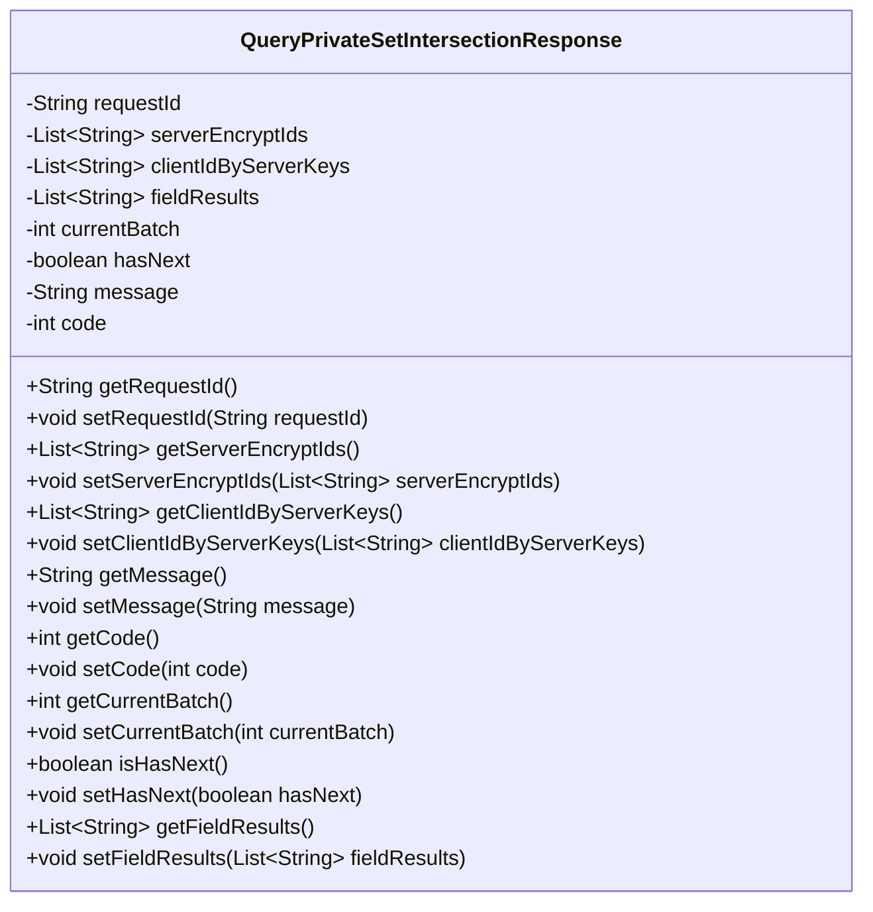

# Basic Information

|      |      |
|------|------|
| Name | QueryPrivateSetIntersectionResponse |
| Language | .java |
| Code Path | WeFe/mpc/mpc-common/src/main/java/com/welab/wefe/mpc/psi/request/QueryPrivateSetIntersectionResponse.java |
| Package Name | com.welab.wefe.mpc.psi.request |
| Dependencies | ['java.util.List'] |
| Brief Description | Private set intersection query response class, containing request ID, encrypted ID list, client ID list, field results, current batch, whether there is a next batch, message, and status code. |

# Description

The `QueryPrivateSetIntersectionResponse` class is used to represent the response result of a private set intersection query. It contains data such as the request ID, server-encrypted ID list, client ID list, and field result list. It also records the current batch number, a flag indicating whether there is a next batch, status message, and status code. The class provides getter and setter methods for all fields, supporting the reading and modification of response data.

# Class Summary

| Name   | Type  | Description |
|-------|------|-------------|
| QueryPrivateSetIntersectionResponse | class | Private Set Intersection Query Response Class, containing request ID, encrypted ID list, client ID list, field results, current batch, whether there is a next batch, message, and status code. |

## Class QueryPrivateSetIntersectionResponse

|      |      |
|------|------|
| Access Modifier | public |
| Type | class |
| Name | QueryPrivateSetIntersectionResponse |
| Description | Private Set Intersection Query Response Class, containing request ID, encrypted ID list, client ID list, field results, current batch, whether there is a next batch, message, and status code. |

### UML Class Diagram

This code defines a class named QueryPrivateSetIntersectionResponse, which encapsulates response data for private set intersection queries. The class includes multiple private fields such as request ID, server-encrypted ID list, client ID list, field results list, current batch, has-next-batch flag, message, and status code, along with corresponding getter and setter methods. These fields and methods collectively form a complete response object for transmitting and manipulating data during private set intersection computations.

### Internal Method Call Graph

```mermaid
graph TD
    A["Class QueryPrivateSetIntersectionResponse"]
    B["Attribute: String requestId"]
    C["Attribute: List<String> serverEncryptIds"]
    D["Attribute: List<String> clientIdByServerKeys"]
    E["Attribute: List<String> fieldResults"]
    F["Attribute: int currentBatch"]
    G["Attribute: boolean hasNext"]
    H["Attribute: String message"]
    I["Attribute: int code"]
    J["Method: getRequestId()"]
    K["Method: setRequestId(String)"]
    L["Method: getServerEncryptIds()"]
    M["Method: setServerEncryptIds(List<String>)"]
    N["Method: getClientIdByServerKeys()"]
    O["Method: setClientIdByServerKeys(List<String>)"]
    P["Method: getMessage()"]
    Q["Method: setMessage(String)"]
    R["Method: getCode()"]
    S["Method: setCode(int)"]
    T["Method: getCurrentBatch()"]
    U["Method: setCurrentBatch(int)"]
    V["Method: isHasNext()"]
    W["Method: setHasNext(boolean)"]
    X["Method: getFieldResults()"]
    Y["Method: setFieldResults(List<String>)"]

    A --> B
    A --> C
    A --> D
    A --> E
    A --> F
    A --> G
    A --> H
    A --> I
    A --> J
    A --> K
    A --> L
    A --> M
    A --> N
    A --> O
    A --> P
    A --> Q
    A --> R
    A --> S
    A --> T
    A --> U
    A --> V
    A --> W
    A --> X
    A --> Y
```

This flowchart illustrates the complete structure of the `QueryPrivateSetIntersectionResponse` class, containing 8 private attributes and 14 public methods. All attributes are encapsulated types, accessed through getter/setter methods for controlled access. It primarily stores and transmits response data for private set intersection calculations, including core information such as request ID, encrypted ID lists, batch status, and result fields. The class design complies with JavaBean specifications, supporting chained operations and data encapsulation.

### Field List

| Name  | Type  | Description |
|-------|-------|------|
| message | String | Private string variable message |
| hasNext | boolean | The boolean variable hasNext indicates whether there exists a next element. |
| clientIdByServerKeys | List<String> | Private string list storing client IDs generated from server keys. |
| serverEncryptIds | List<String> | Private string list, storing encrypted server IDs. |
| requestId | String | The private string variable requestId is used to store the request identifier. |
| currentBatch | int | Current batch number variable declaration |
| fieldResults | List<String> | Private string list field for storing result data. |
| code | int | Private integer variable code |

### Method List

| Name  | Type  | Description |
|-------|-------|------|
| getServerEncryptIds | List<String> | Methods to Obtain the List of Server Encryption IDs. |
| setMessage | void | Methods for setting message content, assigning the input string to the message variable of the class. |
| getCode | int | The method returns the value of the integer variable code. |
| getCurrentBatch | int | Method to obtain the current batch value, returns an integer variable currentBatch. |
| getClientIdByServerKeys | List<String> | Get the list of client IDs associated with the server key. |
| setCurrentBatch | void | This is a Java method used to set the value of the current batch. The method accepts an integer parameter currentBatch and assigns it to the class member variable currentBatch. |
| setRequestId | void | Methods for setting the request ID: Assign the incoming requestId to the requestId property of the current object. |
| setClientIdByServerKeys | void | Method for setting client ID list: assigns the server key list parameter to the class member variable clientIdByServerKeys. |
| getRequestId | String | Methods to obtain the request ID, which returns a string-type requestId. |
| setCode | void | Set the value of the integer variable `code`. |
| setServerEncryptIds | void | The method for setting the server encryption ID list assigns the input parameters to the class member variable `serverEncryptIds`. |
| isHasNext | boolean | The method returns a boolean value hasNext, indicating whether the next element exists. |
| setHasNext | void | Set the boolean value indicating whether there is a next page. |
| getFieldResults | List<String> | The method returns a string list named fieldResults. |
| setFieldResults | void | Java Method: Set field result list, with a parameter of string list fieldResults. |
| getMessage | String | Methods to obtain the message string. |

