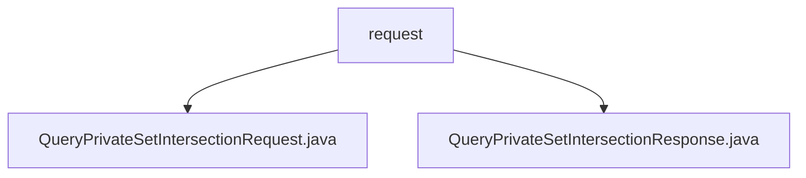

# Basic Information

|      |      |
|------|------|
| Name | request |
| Language | .java |
| Code Path | WeFe/mpc/mpc-common/src/main/java/com/welab/wefe/mpc/psi/request |
| Package Name | docs.mpc.mpc-common.src.main.java.com.welab.wefe.mpc.psi.request |
| Brief Description | The QueryPrivateSetIntersectionRequest class encapsulates the parameters of a private set intersection request, including fields such as clientIds along with their getter/setter methods. The QueryPrivateSetIntersectionResponse class represents the response result, containing fields like an encrypted ID list, status code, and their corresponding getter/setter methods. |

# Description

## Overview  
The core responsibility of this module is to encapsulate requests and responses for Private Set Intersection (PSI) queries, resembling a data exchange protocol pattern. The interface specification includes the QueryPrivateSetIntersectionRequest request class (with fields such as the p parameter and clientIds list) and the QueryPrivateSetIntersectionResponse response class (with fields like encrypted ID lists and batch status). Key data structures consist of client ID lists, batch control parameters, and PSI type identifiers. External dependencies are limited to JSON serialization libraries. For example, the request class uses the JSONField annotation for field mapping.  

## Primary Business Scenarios  
The module supports batch-based PSI query scenarios, enabling streamed data processing through currentBatch and batchSize. The interaction follows a request-response model—for instance, a client submits a request with a type identifier, and the server returns encrypted results and batch status. Typical applications include cross-institution secure data comparison, where clientIds facilitate multi-party identifier matching. The API type is POJO entity classes, with integration cases demonstrating serialized transmission of request/response objects. For example, the response class uses the hasNextBatch flag to control query termination conditions.

### Package Internal Structure View

This flowchart illustrates the hierarchical structure of the psi/request directory under the mpc-common module in the WeFe project. The root node is the request folder, which contains two Java files: QueryPrivateSetIntersectionRequest and QueryPrivateSetIntersectionResponse, representing the request and response class files for private set intersection queries, respectively. The structure clearly reflects the file organization of the request-response model.

# File List

| Name   | Type  | Description |
|-------|------|-------------|
| [QueryPrivateSetIntersectionRequest.java](QueryPrivateSetIntersectionRequest.md) | file | The QueryPrivateSetIntersectionRequest class contains parameters for private set intersection query requests: p, clientIds, requestId, currentBatch, batchSize, and type, providing getter and setter methods for each field. |
| [QueryPrivateSetIntersectionResponse.java](QueryPrivateSetIntersectionResponse.md) | file | Private Set Intersection Query Response Class, containing request ID, encrypted ID list, client ID list, field results, current batch, whether there is a next batch, message, and status code. |

