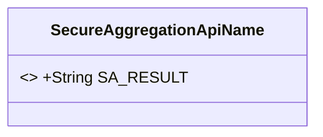
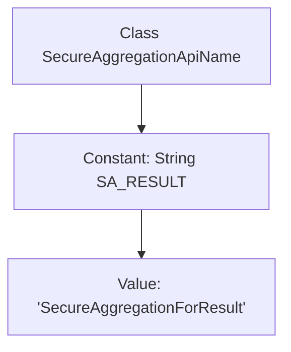

# Basic Information

|      |      |
|------|------|
| Name | SecureAggregationApiName |
| Language | .java |
| Code Path | WeFe/mpc/mpc-common/src/main/java/com/welab/wefe/mpc/sa/SecureAggregationApiName.java |
| Package Name | com.welab.wefe.mpc.sa |
| Dependencies | [] |
| Brief Description | The SecureAggregationApiName class defines a public static string constant SA_RESULT with the value "SecureAggregationForResult". |

# Description

The content defines a public class named SecureAggregationApiName, which contains a static constant string SA_RESULT with the value SecureAggregationForResult. This class may be used for secure aggregation-related API naming or result identification.

# Class Summary

| Name   | Type  | Description |
|-------|------|-------------|
| SecureAggregationApiName | class | The SecureAggregationApiName class defines a public static constant SA_RESULT with the value "SecureAggregationForResult". |

## Class SecureAggregationApiName

|      |      |
|------|------|
| Access Modifier | public |
| Type | class |
| Name | SecureAggregationApiName |
| Description | The SecureAggregationApiName class defines a public static constant SA_RESULT with the value "SecureAggregationForResult". |

### UML Class Diagram

This code defines a class named `SecureAggregationApiName`, which contains a public static constant `SA_RESULT` with the value "SecureAggregationForResult". The class is primarily used to store constant names related to the secure aggregation API, facilitating unified references in the code. Since the class only contains constant definitions and no instance methods, its design intent is to serve as a utility class. The class diagram uses `<<final>>` to denote the immutability characteristic of the constant, adhering to Java constant naming conventions.

### Internal Method Call Graph

This flowchart depicts the structure of the SecureAggregationApiName class, which contains only one public static constant SA_RESULT with the string value "SecureAggregationForResult". It is a typical constant definition class used to centrally manage fixed strings like API names, avoiding hardcoding in the code. The diagram clearly shows the inheritance relationship between the class and the constant, as well as the specific assigned value of the constant.

### Field List

| Name  | Type  | Description |
|-------|-------|------|
| SA_RESULT = "SecureAggregationForResult" | String | A public static constant string SA_RESULT is defined with the value "SecureAggregationForResult". |

### Method List

| Name  | Type  | Description |
|-------|-------|------|

