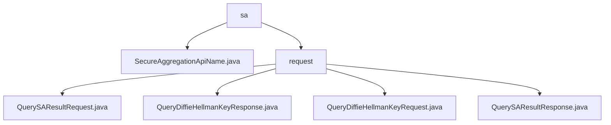

# Basic Information

|      |      |
|------|------|
| Name | sa |
| Language | .java |
| Code Path | WeFe/mpc/mpc-common/src/main/java/com/welab/wefe/mpc/sa |
| Package Name | docs.mpc.mpc-common.src.main.java.com.welab.wefe.mpc.sa |
| Brief Description | This module encapsulates secure aggregation and key exchange functionalities, comprising four types of data transfer objects. It supports multi-party secure computation workflows, adopts a request-response model, and relies on a JSON processing library. |

# Description

## Overview  
The core responsibility of this module is to implement protocol encapsulation for Secure Aggregation and Diffie-Hellman key exchange, providing communication guarantees similar to an encrypted envelope mechanism. The interface specification includes four types of POJO objects: QuerySAResultRequest/Response for handling aggregation calculations, and QueryDiffieHellmanKeyRequest/Response for managing key exchange, all utilizing JSONField annotations for serialization.  

Key data structures encompass the request identifier uuid, Diffie-Hellman parameters (p/g/public_keys), the operator, and weights such as weight. External dependencies require only a basic JSON library; for instance, QueryDiffieHellmanKeyRequest uses JSONObject to store parameters. The SecureAggregationApiName class defines the SA_RESULT constant to identify the secure aggregation API.  

## Primary Business Scenarios  
The module is suitable for multi-party secure computation scenarios, with a typical workflow as follows: 1) Initiate key exchange (QueryDiffieHellmanKeyRequest) 2) Exchange public keys (QueryDiffieHellmanKeyResponse) 3) Submit aggregated data (QuerySAResultRequest) 4) Retrieve encrypted results (QuerySAResultResponse).  

Interactions follow a request-response chain pattern, with sessions linked via uuid. Functional completeness is demonstrated through support for the ADD operator and weight adjustment, such as QuerySAResultResponse providing status feedback via code/message. APIs are uniformly encapsulated as POJOs, with constants like SA_RESULT used to identify secure aggregation result API endpoints.

### Package Internal Structure View

This flowchart illustrates the hierarchical structure of secure aggregation-related code under the mpc-common module in the WeFe project. The root node "sa" contains a Java file and a "request" subdirectory. The request directory includes four request/response class files, which handle secure aggregation and Diffie-Hellman key query functionalities. All node names adopt the naming convention of the last-level element in their paths.

# File List

| Name   | Type  | Description |
|-------|------|-------------|
| [SecureAggregationApiName.java](SecureAggregationApiName.md) | file | The SecureAggregationApiName class defines a public static string constant SA_RESULT with the value "SecureAggregationForResult". |
| [request](request/_module.md) | package | The QuerySAResultRequest class is used to query secure aggregation results and includes attributes such as uuid and a list of public keys. The QueryDiffieHellmanKeyResponse class encapsulates the key exchange response, containing fields like uuid and key value. The QueryDiffieHellmanKeyRequest class encapsulates the key exchange request, including parameters such as requestId, p, and g. The QuerySAResultResponse class encapsulates the query result response, with fields like uuid and result. |

