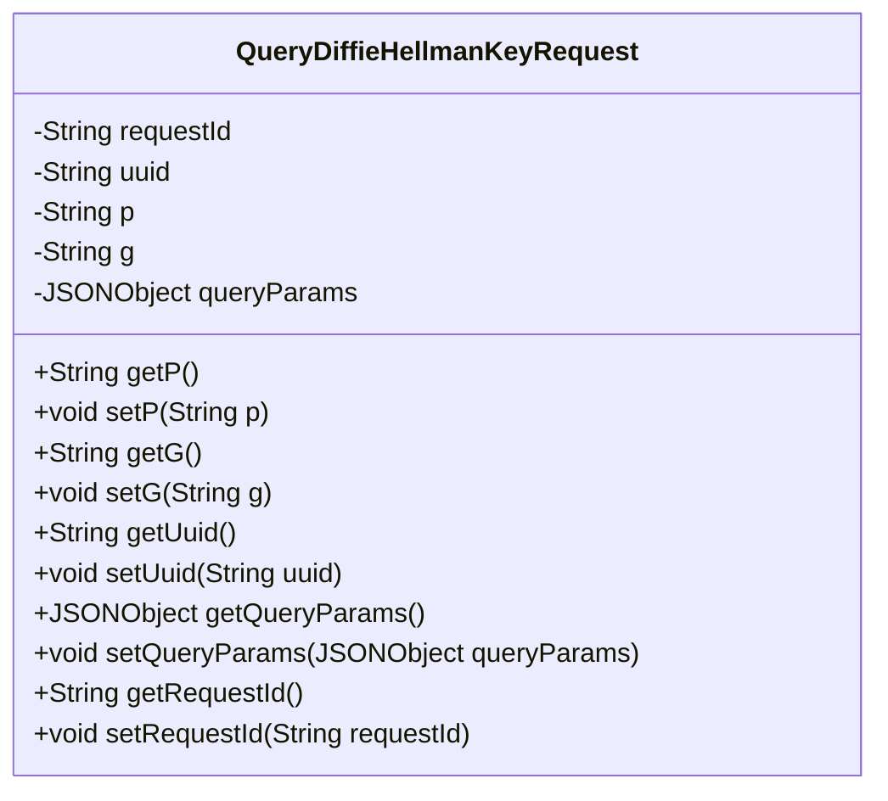

# Basic Information

|      |      |
|------|------|
| Name | QueryDiffieHellmanKeyRequest |
| Language | .java |
| Code Path | WeFe/mpc/mpc-common/src/main/java/com/welab/wefe/mpc/sa/request/QueryDiffieHellmanKeyRequest.java |
| Package Name | com.welab.wefe.mpc.sa.request |
| Dependencies | ['com.alibaba.fastjson.JSONObject', 'com.alibaba.fastjson.annotation.JSONField'] |
| Brief Description | The QueryDiffieHellmanKeyRequest class includes fields such as requestId, uuid, p, g, and queryParams, and provides corresponding getter and setter methods. |

# Description

This is a Java class named QueryDiffieHellmanKeyRequest, designed to encapsulate data related to Diffie-Hellman key exchange requests. The class contains five private fields: requestId represents the request identifier, uuid serves as a unique identifier, p and g denote the large prime number and generator in the Diffie-Hellman algorithm respectively, and queryParams is a JSONObject-type collection of query parameters. The class provides corresponding getter and setter methods for each field, with the queryParams field annotated using JSONField to specify the JSON property name.

# Class Summary

| Name   | Type  | Description |
|-------|------|-------------|
| QueryDiffieHellmanKeyRequest | class | The class QueryDiffieHellmanKeyRequest includes the request ID, UUID, parameters p and g, as well as a JSON object for query parameters queryParams, providing getter and setter methods for each field. |

## Class QueryDiffieHellmanKeyRequest

|      |      |
|------|------|
| Access Modifier | public |
| Type | class |
| Name | QueryDiffieHellmanKeyRequest |
| Description | The class QueryDiffieHellmanKeyRequest includes the request ID, UUID, parameters p and g, as well as a JSON object for query parameters queryParams, providing getter and setter methods for each field. |

### UML Class Diagram

This class diagram illustrates the structure of the `QueryDiffieHellmanKeyRequest` class, which serves as a data model class for handling Diffie-Hellman key exchange requests. It includes private fields `requestId`, `uuid`, `p`, `g`, and `queryParams`, representing the request ID, unique identifier, prime modulus, generator, and query parameters respectively. Public getter and setter methods are provided to access and modify these fields, adhering to the JavaBean specification. The `queryParams` field utilizes the `@JSONField` annotation to specify an alias for JSON serialization.

### Internal Method Call Graph

```mermaid
graph TD
    A["Class QueryDiffieHellmanKeyRequest"]
    B["Attribute: String requestId"]
    C["Attribute: String uuid"]
    D["Attribute: String p"]
    E["Attribute: String g"]
    F["Attribute: JSONObject queryParams"]
    G["Method: String getP()"]
    H["Method: void setP(String p)"]
    I["Method: String getG()"]
    J["Method: void setG(String g)"]
    K["Method: String getUuid()"]
    L["Method: void setUuid(String uuid)"]
    M["Method: JSONObject getQueryParams()"]
    N["Method: void setQueryParams(JSONObject queryParams)"]
    O["Method: String getRequestId()"]
    P["Method: void setRequestId(String requestId)"]

    A --> B
    A --> C
    A --> D
    A --> E
    A --> F
    A --> G
    A --> H
    A --> I
    A --> J
    A --> K
    A --> L
    A --> M
    A --> N
    A --> O
    A --> P
```

This flowchart illustrates the complete structure of the QueryDiffieHellmanKeyRequest class, containing 5 private attributes and 10 public methods. The attributes include requestId, uuid, p, g, and queryParams annotated with JSONField. The methods consist of 8 standard getter/setter pairs for encapsulating attribute access and modification. The class design complies with JavaBean specifications, controlling attribute access through methods, making it suitable for JSON serialization scenarios.

### Field List

| Name  | Type  | Description |
|-------|-------|------|
| uuid | String | Declare a private string variable uuid. |
| p | String | Private string variable p |
| queryParams | JSONObject | JSON field mapping: The private JSONObject variable `queryParams` is bound to the key name `query_params` via the annotation `@JSONField`. |
| g | String | Private string variable g. |
| requestId | String | The private string variable requestId is used to uniquely identify a request. |

### Method List

| Name  | Type  | Description |
|-------|-------|------|
| getQueryParams | JSONObject | Method to obtain a JSON object of query parameters. |
| setP | void | This is a Java method used to set the value of the class member variable p. The method is named setP, which takes a string parameter p and assigns it to the p property of the current object. |
| getRequestId | String | Methods to obtain the request ID, returns a string-type requestId. |
| getP | String | This is a Java method that returns the value of the private variable p. |
| setQueryParams | void | Defined a public method setQueryParams for setting the class's queryParams property, with the parameter being of JSONObject type. |
| setG | void | This is a Java method used to set the value of the string variable g in the class. The method is named setG, which takes a string parameter g and assigns it to the member variable this.g of the class. |
| getG | String | This is a Java method that returns the value of the member variable g of type String. |
| getUuid | String | This method returns a UUID value of string type. |
| setUuid | void | This is a Java method used to set the uuid property of an object, which takes a string parameter and assigns it to the member variable uuid. |
| setRequestId | void | Defines a public method `setRequestId` for setting the `requestId` property value of the current object. The parameter is of string type. |

