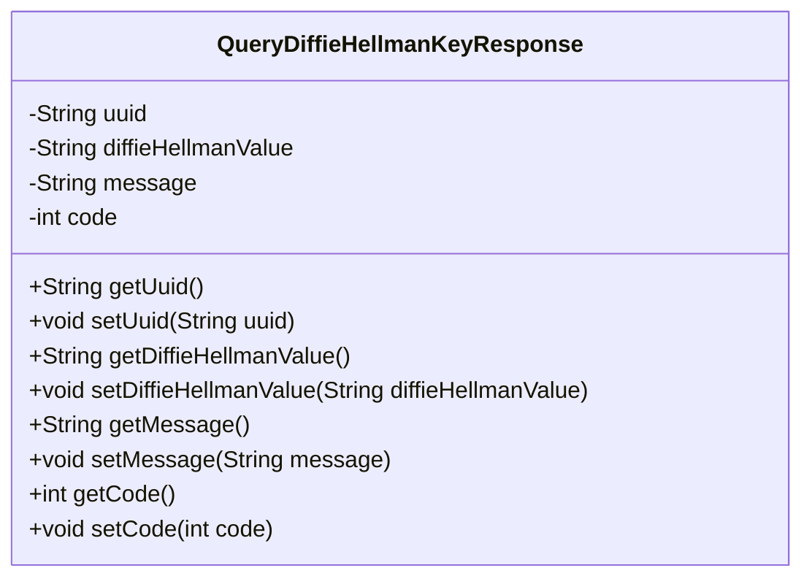
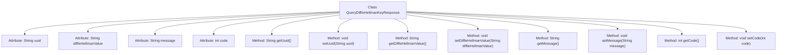

# Basic Information

|      |      |
|------|------|
| Name | QueryDiffieHellmanKeyResponse |
| Language | .java |
| Code Path | WeFe/mpc/mpc-common/src/main/java/com/welab/wefe/mpc/sa/request/QueryDiffieHellmanKeyResponse.java |
| Package Name | com.welab.wefe.mpc.sa.request |
| Dependencies | [] |
| Brief Description | Query the Diffie-Hellman key response class, which includes fields for uuid, key value, message, and status code, along with their getter/setter methods. |

# Description

The `QueryDiffieHellmanKeyResponse` class is a Java class designed to encapsulate responses for querying Diffie-Hellman key exchanges. This class contains four private fields: `uuid` serves as a unique identifier for the request, `diffieHellmanValue` stores the key exchange value, `message` conveys response messages, and `code` represents the response status code. Each field has corresponding getter and setter methods for retrieving and assigning values. This class is primarily used to handle response data during the key exchange process.

# Class Summary

| Name   | Type  | Description |
|-------|------|-------------|
| QueryDiffieHellmanKeyResponse | class | The QueryDiffieHellmanKeyResponse class includes fields such as uuid, diffieHellmanValue, message, and code, providing corresponding getter and setter methods. |

## Class QueryDiffieHellmanKeyResponse

|      |      |
|------|------|
| Access Modifier | public |
| Type | class |
| Name | QueryDiffieHellmanKeyResponse |
| Description | The QueryDiffieHellmanKeyResponse class includes fields such as uuid, diffieHellmanValue, message, and code, providing corresponding getter and setter methods. |

### UML Class Diagram

This code defines a class named `QueryDiffieHellmanKeyResponse`, which encapsulates response data related to the Diffie-Hellman key exchange. The class contains four private fields: `uuid` (unique identifier), `diffieHellmanValue` (DH key value), `message` (response message), and `code` (status code), along with corresponding getter and setter methods for each field. This design pattern is commonly used for Data Transfer Objects (DTOs), facilitating the transfer of structured data between different layers while maintaining encapsulation and maintainability.

### Internal Method Call Graph

This code defines a class named QueryDiffieHellmanKeyResponse, which encapsulates response data related to Diffie-Hellman key exchange. The class contains four private attributes: uuid (unique identifier), diffieHellmanValue (DH key value), message (message content), and code (status code), along with corresponding getter and setter methods for each attribute. The design of this class is primarily for data transmission, enabling secure access and modification of these sensitive data through methods.

### Field List

| Name  | Type  | Description |
|-------|-------|------|
| uuid | String | Private string type variable uuid |
| code | int | Private integer variable code. |
| diffieHellmanValue | String | The key value variable of the Diffie-Hellman algorithm, with a type of String. |
| message | String | Private string type variable message. |

### Method List

| Name  | Type  | Description |
|-------|-------|------|
| getUuid | String | Methods to obtain the UUID string, directly returning the value of the member variable `uuid`. |
| getMessage | String | This is a Java method that returns the value of the string-type message variable. |
| setDiffieHellmanValue | void | Public methods for setting Diffie-Hellman key exchange values. |
| setUuid | void | This is a Java method used to set the uuid property value of an object. The method takes a string parameter uuid and assigns it to the uuid field of the current object. |
| getDiffieHellmanValue | String | Public method to obtain the Diffie-Hellman value, returns a string-type variable diffieHellmanValue. |
| setMessage | void | Methods for setting message content, assigning the input string to the class member variable message. |
| getCode | int | The method getCode returns the value of the integer variable code. |
| setCode | void | Set the value of the integer variable code. |

