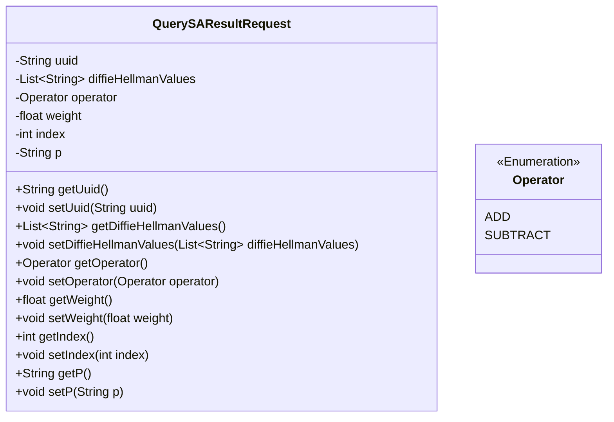

# Basic Information

|      |      |
|------|------|
| Name | QuerySAResultRequest |
| Language | .java |
| Code Path | WeFe/mpc/mpc-common/src/main/java/com/welab/wefe/mpc/sa/request/QuerySAResultRequest.java |
| Package Name | com.welab.wefe.mpc.sa.request |
| Dependencies | ['com.welab.wefe.mpc.commom.Operator', 'java.util.List'] |
| Brief Description | The QuerySAResultRequest class includes fields such as request identifier, list of DH public keys, operator, weight, participant serial number, and DH mode, providing getter and setter methods for each field. |

# Description

The `QuerySAResultRequest` class is used to request the query of secure aggregation results. It includes the request identifier `uuid`, the list of DH public keys from all participants `diffieHellmanValues`, the operator `operator` (defaulting to ADD), the weight `weight` (defaulting to 1.0), the current participant index `index` (ranging from 0 to the size of the public key list minus 1), and the DH mode `p`. The class provides getter and setter methods for each attribute.

# Class Summary

| Name   | Type  | Description |
|-------|------|-------------|
| QuerySAResultRequest | class | The QuerySAResultRequest class includes fields such as request identifier, DH public key list, operator, weight, participant serial number, and DH mode, providing getter and setter methods for each field. |

## Class QuerySAResultRequest

|      |      |
|------|------|
| Access Modifier | public |
| Type | class |
| Name | QuerySAResultRequest |
| Description | The QuerySAResultRequest class includes fields such as request identifier, DH public key list, operator, weight, participant serial number, and DH mode, providing getter and setter methods for each field. |

### UML Class Diagram

This code defines a class named QuerySAResultRequest, which encapsulates request parameters for querying SA results. The class includes private fields such as request identifier uuid, DH public key list diffieHellmanValues, operator operator, weight weight, participant index index, and DH mode p, along with corresponding getter and setter methods for each field. Operator is an enumeration type defining two operators: ADD and SUBTRACT. This class is primarily used for passing and manipulating request parameters in multi-party secure computation scenarios.

### Internal Method Call Graph

```mermaid
graph TD
    A["Class QuerySAResultRequest"]
    B["Attribute: String uuid"]
    C["Attribute: List<String> diffieHellmanValues"]
    D["Attribute: Operator operator = Operator.ADD"]
    E["Attribute: float weight = 1.0f"]
    F["Attribute: int index"]
    G["Attribute: String p"]
    H["Method: String getUuid()"]
    I["Method: void setUuid(String uuid)"]
    J["Method: List<String> getDiffieHellmanValues()"]
    K["Method: void setDiffieHellmanValues(List<String> diffieHellmanValues)"]
    L["Method: int getIndex()"]
    M["Method: void setIndex(int index)"]
    N["Method: String getP()"]
    O["Method: void setP(String p)"]
    P["Method: Operator getOperator()"]
    Q["Method: void setOperator(Operator operator)"]
    R["Method: float getWeight()"]
    S["Method: void setWeight(float weight)"]

    A --> B
    A --> C
    A --> D
    A --> E
    A --> F
    A --> G
    A --> H
    A --> I
    A --> J
    A --> K
    A --> L
    A --> M
    A --> N
    A --> O
    A --> P
    A --> Q
    A --> R
    A --> S
```

This code defines a class named QuerySAResultRequest, primarily used to encapsulate parameters related to secure aggregation query requests. The class contains seven private attributes: uuid serves as the request identifier, diffieHellmanValues stores the DH public keys of all participating parties, operator denotes the operation type (defaulting to ADD), weight represents the weight value (defaulting to 1.0), index indicates the current participant sequence number, and p specifies the DH mode. Each attribute has corresponding getter and setter methods for access and modification. The main purpose of this class is to provide the necessary data structure and access interfaces for secure aggregation computations.

### Field List

| Name  | Type  | Description |
|-------|-------|------|
| uuid | String | Private string variable uuid, used to store the unique identifier. |
| index | int | Private integer variable index. |
| diffieHellmanValues | List<String> | Private string list storing values related to the Diffie-Hellman algorithm. |
| operator = Operator.ADD | Operator | The private variable `operator` is initialized to the addition operator. |
| weight = 1.0f | float | Define a private float variable weight with an initial value of 1.0. |
| p | String | Declare a private string variable p. |

### Method List

| Name  | Type  | Description |
|-------|-------|------|
| getUuid | String | Methods to obtain the UUID string, directly return the value of the member variable uuid. |
| getDiffieHellmanValues | List<String> | This method returns a list of strings containing Diffie-Hellman values. |
| setIndex | void | Set the index value of the current object to the specified parameter value. |
| getIndex | int | The method returns the value of the integer variable index. |
| setP | void | This is a Java method used to set the value of the class member variable p. The method is named setP, which takes a string parameter p and assigns it to the p property of the current object. |
| setDiffieHellmanValues | void | Method for setting the Diffie-Hellman parameter list. |
| setUuid | void | Methods for setting UUID string values. |
| getP | String | Get the string value of property p. |
| getOperator | Operator | This is a Java method that returns the member variable named operator. |
| setOperator | void | Set operator method to assign the incoming operator object to the operator property of the current instance. |
| getWeight | float | Get the weight value of the current object. |
| setWeight | void | Methods for setting the object's weight property, with the parameter being a floating-point number weight. |

