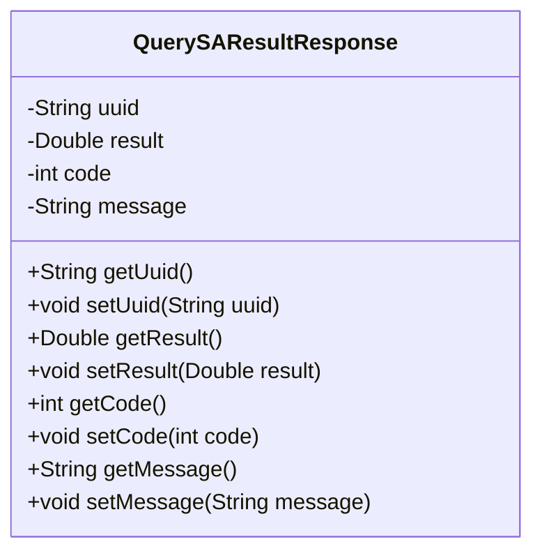
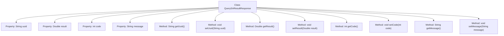

# Basic Information

|      |      |
|------|------|
| Name | QuerySAResultResponse |
| Language | .java |
| Code Path | WeFe/mpc/mpc-common/src/main/java/com/welab/wefe/mpc/sa/request/QuerySAResultResponse.java |
| Package Name | com.welab.wefe.mpc.sa.request |
| Dependencies | [] |
| Brief Description | Java class QuerySAResultResponse, containing fields uuid, result, code, message, and their corresponding getter and setter methods. |

# Description

This is a Java class named QuerySAResultResponse, designed to encapsulate response data for query results. The class contains four private fields: uuid for storing a unique identifier, result for storing a double-precision floating-point result, code for storing a status code, and message for storing message text. Each field has corresponding getter and setter methods for retrieving and setting the field values, respectively. This class is primarily used for data transfer and encapsulation and does not include any business logic or method implementations.

# Class Summary

| Name   | Type  | Description |
|-------|------|-------------|
| QuerySAResultResponse | class | The QuerySAResultResponse class includes fields such as uuid, result, code, and message, and provides corresponding getter and setter methods. |

## Class QuerySAResultResponse

|      |      |
|------|------|
| Access Modifier | public |
| Type | class |
| Name | QuerySAResultResponse |
| Description | The QuerySAResultResponse class includes fields such as uuid, result, code, and message, and provides corresponding getter and setter methods. |

### UML Class Diagram

This code defines a class named QuerySAResultResponse, which encapsulates response data for query results. The class contains four private fields: uuid (unique identifier), result (double-precision floating-point result), code (status code), and message (message text), along with corresponding getter and setter methods for each field. This class is typically used in RESTful APIs or service calls as a standardized data structure for returning results, facilitating client-side parsing and processing of information returned by the server.

### Internal Method Call Graph

This flowchart illustrates the complete structure of the QuerySAResultResponse class, containing 4 private properties and corresponding 8 getter/setter methods. The class is designed to encapsulate query result response data, where uuid identifies unique requests, result stores double-precision result values, code represents status codes, and message carries descriptive information. Each property provides read access via get methods and write control through set methods, conforming to the JavaBean specification's data encapsulation pattern.

### Field List

| Name  | Type  | Description |
|-------|-------|------|
| uuid | String | Declare a private string variable uuid. |
| result | Double | Private double-precision floating-point variable result. |
| code | int | Private integer variable code. |
| message | String | Declare a private string variable named message. |

### Method List

| Name  | Type  | Description |
|-------|-------|------|
| getResult | Double | This method returns a Double-type result value. |
| getCode | int | The method returns the value of the integer variable code. |
| setUuid | void | This is a Java method used to set the uuid property value of an object. The method takes a string parameter uuid and assigns it to the uuid field of the current object. |
| setResult | void | Set the result value to the passed double-precision numerical value. |
| getMessage | String | Methods to obtain the message string. |
| setMessage | void | Methods for setting message content, assigning the input string to the class member variable message. |
| getUuid | String | The method returns the value of the uuid variable of string type. |
| setCode | void | Set the value of the integer variable code. |

